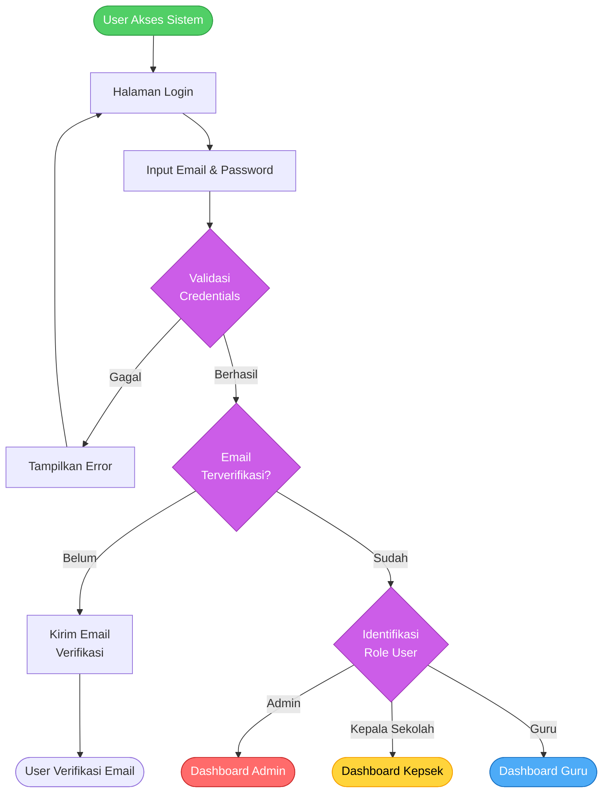
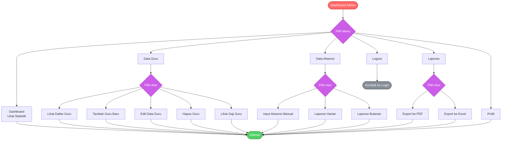
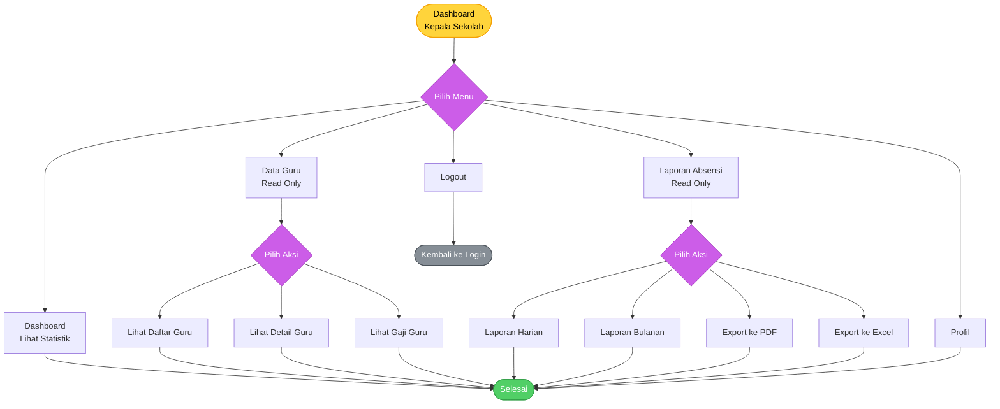
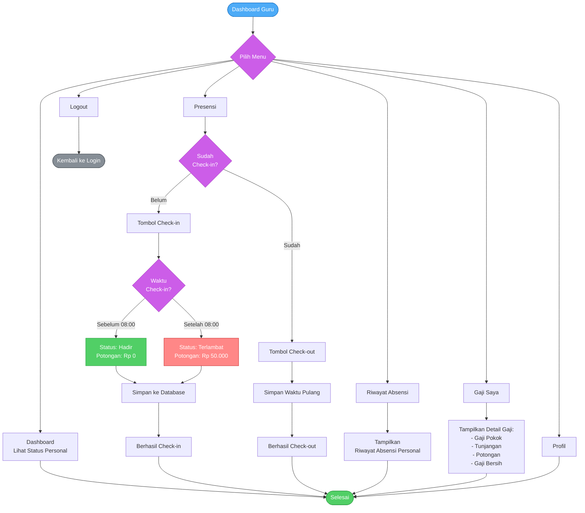
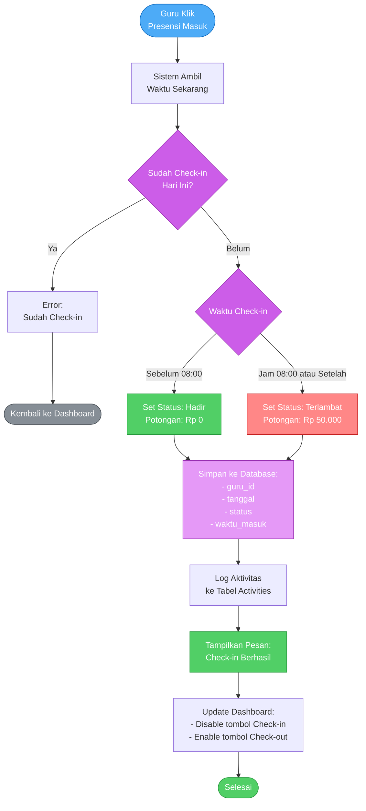
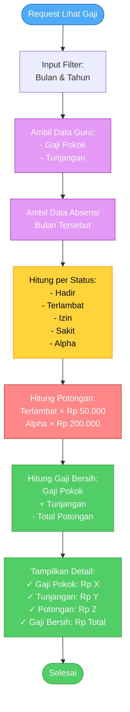
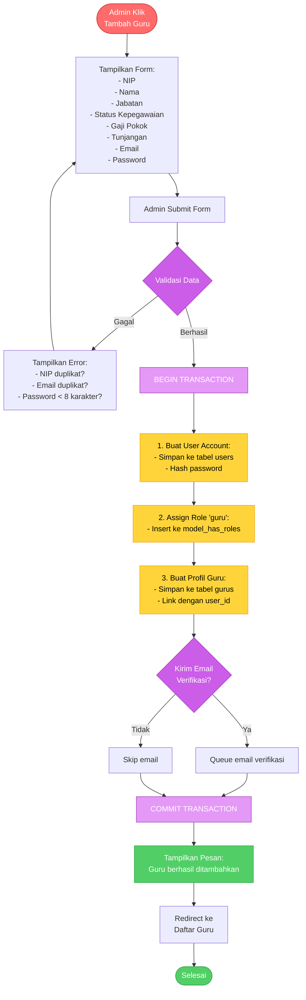

# Flowchart Akses Role dan Fitur (Versi Sederhana)

Dokumen ini berisi flowchart yang disederhanakan agar mudah dimasukkan ke dalam dokumen Word/PDF.

---

## 1. Flowchart Login dan Autentikasi



**Penjelasan:**
1. User mengakses sistem dan masuk ke halaman login
2. Input email dan password
3. Sistem validasi credentials dengan database
4. Jika gagal, tampilkan error dan kembali ke login
5. Jika berhasil, cek apakah email sudah diverifikasi
6. Jika belum verified, kirim email verifikasi
7. Jika sudah verified, cek role user dan redirect ke dashboard sesuai role

---

## 2. Flowchart Menu Administrator



**Penjelasan:**
Administrator memiliki akses penuh ke semua menu:
- **Dashboard**: Melihat statistik sistem
- **Data Guru**: CRUD guru (Create, Read, Update, Delete)
- **Data Absensi**: Input manual dan lihat laporan
- **Laporan**: Export data ke PDF atau Excel
- **Profil**: Kelola profil admin
- **Logout**: Keluar dari sistem

---

## 3. Flowchart Menu Kepala Sekolah



**Penjelasan:**
Kepala Sekolah memiliki akses **Read-Only** (hanya lihat):
- **Dashboard**: Monitoring statistik
- **Data Guru**: Lihat daftar dan detail guru (tidak bisa edit/hapus)
- **Laporan Absensi**: Lihat dan export laporan
- **Profil**: Kelola profil sendiri
- **Logout**: Keluar dari sistem

**Perbedaan dengan Admin:** Kepala Sekolah tidak bisa tambah, edit, atau hapus data.

---

## 4. Flowchart Menu Guru



**Penjelasan:**
Guru memiliki akses **Self-Service** (data pribadi saja):
- **Dashboard**: Status presensi dan ringkasan personal
- **Presensi**:
  - Check-in: Rekam kehadiran (auto detect terlambat jika >= 08:00)
  - Check-out: Rekam waktu pulang
- **Riwayat Absensi**: Lihat riwayat presensi pribadi
- **Gaji Saya**: Lihat detail gaji pribadi dengan perhitungan potongan
- **Profil**: Kelola profil pribadi
- **Logout**: Keluar dari sistem

**Perbedaan dengan Admin/Kepsek:** Guru hanya bisa akses data diri sendiri.

---

## 5. Flowchart Proses Check-in Presensi (Detail)



**Penjelasan Proses Check-in:**
1. Guru klik tombol "Presensi Masuk"
2. Sistem ambil waktu sekarang dari server
3. Cek apakah guru sudah check-in hari ini
4. Jika sudah, tampilkan error (tidak bisa check-in 2x)
5. Jika belum, bandingkan waktu dengan batas jam 08:00
6. Jika sebelum 08:00 → Status "Hadir", potongan Rp 0
7. Jika jam 08:00 atau setelah → Status "Terlambat", potongan Rp 50.000
8. Simpan data ke database (guru_id, tanggal, status, waktu_masuk)
9. Log aktivitas ke tabel activities
10. Tampilkan pesan sukses
11. Update dashboard: disable check-in, enable check-out

---

## 6. Flowchart Perhitungan Gaji



**Penjelasan Perhitungan Gaji:**
1. User request lihat gaji dengan filter bulan & tahun
2. Sistem ambil data guru (gaji pokok & tunjangan)
3. Sistem ambil semua data absensi bulan tersebut
4. Hitung jumlah per status (hadir, terlambat, izin, sakit, alpha)
5. Hitung total potongan:
   - Terlambat: jumlah hari × Rp 50.000
   - Alpha: jumlah hari × Rp 200.000
6. Hitung gaji bersih = Gaji Pokok + Tunjangan - Total Potongan
7. Tampilkan detail lengkap ke user

**Contoh Perhitungan:**
```
Gaji Pokok: Rp 5.000.000
Tunjangan: Rp 1.000.000
──────────────────────
Subtotal: Rp 6.000.000

Potongan:
- Terlambat (3 hari): Rp 150.000
- Alpha (1 hari): Rp 200.000
──────────────────────
Total Potongan: Rp 350.000

GAJI BERSIH: Rp 5.650.000
```

---

## 7. Flowchart Tambah Guru Baru (Admin)



**Penjelasan Proses Tambah Guru:**
1. Admin klik tombol "Tambah Guru"
2. Sistem tampilkan form input data guru
3. Admin isi semua field dan submit
4. Sistem validasi:
   - NIP belum terdaftar?
   - Email belum terdaftar?
   - Password minimal 8 karakter?
5. Jika gagal validasi, tampilkan error dan kembali ke form
6. Jika valid, mulai database transaction:
   - **Step 1**: Buat user account di tabel `users` (hash password)
   - **Step 2**: Assign role 'guru' menggunakan Spatie Permission
   - **Step 3**: Buat profil guru di tabel `gurus` dengan foreign key ke user
7. Opsional: Kirim email verifikasi (jika diaktifkan)
8. Commit transaction
9. Tampilkan pesan sukses
10. Redirect ke halaman daftar guru

**Catatan:** Menggunakan transaction untuk memastikan data konsisten. Jika salah satu step gagal, semua perubahan di-rollback.

---

## Ringkasan Akses per Role

| Fitur | Admin | Kepala Sekolah | Guru |
|-------|-------|----------------|------|
| **Dashboard** | ✅ Full Stats | ✅ Monitoring | ✅ Personal |
| **Data Guru - Lihat** | ✅ | ✅ | ❌ |
| **Data Guru - Tambah** | ✅ | ❌ | ❌ |
| **Data Guru - Edit** | ✅ | ❌ | ❌ |
| **Data Guru - Hapus** | ✅ | ❌ | ❌ |
| **Absensi - Check-in/out** | ❌ | ❌ | ✅ |
| **Absensi - Input Manual** | ✅ | ❌ | ❌ |
| **Laporan - Lihat** | ✅ | ✅ | ✅ Personal |
| **Laporan - Export** | ✅ | ✅ | ❌ |
| **Gaji - Lihat Semua** | ✅ | ✅ | ❌ |
| **Gaji - Lihat Pribadi** | ❌ | ❌ | ✅ |

**Keterangan:**
- ✅ = Bisa akses
- ❌ = Tidak bisa akses
- **Full Stats** = Statistik lengkap semua data
- **Monitoring** = Statistik untuk monitoring (read-only)
- **Personal** = Hanya data pribadi

---

## Tips Memasukkan ke Word/PDF

### 1. Export Diagram ke Gambar
- Buka https://mermaid.live/
- Copy-paste kode diagram
- Klik "Actions" → "PNG" atau "SVG"
- Download dan insert ke Word

### 2. Ukuran Optimal
- PNG: 1200-1600px width untuk kualitas baik
- Compress jika file terlalu besar

### 3. Layout di Word
- Gunakan text wrapping "In line with text" atau "Top and Bottom"
- Beri caption: "Gambar X. [Judul Flowchart]"
- Beri penjelasan di bawah gambar

### 4. Alternatif
Jika diagram masih terlalu besar, bisa dipecah menjadi sub-flowchart per proses:
- Flowchart Login
- Flowchart Menu Admin
- Flowchart Presensi Guru
- dst.

---

## Keuntungan Versi Sederhana Ini

✅ **Lebih Ringkas** - Setiap flowchart fokus pada 1 proses
✅ **Mudah Dipahami** - Tidak terlalu kompleks
✅ **Cocok untuk Word** - Ukuran pas untuk dokumen
✅ **Tetap Lengkap** - Semua proses utama tercakup
✅ **Penjelasan Jelas** - Dilengkapi keterangan detail
