# Flowchart Akses Role dan Fitur

Diagram ini menunjukkan akses dan fitur yang tersedia untuk setiap role dalam sistem E-Presensi.

```mermaid
flowchart TD
    Start([User Login]) --> Auth{Autentikasi<br/>Berhasil?}
    Auth -->|Tidak| LoginFail[Tampilkan Error<br/>Login Gagal]
    LoginFail --> Start
    Auth -->|Ya| EmailVerif{Email<br/>Terverifikasi?}

    EmailVerif -->|Tidak| VerifPage[Halaman<br/>Verifikasi Email]
    VerifPage --> Start

    EmailVerif -->|Ya| CheckRole{Cek Role<br/>User}

    CheckRole -->|Admin| AdminDash[Dashboard Admin]
    CheckRole -->|Kepala Sekolah| KepsekhDash[Dashboard<br/>Kepala Sekolah]
    CheckRole -->|Guru| GuruDash[Dashboard Guru]

    %% Admin Section
    AdminDash --> AdminMenu{Pilih Menu<br/>Admin}
    AdminMenu --> AdminDashView[View Dashboard<br/>- Statistik Kehadiran<br/>- Statistik Guru<br/>- Grafik Mingguan<br/>- Aktivitas Sistem]
    AdminMenu --> AdminGuru[Manajemen Guru<br/>- Tambah Guru<br/>- Edit Guru<br/>- Hapus Guru<br/>- Lihat Detail Guru<br/>- Lihat Gaji Guru]
    AdminMenu --> AdminAbsen[Manajemen Absensi<br/>- Input Manual<br/>- Edit Absensi<br/>- Laporan Harian<br/>- Laporan Bulanan]
    AdminMenu --> AdminLaporan[Laporan & Export<br/>- Export PDF<br/>- Export Excel<br/>- Filter per Bulan]
    AdminMenu --> AdminProfile[Profil Admin<br/>- Edit Profil<br/>- Ubah Password]
    AdminMenu --> AdminLogout[Logout]

    AdminGuru --> AdminGuruAction{Aksi}
    AdminGuruAction --> AdminGuruAdd[Tambah Guru Baru<br/>- Input Data Guru<br/>- Buat Akun User<br/>- Set Role Guru<br/>- Kirim Email Verifikasi]
    AdminGuruAction --> AdminGuruEdit[Edit Data Guru<br/>- Update Info Guru<br/>- Update Email/Password]
    AdminGuruAction --> AdminGuruDelete[Hapus Guru<br/>- Soft Delete<br/>- Log Aktivitas]
    AdminGuruAction --> AdminGuruView[Lihat Detail<br/>- Info Guru<br/>- Riwayat Absensi<br/>- Detail Gaji]

    AdminAbsen --> AdminAbsenAction{Aksi}
    AdminAbsenAction --> AdminAbsenManual[Input Manual<br/>- Pilih Guru<br/>- Pilih Tanggal<br/>- Set Status<br/>- Set Waktu]
    AdminAbsenAction --> AdminAbsenDaily[Laporan Harian<br/>- Filter Tanggal<br/>- Daftar Hadir<br/>- Daftar Tidak Hadir]
    AdminAbsenAction --> AdminAbsenMonthly[Laporan Bulanan<br/>- Ringkasan per Guru<br/>- Statistik Bulanan<br/>- Perhitungan Gaji]

    %% Kepala Sekolah Section
    KepsekhDash --> KepsekhMenu{Pilih Menu<br/>Kepala Sekolah}
    KepsekhMenu --> KepsekhDashView[View Dashboard<br/>- Statistik Kehadiran<br/>- Statistik Guru<br/>- Grafik Mingguan<br/>- Aktivitas Sistem]
    KepsekhMenu --> KepsekhGuru[Data Guru<br/>- Lihat Daftar Guru<br/>- Lihat Detail Guru<br/>- Lihat Gaji Guru<br/>- Filter & Search]
    KepsekhMenu --> KepsekhLaporan[Laporan Absensi<br/>- Laporan Harian<br/>- Laporan Bulanan<br/>- Export PDF/Excel<br/>- Statistik]
    KepsekhMenu --> KepsekhProfile[Profil<br/>- Edit Profil<br/>- Ubah Password]
    KepsekhMenu --> KepsekhLogout[Logout]

    KepsekhGuru --> KepsekhGuruView[Lihat Data Guru<br/>- Info Personal<br/>- Status Kepegawaian<br/>- Gaji & Tunjangan]
    KepsekhGuru --> KepsekhGuruSalary[Detail Gaji<br/>- Gaji Pokok<br/>- Tunjangan<br/>- Potongan<br/>- Gaji Bersih]

    KepsekhLaporan --> KepsekhLaporanDaily[Laporan Harian<br/>- View Only<br/>- Export Data]
    KepsekhLaporan --> KepsekhLaporanMonthly[Laporan Bulanan<br/>- View Only<br/>- Export Data<br/>- Statistik]

    %% Guru Section
    GuruDash --> GuruMenu{Pilih Menu<br/>Guru}
    GuruMenu --> GuruDashView[View Dashboard<br/>- Status Check-in<br/>- Ringkasan Bulan Ini<br/>- Riwayat Terakhir<br/>- Estimasi Gaji<br/>- Grafik Mingguan]
    GuruMenu --> GuruPresensi[Presensi<br/>- Check-in<br/>- Check-out<br/>- Riwayat Absensi]
    GuruMenu --> GuruProfile[Profil Saya<br/>- Lihat Profil<br/>- Edit Password]
    GuruMenu --> GuruGaji[Gaji Saya<br/>- Lihat Komponen Gaji<br/>- Detail Potongan<br/>- Filter per Bulan]
    GuruMenu --> GuruHistory[Riwayat Absensi<br/>- Filter Tanggal<br/>- Filter Status<br/>- Ringkasan Bulanan]
    GuruMenu --> GuruLogout[Logout]

    GuruPresensi --> GuruPresensiAction{Status Hari Ini?}
    GuruPresensiAction -->|Belum Check-in| GuruCheckIn[Check-in<br/>- Rekam Waktu Masuk<br/>- Auto Detect Terlambat<br/>- Log Aktivitas]
    GuruPresensiAction -->|Sudah Check-in| GuruCheckOut[Check-out<br/>- Rekam Waktu Pulang<br/>- Update Status<br/>- Log Aktivitas]
    GuruPresensiAction -->|Sudah Check-out| GuruPresensiDone[Presensi Selesai<br/>untuk Hari Ini]

    GuruCheckIn --> CheckInTime{Waktu Check-in?}
    CheckInTime -->|Sebelum 08:00| StatusHadir[Status: Hadir<br/>Potongan: Rp 0]
    CheckInTime -->|Setelah 08:00| StatusTerlambat[Status: Terlambat<br/>Potongan: Rp 50.000]

    StatusHadir --> SaveCheckIn[Simpan ke Database<br/>- tanggal<br/>- waktu_masuk<br/>- status: hadir]
    StatusTerlambat --> SaveCheckIn

    SaveCheckIn --> LogActivity[Log Aktivitas<br/>- type: hadir/terlambat<br/>- description<br/>- guru_id]

    LogActivity --> RedirectDash[Redirect ke Dashboard<br/>Tampilkan Pesan Sukses]

    GuruCheckOut --> SaveCheckOut[Simpan Waktu Pulang<br/>- waktu_pulang<br/>- update absensi]
    SaveCheckOut --> LogCheckOut[Log Aktivitas<br/>- type: checkout<br/>- description<br/>- guru_id]
    LogCheckOut --> RedirectDash

    GuruGaji --> GuruGajiView[Lihat Detail Gaji]
    GuruGajiView --> CalcGaji[Hitung Gaji<br/>= Gaji Pokok<br/>+ Tunjangan<br/>- Potongan]
    CalcGaji --> CalcPotongan[Hitung Potongan<br/>= Terlambat × 50.000<br/>+ Alpha × 200.000]
    CalcPotongan --> ShowGaji[Tampilkan:<br/>- Komponen Gaji<br/>- Detail Kehadiran<br/>- Total Gaji Bersih]

    %% Styling
    classDef adminStyle fill:#ff6b6b,stroke:#c92a2a,color:#fff
    classDef kepsekhStyle fill:#4dabf7,stroke:#1971c2,color:#fff
    classDef guruStyle fill:#51cf66,stroke:#2f9e44,color:#fff
    classDef processStyle fill:#ffd43b,stroke:#f59f00,color:#000
    classDef decisionStyle fill:#cc5de8,stroke:#9c36b5,color:#fff

    class AdminDash,AdminMenu,AdminDashView,AdminGuru,AdminAbsen,AdminLaporan,AdminProfile,AdminLogout,AdminGuruAction,AdminGuruAdd,AdminGuruEdit,AdminGuruDelete,AdminGuruView,AdminAbsenAction,AdminAbsenManual,AdminAbsenDaily,AdminAbsenMonthly adminStyle

    class KepsekhDash,KepsekhMenu,KepsekhDashView,KepsekhGuru,KepsekhLaporan,KepsekhProfile,KepsekhLogout,KepsekhGuruView,KepsekhGuruSalary,KepsekhLaporanDaily,KepsekhLaporanMonthly kepsekhStyle

    class GuruDash,GuruMenu,GuruDashView,GuruPresensi,GuruProfile,GuruGaji,GuruHistory,GuruLogout,GuruPresensiAction,GuruCheckIn,GuruCheckOut,GuruPresensiDone,GuruGajiView guruStyle

    class SaveCheckIn,SaveCheckOut,LogActivity,LogCheckOut,CalcGaji,CalcPotongan,ShowGaji processStyle

    class Auth,EmailVerif,CheckRole,AdminGuruAction,AdminAbsenAction,GuruPresensiAction,CheckInTime decisionStyle
```

## Keterangan Warna:
- **Merah (Admin)**: Fitur khusus untuk Administrator - Full access CRUD
- **Biru (Kepala Sekolah)**: Fitur untuk Kepala Sekolah - Read-only access
- **Hijau (Guru)**: Fitur untuk Guru - Self-service access
- **Kuning (Process)**: Proses/Aksi yang dijalankan sistem
- **Ungu (Decision)**: Titik keputusan/percabangan alur

## Ringkasan Akses Role:

### 1. Administrator
**Hak Akses:** Full Control (Create, Read, Update, Delete)

**Fitur Utama:**
- Dashboard dengan statistik lengkap
- Manajemen data guru (CRUD)
- Input dan edit absensi manual
- Laporan harian dan bulanan
- Export data (PDF/Excel)
- View detail gaji semua guru

**Tidak Bisa:**
- Check-in/check-out presensi (khusus guru)

---

### 2. Kepala Sekolah
**Hak Akses:** Read-Only & Export

**Fitur Utama:**
- Dashboard dengan statistik monitoring
- Lihat daftar dan detail guru
- Lihat detail gaji guru
- Laporan absensi (harian & bulanan)
- Export laporan (PDF/Excel)
- Filter dan search data

**Tidak Bisa:**
- Tambah, edit, atau hapus data guru
- Input atau edit absensi
- Check-in/check-out presensi

---

### 3. Guru
**Hak Akses:** Self-Service (Data Pribadi Only)

**Fitur Utama:**
- Dashboard personal
- Check-in presensi (dengan deteksi keterlambatan)
- Check-out presensi
- Lihat riwayat absensi pribadi
- Lihat detail gaji pribadi
- Lihat dan edit profil pribadi

**Tidak Bisa:**
- Akses data guru lain
- Input/edit absensi manual
- Akses laporan keseluruhan
- Manajemen data guru
