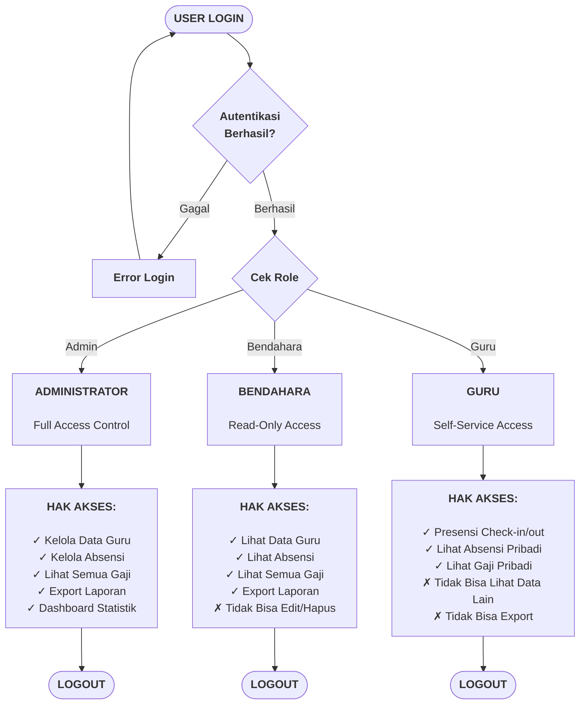

# Flowchart Perbandingan Akses Role

Dokumen ini berisi flowchart yang menunjukkan perbandingan akses dan fitur untuk setiap role dalam satu diagram yang ringkas.

---

## 1. Flowchart Akses Role (Versi Simpel & Besar) ⭐ RECOMMENDED

**Versi ini lebih sederhana dengan font besar, cocok untuk dokumen Word/PDF.**



**Keuntungan Versi Ini:**
- ✅ Font lebih besar dan bold (mudah dibaca)
- ✅ Hanya poin-poin utama, tidak detail
- ✅ Layout vertikal (lebih tinggi = lebih besar saat di-export)
- ✅ Box lebih besar dengan stroke tebal
- ✅ Cocok untuk halaman portrait A4
- ✅ Text lebih sedikit = lebih mudah dipahami sekilas

---

## 2. Flowchart Akses Role (Versi Detail)

**Versi ini lebih lengkap dengan semua detail akses per role. Gunakan jika ingin menampilkan detail lengkap.**

```mermaid
flowchart TB
    Start([User Login ke Sistem]) --> Auth{Autentikasi<br/>Berhasil?}

    Auth -->|Gagal| LoginError[Tampilkan Error]
    LoginError --> Start

    Auth -->|Berhasil| RoleCheck{Identifikasi<br/>Role User}

    %% === ADMIN SECTION ===
    RoleCheck -->|Admin| AdminDash[<b>DASHBOARD ADMIN</b><br/>Full Access Control]

    AdminDash --> AdminAccess[<b>Akses Admin:</b>]
    AdminAccess --> AdminMenu1[✓ Data Guru<br/>- Tambah Guru<br/>- Edit Guru<br/>- Hapus Guru<br/>- Lihat Detail]
    AdminAccess --> AdminMenu2[✓ Data Absensi<br/>- Input Manual<br/>- Edit Absensi<br/>- Laporan Harian<br/>- Laporan Bulanan]
    AdminAccess --> AdminMenu3[✓ Data Gaji<br/>- Lihat Gaji Semua Guru<br/>- Detail Perhitungan<br/>- Potongan]
    AdminAccess --> AdminMenu4[✓ Laporan & Export<br/>- Export PDF<br/>- Export Excel<br/>- Filter Data]
    AdminAccess --> AdminMenu5[✓ Dashboard Statistik<br/>- Grafik Kehadiran<br/>- Total Guru<br/>- Aktivitas Sistem]

    %% === KEPALA SEKOLAH SECTION ===
    RoleCheck -->|Kepala Sekolah| KepsekDash[<b>DASHBOARD KEPALA SEKOLAH</b><br/>Read-Only Access]

    KepsekDash --> KepsekAccess[<b>Akses Kepala Sekolah:</b>]
    KepsekAccess --> KepsekMenu1[✓ Data Guru<br/>- Lihat Daftar Guru<br/>- Lihat Detail Guru<br/>✗ Tidak Bisa Edit/Hapus]
    KepsekAccess --> KepsekMenu2[✓ Data Absensi<br/>- Laporan Harian<br/>- Laporan Bulanan<br/>✗ Tidak Bisa Input Manual]
    KepsekAccess --> KepsekMenu3[✓ Data Gaji<br/>- Lihat Gaji Semua Guru<br/>- Detail Perhitungan<br/>✗ Tidak Bisa Edit]
    KepsekAccess --> KepsekMenu4[✓ Laporan & Export<br/>- Export PDF<br/>- Export Excel<br/>- Filter Data]
    KepsekAccess --> KepsekMenu5[✓ Dashboard Statistik<br/>- Grafik Kehadiran<br/>- Total Guru<br/>- Monitoring]

    %% === GURU SECTION ===
    RoleCheck -->|Guru| GuruDash[<b>DASHBOARD GURU</b><br/>Self-Service Access]

    GuruDash --> GuruAccess[<b>Akses Guru:</b>]
    GuruAccess --> GuruMenu1[✓ Presensi<br/>- Check-in Harian<br/>- Check-out Harian<br/>- Deteksi Terlambat]
    GuruAccess --> GuruMenu2[✓ Data Absensi Pribadi<br/>- Riwayat Presensi<br/>- Filter per Bulan<br/>✗ Tidak Bisa Lihat Guru Lain]
    GuruAccess --> GuruMenu3[✓ Data Gaji Pribadi<br/>- Gaji Pokok<br/>- Tunjangan<br/>- Potongan<br/>- Gaji Bersih<br/>✗ Tidak Bisa Lihat Guru Lain]
    GuruAccess --> GuruMenu4[✓ Dashboard Personal<br/>- Status Check-in Hari Ini<br/>- Ringkasan Bulan Ini<br/>- Estimasi Gaji]
    GuruAccess --> GuruMenu5[✗ Tidak Ada Akses:<br/>- Data Guru Lain<br/>- Input Manual Absensi<br/>- Export Laporan]

    %% End Points
    AdminMenu1 --> EndAdmin([Logout])
    AdminMenu2 --> EndAdmin
    AdminMenu3 --> EndAdmin
    AdminMenu4 --> EndAdmin
    AdminMenu5 --> EndAdmin

    KepsekMenu1 --> EndKepsek([Logout])
    KepsekMenu2 --> EndKepsek
    KepsekMenu3 --> EndKepsek
    KepsekMenu4 --> EndKepsek
    KepsekMenu5 --> EndKepsek

    GuruMenu1 --> EndGuru([Logout])
    GuruMenu2 --> EndGuru
    GuruMenu3 --> EndGuru
    GuruMenu4 --> EndGuru
    GuruMenu5 --> EndGuru

    %% === STYLING ===
    classDef adminStyle fill:#ff6b6b,stroke:#c92a2a,stroke-width:3px,color:#fff,font-weight:bold
    classDef kepsekStyle fill:#ffd43b,stroke:#f59f00,stroke-width:3px,color:#000,font-weight:bold
    classDef guruStyle fill:#4dabf7,stroke:#1971c2,stroke-width:3px,color:#fff,font-weight:bold
    classDef menuStyle fill:#e9ecef,stroke:#495057,stroke-width:2px,color:#000
    classDef decisionStyle fill:#cc5de8,stroke:#9c36b5,stroke-width:2px,color:#fff
    classDef accessStyle fill:#51cf66,stroke:#2f9e44,stroke-width:2px,color:#fff,font-weight:bold
```



---

## Penjelasan Flowchart

### Alur Utama:
1. **User Login** → Sistem melakukan autentikasi
2. **Cek Role** → Sistem mengidentifikasi role user (Admin/Kepala Sekolah/Guru)
3. **Redirect ke Dashboard** sesuai role
4. **Tampilkan Menu & Akses** sesuai dengan hak akses role tersebut

---

## Tabel Perbandingan Akses Role

### 1. ADMINISTRATOR (Merah)
**Hak Akses:** Full Control - CRUD Semua Data

| Modul | Akses |
|-------|-------|
| **Data Guru** | ✅ Tambah, ✅ Edit, ✅ Hapus, ✅ Lihat |
| **Data Absensi** | ✅ Input Manual, ✅ Edit, ✅ Lihat Semua |
| **Data Gaji** | ✅ Lihat Semua Guru |
| **Laporan** | ✅ Export PDF/Excel, ✅ Filter |
| **Dashboard** | ✅ Statistik Lengkap |
| **Presensi Harian** | ❌ Tidak bisa check-in/out (khusus guru) |

**Ringkasan:** Admin bisa **mengelola semua data** (Create, Read, Update, Delete) untuk guru, absensi, dan gaji.

---

### 2. KEPALA SEKOLAH (Kuning)
**Hak Akses:** Read-Only - Monitoring & Export

| Modul | Akses |
|-------|-------|
| **Data Guru** | ✅ Lihat Daftar & Detail, ❌ Tidak bisa Edit/Hapus |
| **Data Absensi** | ✅ Lihat Laporan, ❌ Tidak bisa Input Manual |
| **Data Gaji** | ✅ Lihat Semua Guru (Read-Only) |
| **Laporan** | ✅ Export PDF/Excel, ✅ Filter |
| **Dashboard** | ✅ Statistik Monitoring |
| **Presensi Harian** | ❌ Tidak bisa check-in/out |

**Ringkasan:** Kepala Sekolah hanya bisa **melihat dan monitoring** data. Tidak bisa menambah, edit, atau hapus data apapun.

---

### 3. GURU (Biru)
**Hak Akses:** Self-Service - Data Pribadi Saja

| Modul | Akses |
|-------|-------|
| **Data Guru** | ❌ Tidak ada akses |
| **Data Absensi** | ✅ Check-in/out Pribadi, ✅ Riwayat Pribadi, ❌ Tidak bisa lihat guru lain |
| **Data Gaji** | ✅ Lihat Gaji Pribadi, ❌ Tidak bisa lihat guru lain |
| **Laporan** | ❌ Tidak bisa export |
| **Dashboard** | ✅ Dashboard Personal (status & ringkasan pribadi) |
| **Presensi Harian** | ✅ Check-in/out dengan deteksi terlambat |

**Ringkasan:** Guru hanya bisa **akses data pribadi** (presensi sendiri dan gaji sendiri). Tidak bisa akses data guru lain atau fitur manajemen.

---

## Ringkasan Visual Akses

### Legend Warna:
- 🔴 **Merah (Admin)** = Full Access Control
- 🟡 **Kuning (Kepala Sekolah)** = Read-Only & Monitoring
- 🔵 **Biru (Guru)** = Self-Service Personal Data

### Simbol:
- ✅ = Bisa Akses
- ❌ = Tidak Bisa Akses

---

## Matriks Akses Lengkap

| Fitur | Admin | Kepala Sekolah | Guru |
|-------|:-----:|:--------------:|:----:|
| **Dashboard Statistik** | ✅ Full | ✅ Monitoring | ✅ Personal |
| **Lihat Data Guru** | ✅ | ✅ | ❌ |
| **Tambah Guru** | ✅ | ❌ | ❌ |
| **Edit Guru** | ✅ | ❌ | ❌ |
| **Hapus Guru** | ✅ | ❌ | ❌ |
| **Lihat Gaji Semua Guru** | ✅ | ✅ | ❌ |
| **Lihat Gaji Pribadi** | - | - | ✅ |
| **Check-in/out Presensi** | ❌ | ❌ | ✅ |
| **Input Absensi Manual** | ✅ | ❌ | ❌ |
| **Lihat Absensi Semua Guru** | ✅ | ✅ | ❌ |
| **Lihat Absensi Pribadi** | - | - | ✅ |
| **Laporan Harian** | ✅ | ✅ | ❌ |
| **Laporan Bulanan** | ✅ | ✅ | ❌ |
| **Export PDF/Excel** | ✅ | ✅ | ❌ |

**Keterangan:**
- ✅ = Ada akses
- ❌ = Tidak ada akses
- `-` = Tidak relevan untuk role tersebut

---

## Hierarki Akses

```
┌─────────────────────────────────────────┐
│           ADMINISTRATOR                 │
│   (Full Control - CRUD Semua Data)      │
│                                         │
│  • Data Guru: Tambah/Edit/Hapus         │
│  • Data Absensi: Input/Edit Manual      │
│  • Data Gaji: Lihat Semua               │
│  • Laporan: Full Access + Export        │
│  • Dashboard: Statistik Lengkap         │
└─────────────────────────────────────────┘
                    ↓
┌─────────────────────────────────────────┐
│         KEPALA SEKOLAH                  │
│    (Read-Only - Monitoring & Export)    │
│                                         │
│  • Data Guru: Lihat Saja                │
│  • Data Absensi: Lihat Laporan          │
│  • Data Gaji: Lihat Semua               │
│  • Laporan: View + Export               │
│  • Dashboard: Monitoring                │
└─────────────────────────────────────────┘
                    ↓
┌─────────────────────────────────────────┐
│              GURU                       │
│   (Self-Service - Data Pribadi Saja)   │
│                                         │
│  • Presensi: Check-in/out Harian        │
│  • Absensi: Riwayat Pribadi             │
│  • Gaji: Detail Gaji Pribadi            │
│  • Dashboard: Status Personal           │
│  • Tidak Ada Akses Data Guru Lain       │
└─────────────────────────────────────────┘
```

---

## Skenario Penggunaan

### Skenario 1: Admin Mengelola Data Guru
1. Admin login ke sistem
2. Masuk ke menu "Data Guru"
3. Admin bisa:
   - **Tambah** guru baru (input NIP, nama, gaji, dll)
   - **Edit** data guru yang sudah ada
   - **Hapus** guru (soft delete)
   - **Lihat** detail guru beserta gaji dan absensinya

---

### Skenario 2: Kepala Sekolah Monitoring
1. Kepala Sekolah login ke sistem
2. Masuk ke dashboard, melihat:
   - Grafik kehadiran guru bulan ini
   - Total guru (PNS vs Honorer)
   - Statistik absensi
3. Masuk ke "Laporan Bulanan"
   - Lihat ringkasan kehadiran semua guru
   - Export ke PDF untuk rapat
4. **Tidak bisa** mengubah data apapun (read-only)

---

### Skenario 3: Guru Presensi Harian
1. Guru login ke sistem
2. Dashboard menampilkan:
   - Status: "Belum check-in hari ini"
   - Ringkasan bulan ini: 18 hadir, 2 terlambat
   - Estimasi gaji bulan ini
3. Klik tombol "Check-in"
   - Jika sebelum jam 08:00 → Status: Hadir (Rp 0 potongan)
   - Jika jam 08:00 atau lebih → Status: Terlambat (Rp 50.000 potongan)
4. Lihat "Gaji Saya"
   - Gaji Pokok: Rp 5.000.000
   - Tunjangan: Rp 1.000.000
   - Potongan: Rp 100.000 (2× terlambat)
   - **Gaji Bersih: Rp 5.900.000**
5. **Tidak bisa** lihat data guru lain

---

## Keamanan & Pembatasan Akses

### Implementasi di Sistem:

1. **Middleware `role`**: Cek role sebelum akses route
   ```php
   Route::middleware('role:admin')->group(function() {
       // Routes khusus admin
   });
   ```

2. **Gate/Policy**: Cek permission di level method
   ```php
   if (auth()->user()->hasRole('admin')) {
       // Aksi admin
   }
   ```

3. **View-level**: Hide/show tombol berdasarkan role
   ```blade
   @role('admin')
       <button>Edit Guru</button>
   @endrole
   ```

---

## Kesimpulan

Flowchart ini menunjukkan **3 tingkat akses** dalam sistem E-Presensi:

1. **Admin (Merah)** → Full Control untuk manajemen sistem
2. **Kepala Sekolah (Kuning)** → Monitoring dan evaluasi (read-only)
3. **Guru (Biru)** → Self-service untuk data pribadi

Setiap role memiliki **dashboard dan menu yang berbeda** sesuai dengan kebutuhan dan tanggung jawabnya. Sistem menggunakan **Role-Based Access Control (RBAC)** dengan package Spatie Laravel Permission untuk memastikan setiap user hanya bisa mengakses fitur yang sesuai dengan role-nya.

---

## Tips untuk Skripsi

Flowchart ini cocok digunakan di **BAB III - Perancangan Sistem** untuk menjelaskan:
- Perbedaan hak akses antar role
- Struktur hierarki akses
- Fitur yang tersedia untuk setiap user

Bisa digabungkan dengan tabel perbandingan untuk memperjelas perbedaan akses antar role.
