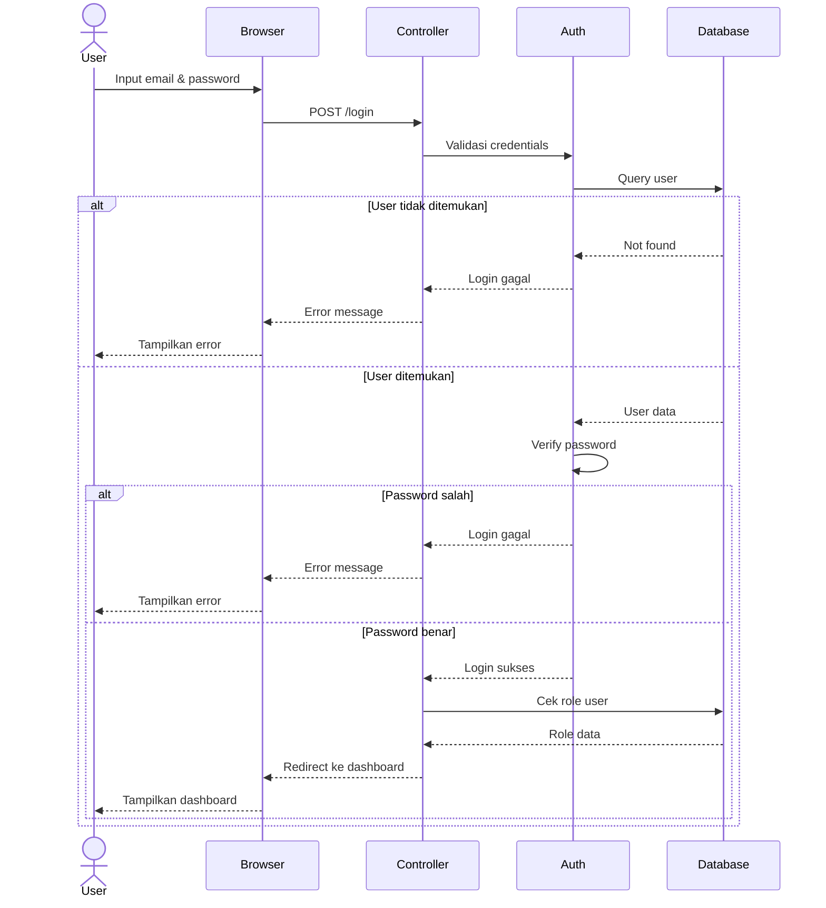
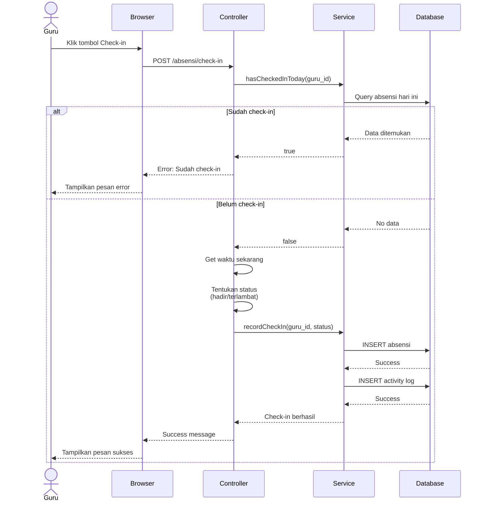
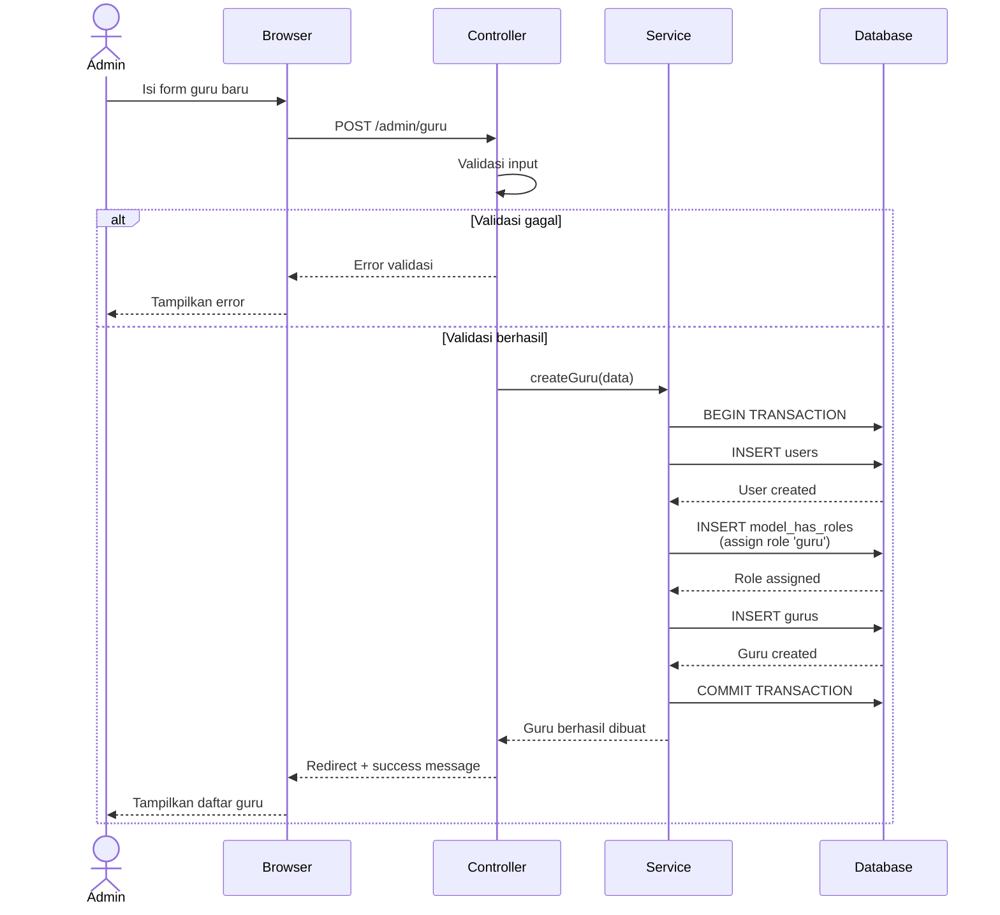
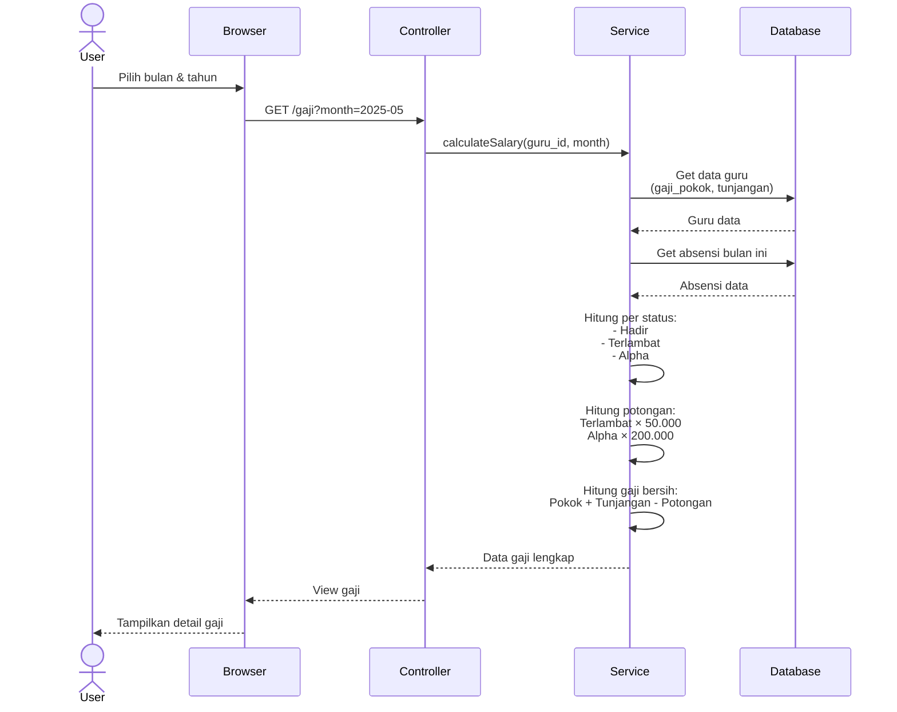
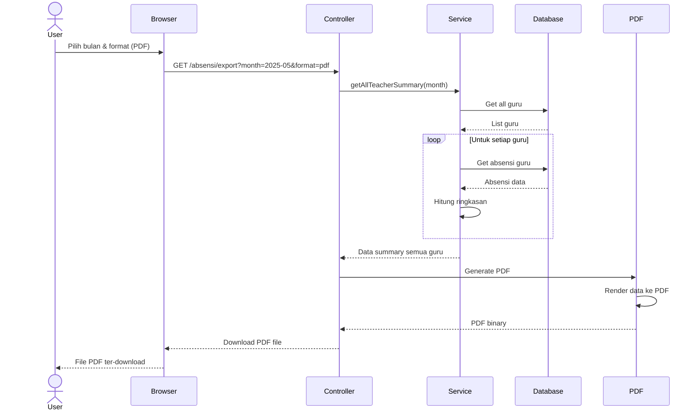
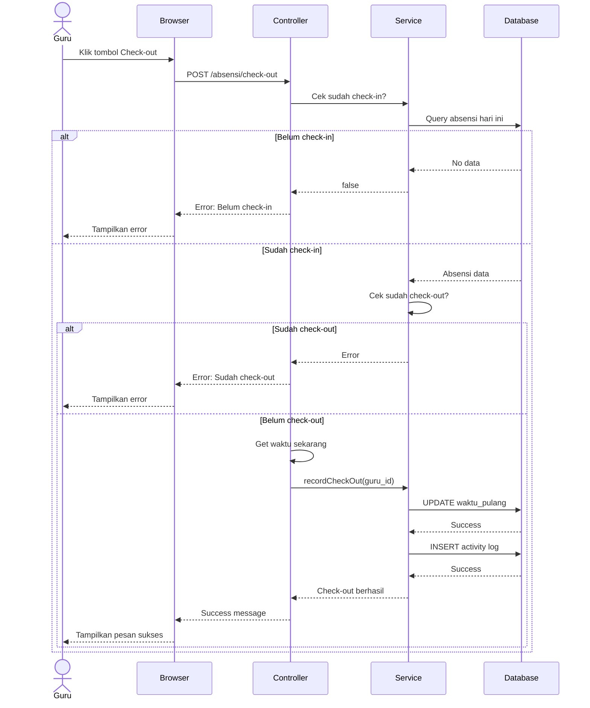
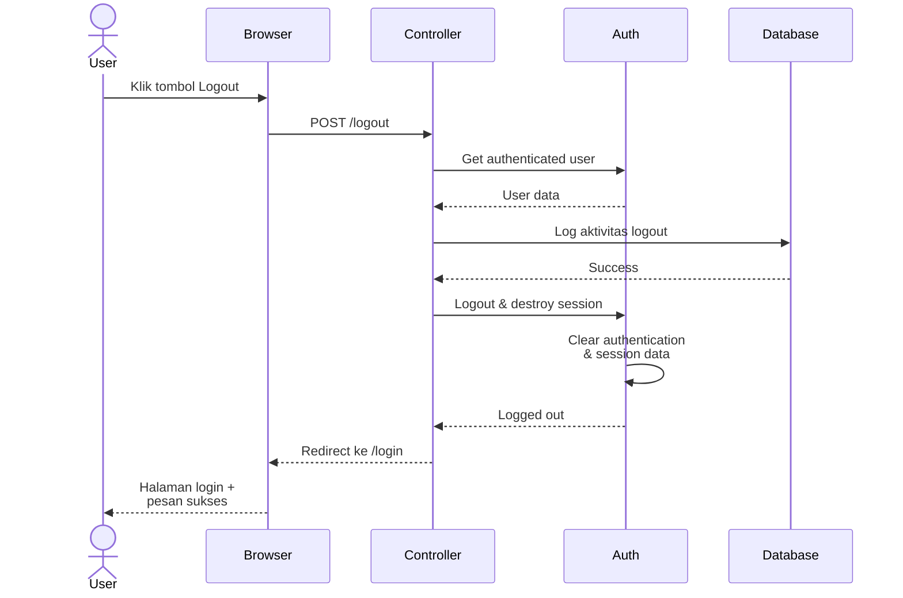
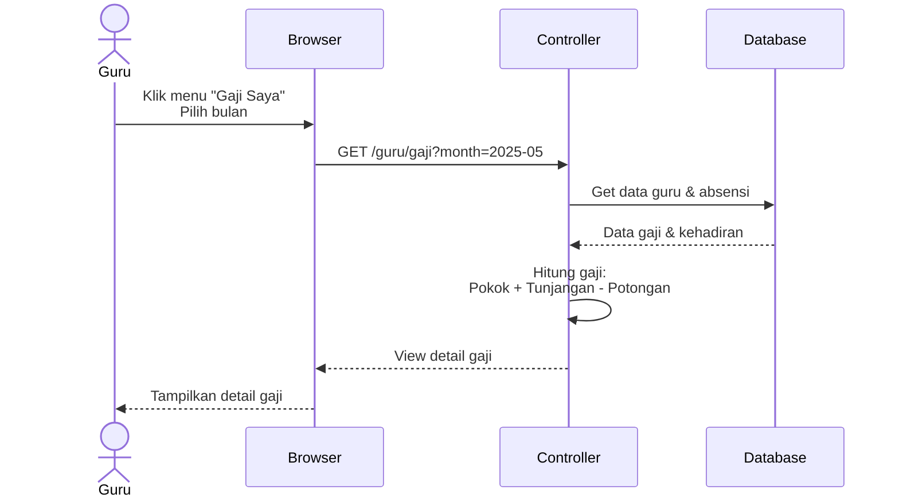
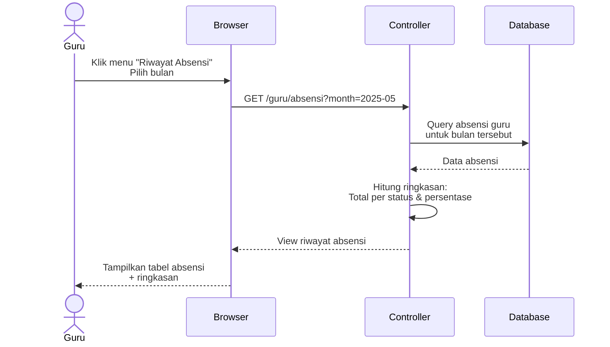
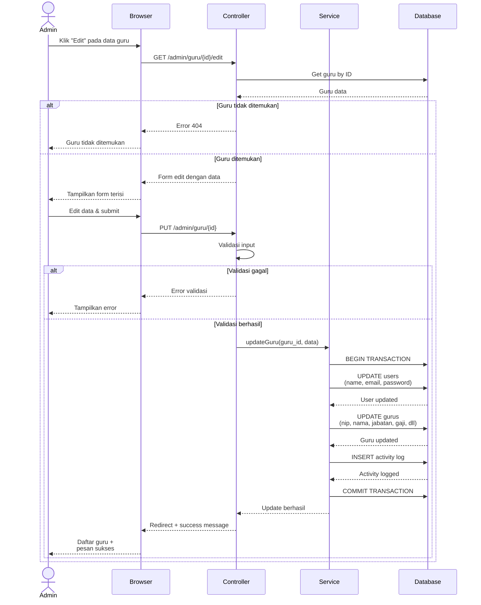

# Sequence Diagram Sistem E-Presensi (Versi Simple)

Dokumen ini berisi Sequence Diagram yang disederhanakan untuk sistem E-Presensi, cocok untuk dimasukkan ke dokumen Word/PDF skripsi.

---

## 1. Sequence Diagram: Login (Simple)



**Penjelasan:**
- User input email dan password di browser
- Browser kirim request ke Controller
- Controller minta Auth untuk validasi
- Auth query database untuk cek user
- Jika user tidak ada atau password salah → tampilkan error
- Jika berhasil → cek role dan redirect ke dashboard sesuai role

---

## 2. Sequence Diagram: Check-in Presensi (Simple)



**Penjelasan:**
- Guru klik tombol check-in
- Sistem cek apakah sudah check-in hari ini
- Jika sudah → tampilkan error
- Jika belum → ambil waktu sekarang, tentukan status (hadir jika < 08:00, terlambat jika >= 08:00)
- Simpan ke database dan log aktivitas
- Tampilkan pesan sukses

---

## 3. Sequence Diagram: Tambah Guru Baru (Simple)



**Penjelasan:**
- Admin isi form data guru baru dan submit
- Controller validasi input (NIP unique, email unique, dll)
- Jika gagal → tampilkan error
- Jika berhasil → Service mulai database transaction:
  1. Buat user account
  2. Assign role 'guru'
  3. Buat profil guru
- Commit transaction
- Redirect ke daftar guru dengan pesan sukses

---

## 4. Sequence Diagram: Perhitungan Gaji (Simple)



**Penjelasan:**
- User pilih bulan dan tahun untuk melihat gaji
- Controller minta Service untuk hitung gaji
- Service ambil data gaji pokok dan tunjangan dari database
- Service ambil data absensi bulan tersebut
- Hitung jumlah per status
- Hitung total potongan
- Hitung gaji bersih
- Tampilkan hasil ke user

---

## 5. Sequence Diagram: Export Laporan (Simple)



**Penjelasan:**
- User pilih bulan dan format export (PDF atau Excel)
- Controller minta Service untuk ambil summary semua guru
- Service loop untuk setiap guru:
  - Ambil data absensi
  - Hitung ringkasan (hadir, terlambat, alpha, gaji)
- Service return data lengkap ke Controller
- Controller generate PDF
- Return file PDF untuk di-download

---

## 6. Sequence Diagram: Check-out Presensi (Simple)



**Penjelasan:**
- Guru klik tombol check-out
- Sistem cek apakah sudah check-in (jika belum → error)
- Sistem cek apakah sudah check-out (jika sudah → error)
- Jika lolos validasi, ambil waktu sekarang
- Update database dengan waktu pulang
- Log aktivitas
- Tampilkan pesan sukses

---

## 7. Sequence Diagram: Logout (Simple)



**Penjelasan:**
- User (semua role) klik tombol logout
- Sistem log aktivitas logout ke database
- Sistem destroy session dan clear authentication
- Redirect ke halaman login dengan pesan sukses

---

## 8. Sequence Diagram: Lihat Gaji (Simple)



**Penjelasan:**
- Guru pilih bulan untuk melihat gaji
- Sistem ambil data gaji dan absensi dari database
- Sistem hitung gaji bersih (Pokok + Tunjangan - Potongan)
- Tampilkan detail gaji lengkap

---

## 9. Sequence Diagram: Lihat Absensi (Simple)



**Penjelasan:**
- Guru pilih bulan untuk melihat riwayat absensi
- Sistem query data absensi dari database
- Sistem hitung ringkasan (total per status dan persentase)
- Tampilkan tabel absensi dengan ringkasan kehadiran

---

## 10. Sequence Diagram: Update Data Guru (Simple)



**Penjelasan:**
- Admin klik tombol "Edit" pada data guru
- Sistem ambil data guru yang akan diedit
- Jika tidak ditemukan, tampilkan error 404
- Jika ditemukan, tampilkan form dengan data existing
- Admin edit data (semua field atau sebagian) dan submit
- Sistem validasi input (NIP unique, email unique, dll)
- Jika berhasil, mulai transaction:
  1. Update user account (name, email, password jika diubah)
  2. Update profil guru (NIP, jabatan, gaji, dll)
  3. Log aktivitas admin
- Commit transaction dan redirect dengan pesan sukses

---

## Perbandingan Versi Lengkap vs Simple

| Aspek | Versi Lengkap | Versi Simple |
|-------|---------------|--------------|
| **Participants** | 10+ komponen | 4-5 komponen utama |
| **Detail** | Sangat detail (middleware, validation, dll) | Fokus alur utama |
| **Ukuran** | Sangat tinggi/panjang | Lebih pendek |
| **Cocok untuk** | Dokumentasi teknis lengkap | Skripsi/presentasi |
| **Readability** | Kompleks | Mudah dipahami |

---

## Komponen yang Disederhanakan

### Yang Dihilangkan di Versi Simple:
- ❌ Middleware (Auth, Role, VerifyEmail)
- ❌ FormRequest validation detail
- ❌ Session management
- ❌ Event dispatcher
- ❌ Mail queue
- ❌ Multiple conditional branches yang terlalu detail

### Yang Dipertahankan:
- ✅ Actor (User/Admin/Guru)
- ✅ Browser/Frontend
- ✅ Controller
- ✅ Service (business logic)
- ✅ Database
- ✅ Alur utama proses
- ✅ Decision point penting

---

## Tips Export ke Word

### 1. Gunakan Width yang Tepat
```
Width: 1400-1600px (untuk versi simple)
Height: Auto
```

### 2. Layout di Word
- Orientation: **Portrait** untuk diagram vertikal
- Text wrapping: **In line with text**
- Size: Maksimal 15cm width (jangan terlalu kecil)

### 3. Caption Format
```
Gambar X.X. Sequence Diagram [Nama Proses]

Contoh:
Gambar 3.5. Sequence Diagram Proses Login
Gambar 3.6. Sequence Diagram Proses Check-in Presensi
```

### 4. Penjelasan
Setelah gambar, beri penjelasan 1-2 paragraf:
- Jelaskan participants yang terlibat
- Jelaskan alur komunikasi
- Jelaskan decision point (alt/else)

---

## Rekomendasi untuk Skripsi

### Pilih 3-4 Sequence Diagram Paling Penting:

1. **Sequence Diagram Login** ⭐⭐⭐ (Wajib)
   - Menunjukkan autentikasi sistem
   - Menunjukkan role-based redirect

2. **Sequence Diagram Check-in** ⭐⭐⭐ (Sangat Penting)
   - Proses inti sistem
   - Menunjukkan business logic (deteksi terlambat)

3. **Sequence Diagram Tambah Guru** ⭐⭐ (Penting)
   - Contoh proses CRUD
   - Menunjukkan database transaction

4. **Sequence Diagram Perhitungan Gaji** ⭐⭐ (Penting)
   - Menunjukkan business logic kompleks
   - Menunjukkan perhitungan

5. **Sequence Diagram Check-out** ⭐ (Opsional)
   - Mirip dengan check-in, bisa diskip

6. **Sequence Diagram Export** ⭐ (Opsional)
   - Menunjukkan fitur export
   - Bisa diskip jika sudah banyak diagram

---

## Struktur BAB III (Dengan Sequence Diagram)

### 3.1 Perancangan Hak Akses
- Gambar 3.1: Flowchart Perbandingan Akses Role

### 3.2 Perancangan Proses Bisnis
- Gambar 3.2: Activity Diagram Login
- Gambar 3.3: Activity Diagram Check-in

### 3.3 Perancangan Interaksi Sistem ← **Gunakan Sequence Diagram Simple di sini!**
- **Gambar 3.4**: Sequence Diagram Login ← **File ini (versi simple)**
- **Gambar 3.5**: Sequence Diagram Check-in ← **File ini (versi simple)**
- **Gambar 3.6**: Sequence Diagram Tambah Guru ← **File ini (versi simple)**
- **Gambar 3.7**: Sequence Diagram Perhitungan Gaji ← **File ini (versi simple)**

### 3.4 Perancangan Aliran Data
- Gambar 3.8: Context Diagram (DFD Level 0)
- Gambar 3.9: DFD Level 1

### 3.5 Perancangan Database
- Gambar 3.10: ERD

---

## Cara Export dari Mermaid Live

1. **Buka**: https://mermaid.live/
2. **Copy-paste** kode diagram dari file ini
3. **Atur Configuration**:
   ```
   Width: 1400px (untuk versi simple sudah cukup)
   Scale: 1.5 atau 2
   ```
4. **Export**: Actions → PNG Image
5. **Download** dan insert ke Word

---

## Penjelasan Notasi Sequence Diagram

### Simbol:
- `actor User` = Aktor (manusia)
- `participant Browser` = Komponen sistem
- `->>` = Synchronous message (request)
- `-->>` = Response message
- `alt/else/end` = Conditional (percabangan)
- `loop` = Perulangan

### Arti Panah:
- **Solid arrow** (`->>`) = Request/call
- **Dashed arrow** (`-->>`) = Return/response

---

## Kesimpulan

Sequence Diagram versi simple ini:
- ✅ Lebih ringkas dan mudah dipahami
- ✅ Fokus pada alur utama
- ✅ Cocok untuk dokumen skripsi
- ✅ Ukuran pas untuk halaman A4
- ✅ Tetap menunjukkan interaksi penting antar komponen

Gunakan versi ini untuk skripsi, dan versi lengkap (file `02-sequence-diagram.md`) sebagai referensi teknis jika diperlukan.
