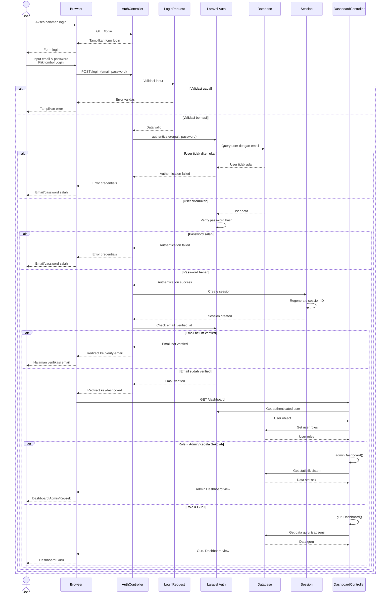
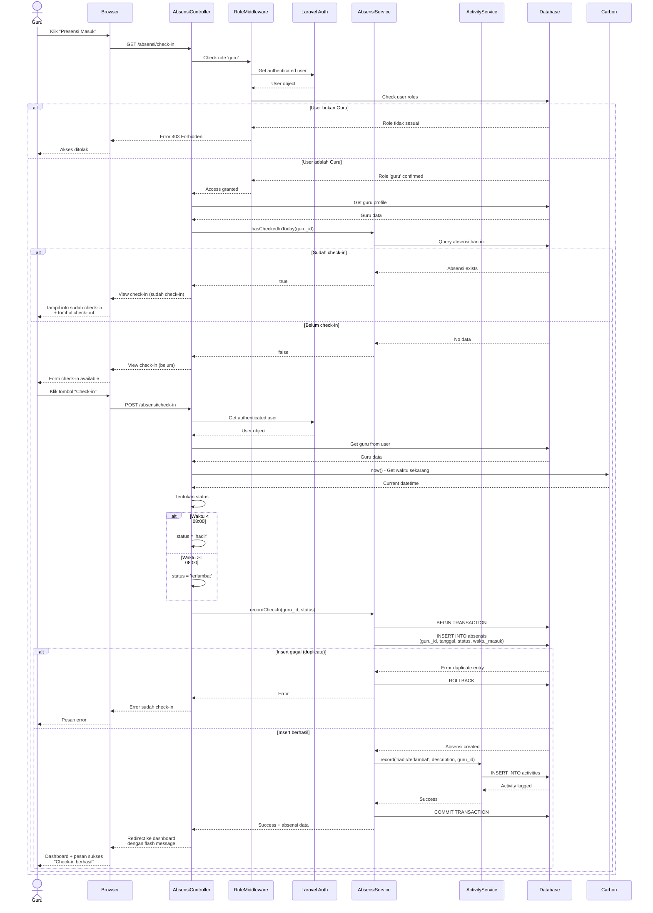
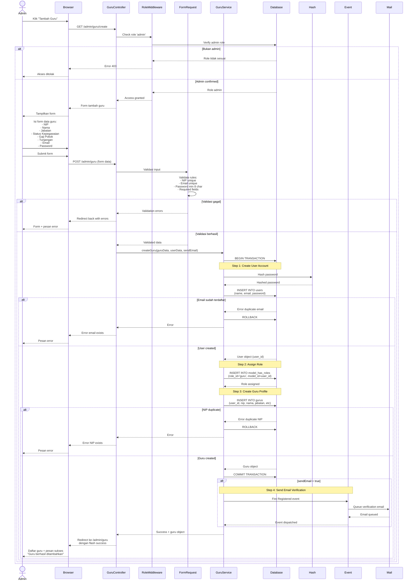
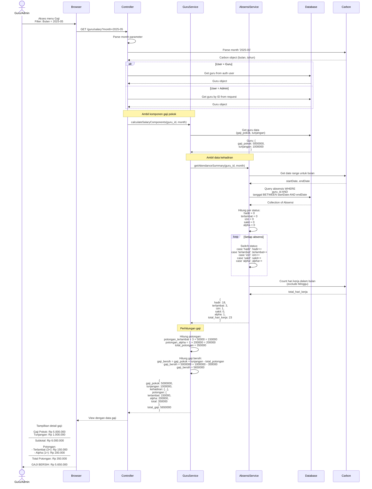
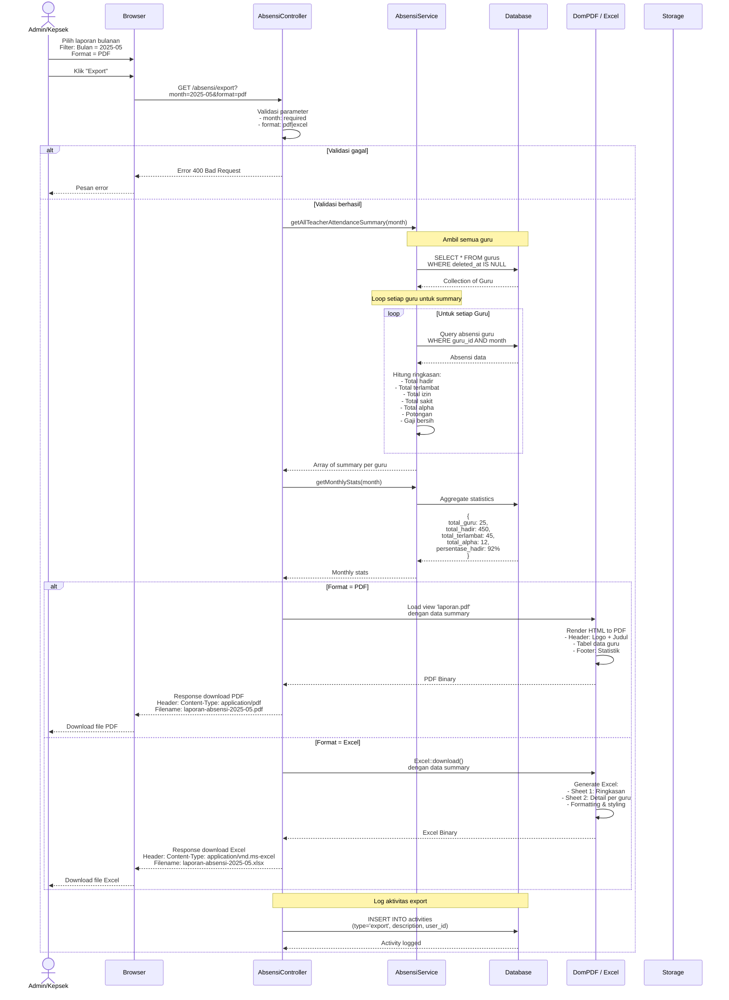
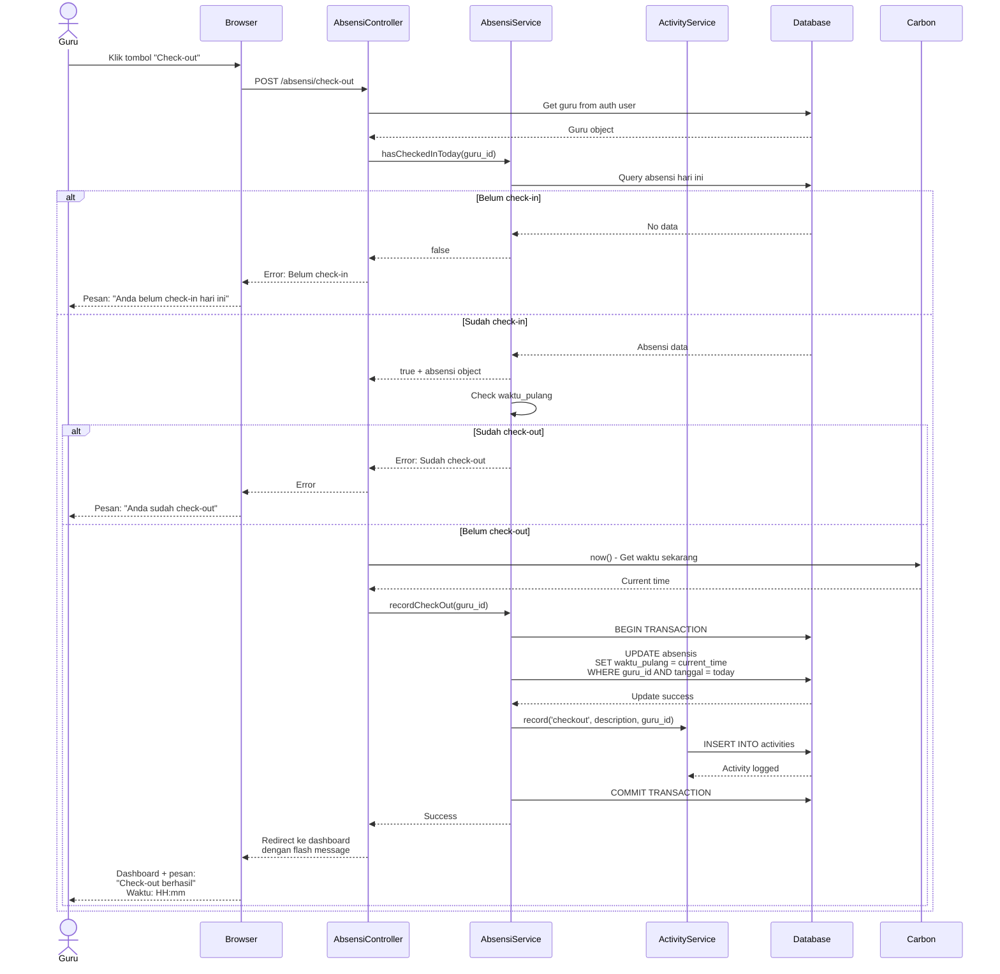
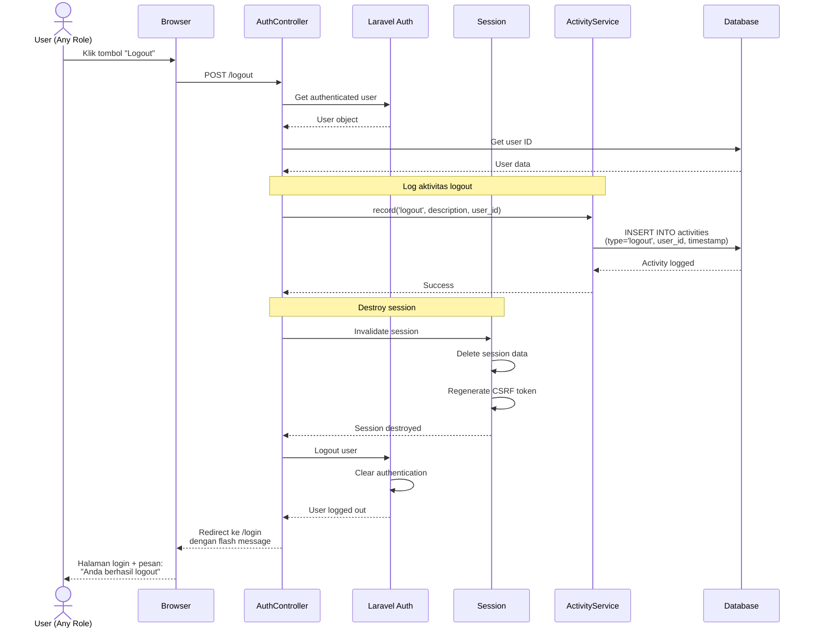
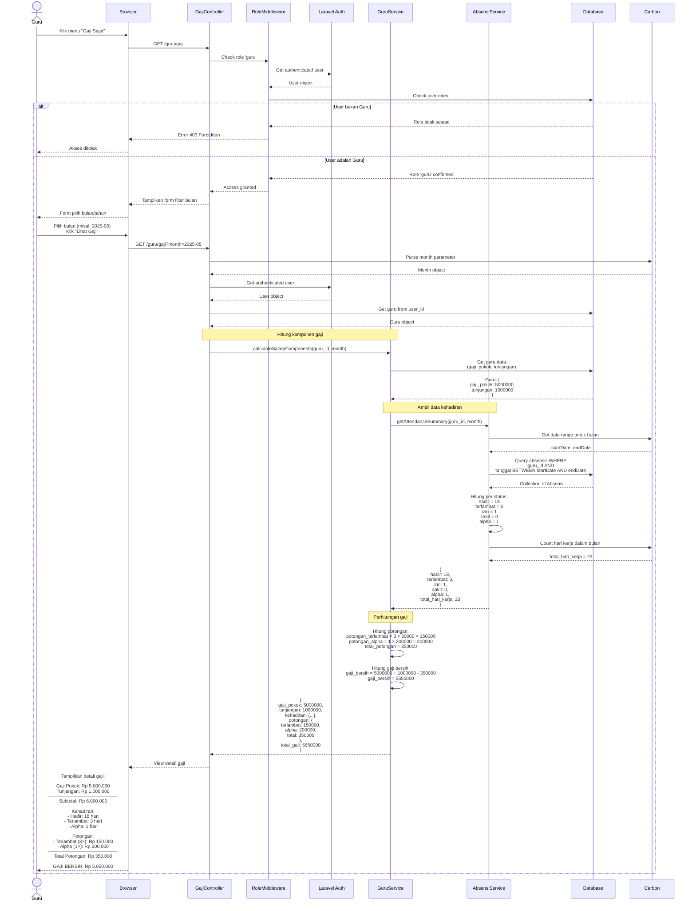
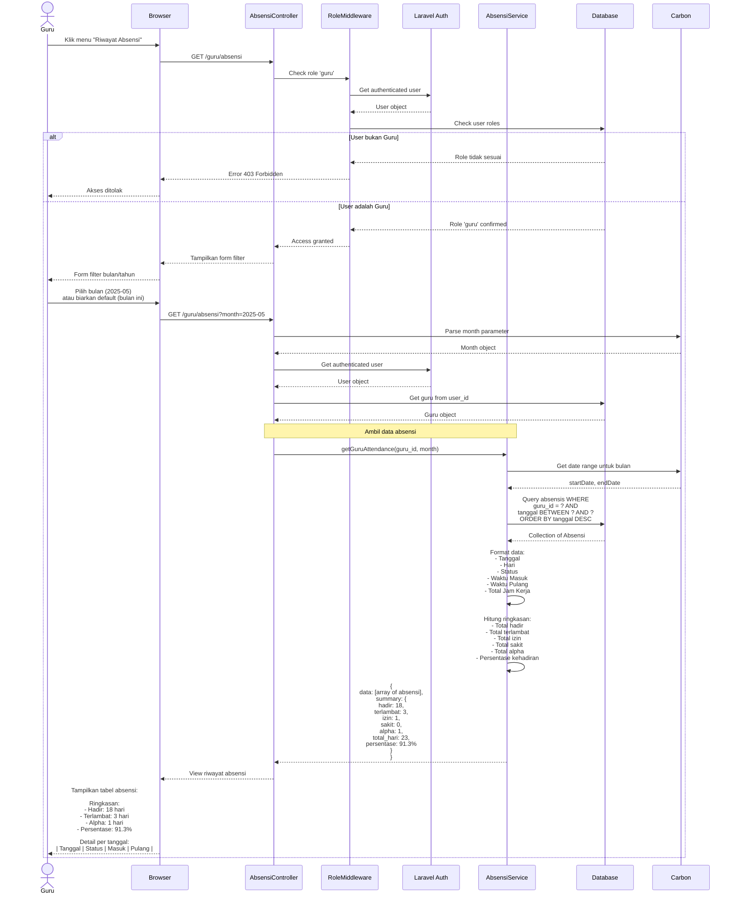
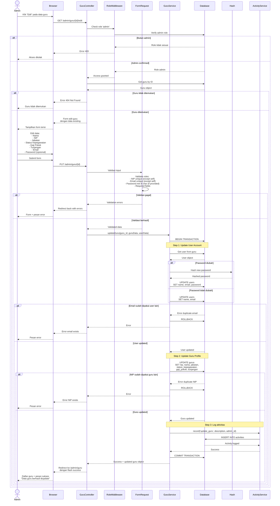

# Sequence Diagram Sistem E-Presensi

Dokumen ini berisi berbagai sequence diagram untuk proses-proses utama dalam sistem E-Presensi.

## 1. Sequence Diagram: Proses Login

---

## 2. Sequence Diagram: Proses Check-in Presensi (Guru)

---

## 3. Sequence Diagram: Proses Tambah Guru Baru (Admin)

---

## 4. Sequence Diagram: Proses Perhitungan Gaji Bulanan

---

## 5. Sequence Diagram: Proses Export Laporan (Admin/Kepala Sekolah)

---

## 6. Sequence Diagram: Proses Check-out Presensi (Guru)

## 7. Sequence Diagram: Proses Logout (Shared Activity)

**Penjelasan:**
- User dari role apapun (Admin/Guru/Kepsek) bisa logout
- Klik tombol logout
- Sistem log aktivitas logout terlebih dahulu
- Sistem destroy session dan clear authentication
- Regenerate CSRF token untuk keamanan
- Redirect ke halaman login dengan pesan sukses

---

## 8. Sequence Diagram: Proses Lihat Gaji (Guru Activity)

**Penjelasan:**
- Guru login dan klik menu "Gaji Saya"
- Middleware check role 'guru'
- Tampilkan form filter bulan/tahun
- Guru pilih bulan dan klik "Lihat Gaji"
- Sistem ambil data gaji pokok dan tunjangan dari tabel Guru
- Sistem ambil data absensi untuk bulan tersebut
- Hitung jumlah per status (hadir, terlambat, izin, sakit, alpha)
- Hitung total potongan: (Terlambat × 50.000) + (Alpha × 200.000)
- Hitung gaji bersih: Gaji Pokok + Tunjangan - Total Potongan
- Tampilkan detail gaji lengkap dengan breakdown

---

## 9. Sequence Diagram: Proses Lihat Absensi (Guru Activity)

**Penjelasan:**
- Guru login dan klik menu "Riwayat Absensi"
- Middleware check role 'guru'
- Tampilkan form filter bulan/tahun (default: bulan ini)
- Guru bisa memilih bulan lain atau menggunakan default
- Sistem ambil data absensi guru untuk bulan tersebut, diurutkan dari terbaru
- Format data dengan informasi lengkap (tanggal, status, waktu masuk/pulang, jam kerja)
- Hitung ringkasan kehadiran (total per status dan persentase)
- Tampilkan tabel riwayat absensi dengan ringkasan di atas

---

## 10. Sequence Diagram: Proses Update Data Guru (Admin Activity)

**Penjelasan:**
- Admin login dan klik tombol "Edit" pada data guru tertentu
- Middleware check role 'admin'
- Sistem ambil data guru yang akan diedit
- Jika tidak ditemukan, return error 404
- Jika ditemukan, tampilkan form edit dengan data existing
- Admin edit data yang ingin diubah (bisa semua field atau sebagian)
- Password bersifat opsional (jika tidak diisi, password lama tetap digunakan)
- Submit form dan validasi input
- Jika validasi gagal, kembali ke form dengan error
- Jika berhasil, mulai database transaction:
  1. Update user account (name, email, dan password jika diubah)
  2. Update profil guru (NIP, nama, jabatan, gaji, dll)
  3. Log aktivitas admin
- Commit transaction
- Redirect ke daftar guru dengan pesan sukses

---

## Penjelasan Komponen Sequence Diagram

### Aktor
- **User**: Pengguna umum yang belum login
- **Admin**: Administrator sistem dengan full access
- **Kepala Sekolah**: User dengan role kepala sekolah (read-only)
- **Guru**: User dengan role guru (self-service)

### Participants (Komponen Sistem)
1. **Browser**: Interface pengguna (frontend)
2. **Controller**: HTTP Controller (AbsensiController, GuruController, dll)
3. **Middleware**: RoleMiddleware, AuthMiddleware
4. **Service Layer**: GuruService, AbsensiService, ActivityService
5. **Database**: MySQL Database
6. **Auth**: Laravel Authentication System
7. **Session**: Session Manager
8. **Carbon**: Date/Time Library
9. **Hash**: Password Hashing
10. **Event**: Event Dispatcher
11. **Mail**: Email Service
12. **PDF/Excel**: Export Library

### Flow Pattern
Semua sequence diagram mengikuti pattern:
1. **Request** dari user
2. **Authentication & Authorization** check
3. **Validation** input data
4. **Business Logic** processing
5. **Database Transaction** (jika ada perubahan data)
6. **Response** ke user

### Error Handling
Setiap diagram menunjukkan alt/else untuk:
- Validasi gagal
- Authentication gagal
- Authorization ditolak
- Database constraint violation
- Business logic error
