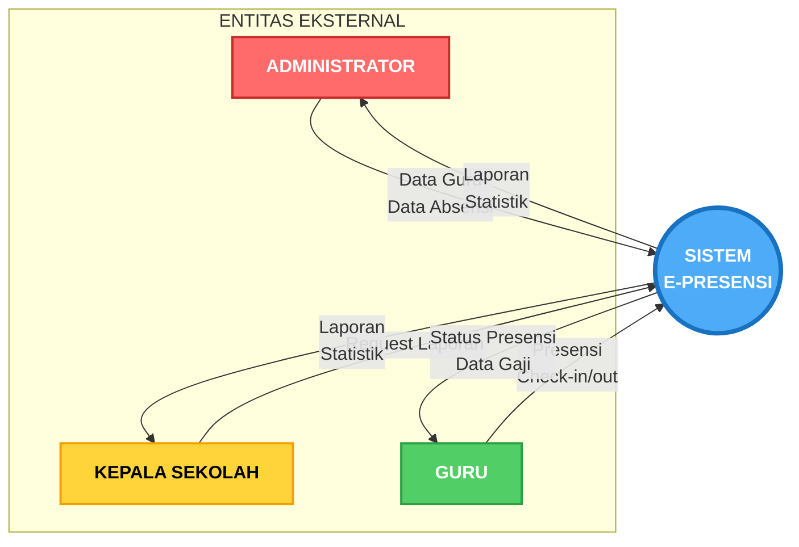
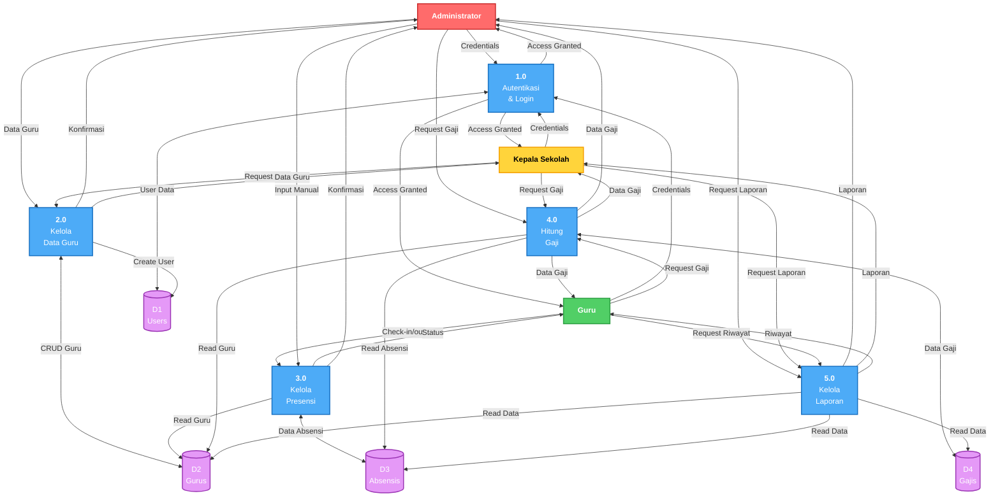
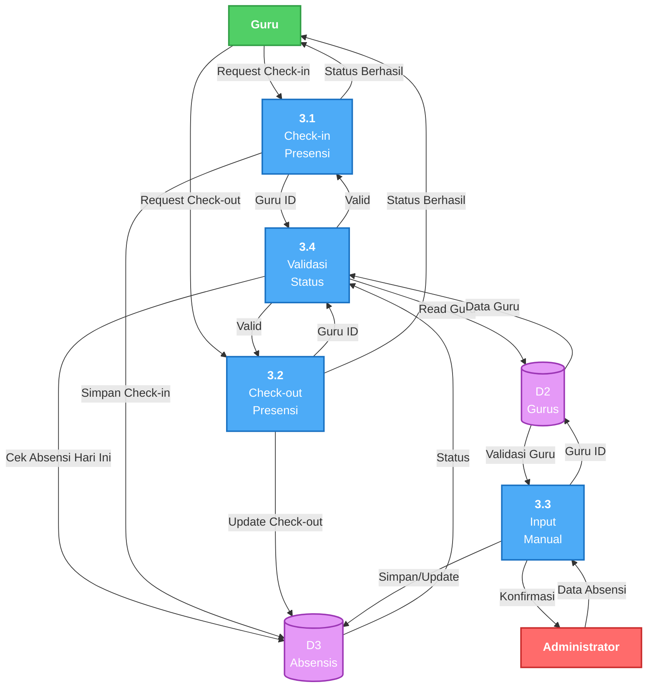
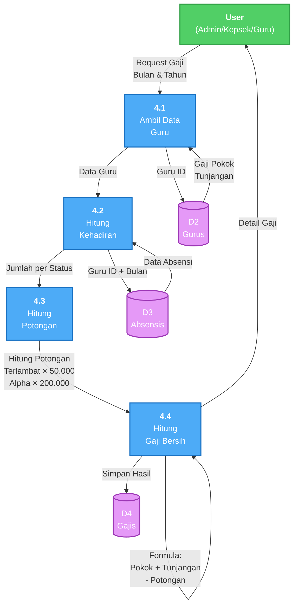

# Data Flow Diagram (DFD) Sistem E-Presensi (Versi Simple)

Dokumen ini berisi Data Flow Diagram yang disederhanakan untuk sistem E-Presensi, cocok untuk dokumen Word/PDF skripsi.

---

## 1. Context Diagram (DFD Level 0) - Simple



**Penjelasan:**
- **Entitas Eksternal**: Administrator, Kepala Sekolah, dan Guru
- **Sistem**: Sistem E-Presensi sebagai satu kesatuan
- **Data Flow In**: Data yang masuk ke sistem dari user
- **Data Flow Out**: Data yang keluar dari sistem ke user

**Input dari User:**
- Admin: Data guru, data absensi manual
- Kepala Sekolah: Request laporan
- Guru: Check-in/check-out presensi

**Output ke User:**
- Admin: Laporan lengkap, statistik sistem
- Kepala Sekolah: Laporan, statistik monitoring
- Guru: Status presensi, data gaji pribadi

---

## 2. DFD Level 1 - Simple



**Penjelasan:**

**Proses Utama (5 proses):**
1. **1.0 Autentikasi & Login** - Login dan verifikasi user
2. **2.0 Kelola Data Guru** - CRUD data guru
3. **3.0 Kelola Presensi** - Check-in/out dan input manual
4. **4.0 Hitung Gaji** - Kalkulasi gaji berdasarkan absensi
5. **5.0 Kelola Laporan** - Generate dan export laporan

**Data Store (4 tabel utama):**
- **D1: Users** - Data user untuk login
- **D2: Gurus** - Data profil guru
- **D3: Absensis** - Data presensi
- **D4: Gajis** - Data penggajian

---

## 3. DFD Level 2 - Proses 3.0 Kelola Presensi (Simple)



**Penjelasan:**

**Sub-proses Kelola Presensi:**
- **3.1 Check-in Presensi** - Guru melakukan check-in harian
- **3.2 Check-out Presensi** - Guru melakukan check-out
- **3.3 Input Manual** - Admin input absensi manual
- **3.4 Validasi Status** - Validasi status absensi (sudah check-in/belum, terlambat/tidak)

**Data Flow:**
- Guru request check-in → Validasi → Simpan ke D3
- Guru request check-out → Validasi → Update D3
- Admin input manual → Validasi guru di D2 → Simpan/Update D3

---

## 4. DFD Level 2 - Proses 4.0 Hitung Gaji (Simple)



**Penjelasan:**

**Sub-proses Hitung Gaji:**
- **4.1 Ambil Data Guru** - Ambil gaji pokok dan tunjangan dari D2
- **4.2 Hitung Kehadiran** - Hitung jumlah hadir, terlambat, alpha dari D3
- **4.3 Hitung Potongan** - Kalkulasi: (Terlambat × 50.000) + (Alpha × 200.000)
- **4.4 Hitung Gaji Bersih** - Formula: Gaji Pokok + Tunjangan - Potongan

**Data Flow:**
1. User request gaji dengan filter bulan/tahun
2. Ambil data gaji pokok dan tunjangan dari D2: Gurus
3. Ambil data absensi bulan tersebut dari D3: Absensis
4. Hitung jumlah per status (hadir, terlambat, alpha)
5. Hitung total potongan
6. Hitung gaji bersih
7. Simpan ke D4: Gajis (opsional)
8. Return detail gaji ke user

---

## 5. Kamus Data (Data Dictionary) - Simple

### Tabel: Users
| Field | Type | Deskripsi | Constraint |
|-------|------|-----------|-----------|
| id | integer | Primary key | PK |
| name | string | Nama user | NOT NULL |
| email | string | Email login | UNIQUE, NOT NULL |
| password | string | Password (hashed) | NOT NULL |

### Tabel: Gurus
| Field | Type | Deskripsi | Constraint |
|-------|------|-----------|-----------|
| id | integer | Primary key | PK |
| user_id | integer | Foreign key ke users | FK, UNIQUE |
| nip | string | Nomor Induk Pegawai | UNIQUE, NOT NULL |
| nama | string | Nama guru | NOT NULL |
| jabatan | string | Jabatan | NOT NULL |
| status_kepegawaian | enum | PNS/Honorer | NOT NULL |
| gaji_pokok | integer | Gaji pokok bulanan | NOT NULL |
| tunjangan | integer | Tunjangan | DEFAULT 0 |

### Tabel: Absensis
| Field | Type | Deskripsi | Constraint |
|-------|------|-----------|-----------|
| id | integer | Primary key | PK |
| guru_id | integer | Foreign key ke gurus | FK, NOT NULL |
| tanggal | date | Tanggal presensi | NOT NULL |
| status | enum | hadir/terlambat/izin/sakit/alpha | NOT NULL |
| waktu_masuk | time | Waktu check-in | NULLABLE |
| waktu_pulang | time | Waktu check-out | NULLABLE |

**Unique Constraint:** (guru_id, tanggal) - Satu guru hanya bisa absen 1× per hari

### Tabel: Gajis
| Field | Type | Deskripsi | Constraint |
|-------|------|-----------|-----------|
| id | integer | Primary key | PK |
| guru_id | integer | Foreign key ke gurus | FK, NOT NULL |
| bulan | integer | Bulan (1-12) | NOT NULL |
| tahun | integer | Tahun | NOT NULL |
| jumlah_hadir | integer | Total hari hadir | DEFAULT 0 |
| jumlah_alpha | integer | Total hari alpha | DEFAULT 0 |
| potongan | integer | Total potongan | DEFAULT 0 |
| total_gaji | integer | Gaji bersih | DEFAULT 0 |

---

## Perbandingan Versi Lengkap vs Simple

| Aspek | Versi Lengkap | Versi Simple |
|-------|---------------|--------------|
| **Jumlah Proses di Level 1** | 5 proses | 5 proses |
| **DFD Level 2** | 5 diagram detail | 2 diagram penting saja |
| **Data Store** | 6 tabel | 4 tabel utama |
| **Detail Data Flow** | Sangat detail | Fokus alur utama |
| **Ukuran Diagram** | Besar & kompleks | Ringkas & jelas |
| **Cocok untuk** | Dokumentasi lengkap | Skripsi/presentasi |

---

## Yang Disederhanakan

### Data Store yang Digabung/Dihilangkan:
- ❌ D5: Activities (log) - Dihilangkan untuk kesederhanaan
- ❌ D6: Roles & Permissions - Sudah implisit di Users

### DFD Level 2 yang Difokuskan:
- ✅ **Proses 3.0 (Kelola Presensi)** - Proses inti sistem
- ✅ **Proses 4.0 (Hitung Gaji)** - Business logic penting
- ❌ Proses 1.0 (Autentikasi) - Terlalu teknis
- ❌ Proses 2.0 (Kelola Guru) - Standar CRUD
- ❌ Proses 5.0 (Laporan) - Mirip dengan yang lain

### Detail yang Disederhanakan:
- Hanya flow utama, tidak semua edge case
- Tidak ada sub-sub proses yang terlalu detail
- Fokus pada data flow utama

---

## Tips Export ke Word

### 1. Ukuran Optimal per Diagram:

**Context Diagram (Level 0):**
- Width: 1200px
- Simpel dan kecil, cocok untuk opening

**DFD Level 1:**
- Width: 1800-2000px
- Yang paling besar, butuh space

**DFD Level 2:**
- Width: 1600px
- Medium size

### 2. Layout di Word:

**Context Diagram:**
- Bisa center, ukuran 10-12cm

**DFD Level 1:**
- Full width (15-16cm)
- Atau gunakan landscape orientation

**DFD Level 2:**
- Medium (12-14cm)

### 3. Caption Format:
```
Gambar 3.X. Context Diagram Sistem E-Presensi
Gambar 3.Y. DFD Level 1 Sistem E-Presensi
Gambar 3.Z. DFD Level 2 Proses 3.0 Kelola Presensi
```

---

## Rekomendasi untuk Skripsi

### Diagram Wajib (3 diagram):

1. ⭐⭐⭐ **Context Diagram** (Level 0)
   - Gambaran besar sistem
   - Interaksi dengan entitas eksternal
   - Simple dan mudah dipahami

2. ⭐⭐⭐ **DFD Level 1**
   - Proses utama sistem (5 proses)
   - Aliran data antar proses
   - Data store yang digunakan

3. ⭐⭐ **DFD Level 2 - Proses 3.0 (Kelola Presensi)**
   - Detail proses inti sistem
   - Menunjukkan sub-proses
   - Contoh dekomposisi

### Diagram Opsional:

4. ⭐ **DFD Level 2 - Proses 4.0 (Hitung Gaji)**
   - Jika ingin menunjukkan business logic
   - Bisa diganti dengan flowchart/activity diagram

---

## Struktur BAB III dengan DFD Simple

### 3.1 Perancangan Hak Akses
- Gambar 3.1: Flowchart Perbandingan Akses Role

### 3.2 Perancangan Proses Bisnis
- Gambar 3.2: Activity Diagram Login
- Gambar 3.3: Activity Diagram Check-in

### 3.3 Perancangan Interaksi Sistem
- Gambar 3.4: Sequence Diagram Login
- Gambar 3.5: Sequence Diagram Check-in

### 3.4 Perancangan Aliran Data ← **Gunakan DFD Simple di sini!**
- **Gambar 3.6**: Context Diagram ← **File ini (versi simple)** ⭐
- **Gambar 3.7**: DFD Level 1 ← **File ini (versi simple)** ⭐
- **Gambar 3.8**: DFD Level 2 Proses 3.0 ← **File ini (versi simple)** ⭐
- **Tabel 3.1**: Kamus Data ← **File ini**

### 3.5 Perancangan Database
- Gambar 3.9: ERD

---

## Penjelasan Notasi DFD

### Simbol:
- **Lingkaran/Oval** = Proses
- **Persegi** = Entitas Eksternal
- **Garis dengan panah** = Data Flow
- **Silinder** = Data Store

### Penomoran:
- **Level 0**: Sistem sebagai 1 proses
- **Level 1**: Proses nomor bulat (1.0, 2.0, 3.0, ...)
- **Level 2**: Proses nomor desimal (3.1, 3.2, 3.3, ...)

---

## Kesimpulan

DFD versi simple ini:
- ✅ Lebih ringkas dan fokus
- ✅ Hanya 3 diagram utama (Context, Level 1, Level 2)
- ✅ Data store hanya 4 tabel utama
- ✅ Cocok untuk skripsi dengan space terbatas
- ✅ Tetap menunjukkan aliran data yang penting
- ✅ Dilengkapi kamus data simple

Gunakan versi ini untuk skripsi, dan versi lengkap (file `03-data-flow-diagram.md`) sebagai referensi jika butuh detail lebih lengkap.
