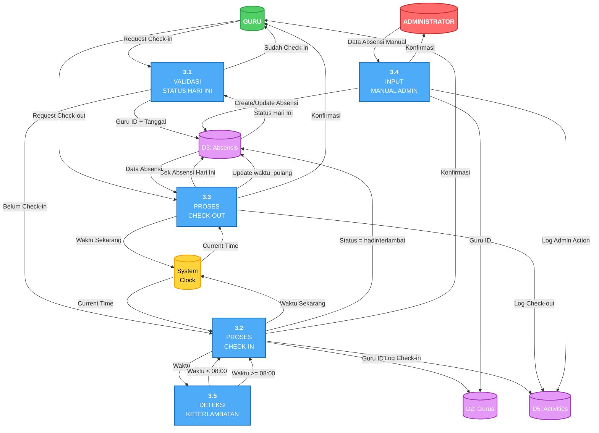

# Data Flow Diagram (DFD) Sistem E-Presensi

Dokumen ini berisi Data Flow Diagram untuk sistem E-Presensi, mulai dari Context Diagram (Level 0), DFD Level 1, hingga DFD Level 2 untuk proses-proses kritis.

## 1. Context Diagram (DFD Level 0)

Context Diagram menunjukkan sistem secara keseluruhan dan interaksi dengan entitas eksternal.

### Penjelasan Context Diagram

**Entitas Eksternal:**
1. **Administrator**: Mengelola seluruh sistem, input data, dan monitoring
2. **Kepala Sekolah**: Monitoring dan evaluasi kehadiran (read-only)
3. **Guru**: Melakukan presensi dan melihat data pribadi

**Data Flow:**
- **Input ke Sistem**: Data guru, absensi, credentials, request data
- **Output dari Sistem**: Laporan, statistik, status presensi, detail gaji

---

## 2. DFD Level 1 - Dekomposisi Sistem

DFD Level 1 memecah sistem menjadi proses-proses utama.

### Penjelasan DFD Level 1

**Proses Utama:**
1. **1.0 Autentikasi & Autorisasi**: Login, verifikasi role, session management
2. **2.0 Manajemen Data Guru**: CRUD data guru oleh admin
3. **3.0 Presensi Harian**: Check-in/check-out guru dan input manual admin
4. **4.0 Perhitungan Gaji**: Kalkulasi gaji berdasarkan kehadiran dan potongan
5. **5.0 Pelaporan & Export**: Generate laporan dan export data

**Data Stores:**
- **D1: Users**: Tabel users untuk autentikasi
- **D2: Gurus**: Tabel gurus dengan profil lengkap
- **D3: Absensis**: Tabel absensis untuk record presensi
- **D4: Gajis**: Tabel gajis untuk data penggajian
- **D5: Activities**: Tabel activities untuk log aktivitas
- **D6: Roles & Permissions**: Tabel role dan permission (Spatie)

---

## 3. DFD Level 2 - Proses 1.0 (Autentikasi & Autorisasi)

---

## 4. DFD Level 2 - Proses 2.0 (Manajemen Data Guru)

---

## 5. DFD Level 2 - Proses 3.0 (Presensi Harian)

---

## 6. DFD Level 2 - Proses 4.0 (Perhitungan Gaji)

---

## 7. DFD Level 2 - Proses 5.0 (Pelaporan & Export)

---

## Kamus Data (Data Dictionary)

### Data Flow Descriptions

| No | Data Flow | Deskripsi | Komposisi Data |
|----|-----------|-----------|----------------|
| 1 | Credentials | Data login user | email + password |
| 2 | Data Guru Baru | Data untuk membuat guru baru | nip + nama + jabatan + status_kepegawaian + gaji_pokok + tunjangan + email + password |
| 3 | Update Guru | Data untuk update guru | [field yang diupdate] |
| 4 | Check-in/Check-out | Request presensi | guru_id + timestamp |
| 5 | Absensi Manual | Input manual oleh admin | guru_id + tanggal + status + waktu_masuk + waktu_pulang |
| 6 | Request Gaji | Request perhitungan gaji | guru_id + bulan + tahun |
| 7 | Detail Gaji | Detail perhitungan gaji | gaji_pokok + tunjangan + kehadiran + potongan + total_gaji |
| 8 | Request Laporan | Request laporan dengan filter | tanggal/bulan + format (PDF/Excel) |
| 9 | Laporan PDF/Excel | File laporan yang dihasilkan | Binary file (PDF/XLSX) |
| 10 | Riwayat Pribadi | Riwayat absensi guru | List(tanggal + status + waktu_masuk + waktu_pulang) |
| 11 | Session Valid | Session authentication | user_id + roles + session_token |
| 12 | Status Presensi | Status presensi hari ini | sudah_checkin (boolean) + waktu_masuk + waktu_pulang |
| 13 | Log Activity | Log aktivitas sistem | type + description + user_id + guru_id + data (JSON) |

### Data Store Descriptions

| Data Store | Nama Tabel | Deskripsi | Primary Key | Foreign Keys |
|------------|------------|-----------|-------------|--------------|
| D1 | users | Data akun pengguna | id | - |
| D2 | gurus | Data profil guru | id | user_id → users(id) |
| D3 | absensis | Data presensi harian | id | guru_id → gurus(id) |
| D4 | gajis | Data penggajian bulanan | id | guru_id → gurus(id) |
| D5 | activities | Log aktivitas sistem | id | user_id → users(id) guru_id → gurus(id) |
| D6 | roles, permissions, model_has_roles | Data role & permission | id | - |

### Process Descriptions

| Process | Nama Proses | Deskripsi | Input | Output |
|---------|-------------|-----------|-------|--------|
| 1.0 | Autentikasi & Autorisasi | Proses login dan verifikasi akses | Credentials | Session Valid |
| 2.0 | Manajemen Data Guru | CRUD data guru | Data Guru | Konfirmasi |
| 3.0 | Presensi Harian | Check-in/out dan input manual | Request Presensi | Status Presensi |
| 4.0 | Perhitungan Gaji | Kalkulasi gaji berdasarkan kehadiran | Request Gaji | Detail Gaji |
| 5.0 | Pelaporan & Export | Generate dan export laporan | Request Laporan | File Laporan |

---

## Catatan Penting untuk Skripsi

### Penjelasan Aliran Data

1. **Autentikasi (DFD 1.0):**
   - User memasukkan credentials
   - Sistem verifikasi dengan database users
   - Cek email verification
   - Cek role dari tabel roles
   - Buat session
   - Redirect sesuai role

2. **Manajemen Guru (DFD 2.0):**
   - Admin input data guru dan user
   - Sistem buat user account terlebih dahulu
   - Assign role 'guru' menggunakan Spatie Permission
   - Buat profil guru dengan foreign key ke user
   - Log semua aktivitas

3. **Presensi (DFD 3.0):**
   - Guru request check-in
   - Sistem ambil waktu dari system clock
   - Deteksi keterlambatan (>= 08:00)
   - Simpan ke database dengan status sesuai
   - Log aktivitas presensi

4. **Perhitungan Gaji (DFD 4.0):**
   - Request gaji dengan guru_id dan bulan
   - Ambil data gaji pokok dari tabel gurus
   - Hitung kehadiran dari tabel absensis
   - Hitung potongan sesuai aturan bisnis
   - Return total gaji bersih

5. **Pelaporan (DFD 5.0):**
   - Request laporan dengan filter
   - Aggregate data dari multiple tables
   - Generate file sesuai format (PDF/Excel)
   - Log aktivitas export

### Validasi DFD

✅ **Balancing**: Setiap dekomposisi level memiliki input/output yang sama
✅ **Konsistensi**: Naming conventions konsisten di semua level
✅ **Completeness**: Semua proses, data store, dan data flow terdokumentasi
✅ **Numbering**: Sistem penomoran hierarkis (1.0, 1.1, 1.2, dst)
