# Class Diagram Sistem E-Presensi

Dokumen ini berisi Class Diagram lengkap untuk sistem E-Presensi, menunjukkan struktur class, atribut, method, dan relasi antar class.

## 1. Class Diagram Lengkap

```mermaid
classDiagram
    %% ========================================
    %% MODEL CLASSES
    %% ========================================

    class User {
        <<Model>>
        +int id
        +string name
        +string email
        +timestamp email_verified_at
        +string password
        +string remember_token
        +timestamp created_at
        +timestamp updated_at
        +timestamp deleted_at

        +hasRole(role: string) bool
        +assignRole(role: string) void
        +removeRole(role: string) void
        +getRoleNames() Collection
        +hasPermissionTo(permission: string) bool
        +guru() BelongsTo
        +activities() HasMany
    }

    class Guru {
        <<Model>>
        +int id
        +int user_id
        +string nip
        +string nama
        +string jabatan
        +enum status_kepegawaian
        +int gaji_pokok
        +int tunjangan
        +timestamp created_at
        +timestamp updated_at
        +timestamp deleted_at

        +user() BelongsTo
        +absensis() HasMany
        +gajis() HasMany
        +activities() HasMany
        +getGajiBersih(month: string) int
        +getTotalPotongan(month: string) int
    }

    class Absensi {
        <<Model>>
        +int id
        +int guru_id
        +date tanggal
        +enum status
        +time waktu_masuk
        +time waktu_pulang
        +timestamp created_at
        +timestamp updated_at
        +timestamp deleted_at

        +guru() BelongsTo
        +isTerlambat() bool
        +getPotongan() int
        +getDurasi() int
        +scopeHariIni(query) Builder
        +scopeBulanIni(query) Builder
    }

    class Gaji {
        <<Model>>
        +int id
        +int guru_id
        +int bulan
        +int tahun
        +int jumlah_hadir
        +int jumlah_alpha
        +int potongan
        +int total_gaji
        +date tanggal_dibayarkan
        +timestamp created_at
        +timestamp updated_at
        +timestamp deleted_at

        +guru() BelongsTo
        +hitungGajiBersih() int
        +hitungPotongan() int
        +scopePeriode(query, bulan, tahun) Builder
    }

    class Activity {
        <<Model>>
        +int id
        +int user_id
        +int guru_id
        +string type
        +text description
        +json data
        +timestamp created_at
        +timestamp updated_at

        +user() BelongsTo
        +guru() BelongsTo
        +scopeRecent(query, limit) Builder
        +scopeByType(query, type) Builder
        +scopeToday(query) Builder
    }

    class Role {
        <<Spatie Model>>
        +int id
        +string name
        +string guard_name
        +timestamp created_at
        +timestamp updated_at

        +permissions() BelongsToMany
        +users() BelongsToMany
        +givePermissionTo(permission) void
        +revokePermissionTo(permission) void
    }

    class Permission {
        <<Spatie Model>>
        +int id
        +string name
        +string guard_name
        +timestamp created_at
        +timestamp updated_at

        +roles() BelongsToMany
        +users() BelongsToMany
    }

    %% ========================================
    %% CONTROLLER CLASSES
    %% ========================================

    class DashboardController {
        <<Controller>>
        -absensiService: AbsensiService
        -activityService: ActivityService

        +index(Request) View
        -adminDashboard() View
        -guruDashboard() View
        -getWeeklyStats() array
    }

    class GuruController {
        <<Controller>>
        -guruService: GuruService

        +index(Request) View
        +create() View
        +store(Request) RedirectResponse
        +show(id: int) View
        +edit(id: int) View
        +update(Request, id: int) RedirectResponse
        +destroy(id: int) RedirectResponse
        +showProfile() View
        +showMySalary(Request) View
        +showMyAttendance(Request) View
        +showSalaryDetails(id: int, Request) View
    }

    class AbsensiController {
        <<Controller>>
        -absensiService: AbsensiService
        -activityService: ActivityService

        +dashboard() View
        +daily(Request) View
        +monthly(Request) View
        +recordManual(Request) RedirectResponse
        +export(Request) Response
        +checkInForm() View
        +checkIn(Request) RedirectResponse
        +checkOut(Request) RedirectResponse
        +history(Request) View
    }

    class AuthenticatedSessionController {
        <<Controller>>
        +create() View
        +store(LoginRequest) RedirectResponse
        +destroy(Request) RedirectResponse
    }

    class ProfileController {
        <<Controller>>
        +edit(Request) View
        +update(ProfileUpdateRequest) RedirectResponse
        +destroy(Request) RedirectResponse
    }

    %% ========================================
    %% SERVICE CLASSES
    %% ========================================

    class GuruService {
        <<Service>>
        -guruRepository: Guru
        -userRepository: User

        +getAllGuru(perPage: int, filters: array) LengthAwarePaginator
        +getGuruById(id: int) Guru
        +getGuruByNip(nip: string) Guru
        +createGuru(guruData: array, userData: array, sendEmail: bool) Guru
        +updateGuru(id: int, guruData: array, userData: array) Guru
        +deleteGuru(id: int) bool
        +getGuruStatistics() array
        +calculateSalaryComponents(guruId: int, month: string) array
        -validateNipUnique(nip: string, excludeId: int) bool
    }

    class AbsensiService {
        <<Service>>
        -absensiRepository: Absensi
        -guruRepository: Guru

        +catatAbsensi(guru: Guru, data: array) Absensi
        +getAbsensiByGuruAndMonth(guruId: int, month: string) Collection
        +getAbsensiByGuru(guruId: int, filters: array) Collection
        +getAttendanceSummary(guruId: int, month: string) array
        +getAllTeacherAttendanceSummary(month: string) array
        +getDailyAttendance(date: string) Collection
        +getTodayAttendance() Collection
        +hasCheckedInToday(guruId: int) bool
        +recordCheckIn(guruId: int, status: string) Absensi
        +recordCheckOut(guruId: int) Absensi
        +getAttendanceStats() array
        +getMonthlyStats(month: string) array
        +getWeeklyAttendanceStats() array
        -calculateWorkingDays(month: string) int
        -determineStatus(waktuMasuk: Carbon) string
    }

    class ActivityService {
        <<Service>>
        -activityRepository: Activity

        +record(type: string, description: string, guruId: int, userId: int, data: array) Activity
        +getRecent(limit: int) Collection
        +getTeacherActivities(guruId: int, limit: int) Collection
        +getTodayActivities() Collection
        +getByType(type: string) Collection
        +deleteOldActivities(days: int) int
    }

    class GajiService {
        <<Service>>
        -gajiRepository: Gaji
        -absensiService: AbsensiService

        +calculateGaji(guruId: int, bulan: int, tahun: int) array
        +saveGaji(guruId: int, bulan: int, tahun: int) Gaji
        +getGajiByPeriode(guruId: int, bulan: int, tahun: int) Gaji
        +updateTanggalBayar(gajiId: int, tanggal: date) Gaji
        -hitungPotongan(absensiData: array) int
    }

    %% ========================================
    %% MIDDLEWARE CLASSES
    %% ========================================

    class RoleMiddleware {
        <<Middleware>>
        +handle(Request, Closure, roles: string) Response
        -checkRole(user: User, roles: array) bool
    }

    class Authenticate {
        <<Middleware>>
        +handle(Request, Closure) Response
        -redirectTo(Request) string
    }

    class VerifyEmail {
        <<Middleware>>
        +handle(Request, Closure) Response
    }

    %% ========================================
    %% REQUEST CLASSES
    %% ========================================

    class LoginRequest {
        <<FormRequest>>
        +authorize() bool
        +rules() array
        +authenticate() void
        +ensureIsNotRateLimited() void
    }

    class ProfileUpdateRequest {
        <<FormRequest>>
        +authorize() bool
        +rules() array
    }

    class StoreGuruRequest {
        <<FormRequest>>
        +authorize() bool
        +rules() array
        +messages() array
    }

    class UpdateGuruRequest {
        <<FormRequest>>
        +authorize() bool
        +rules() array
        +messages() array
    }

    %% ========================================
    %% RELATIONSHIPS - Models
    %% ========================================

    User "1" --> "0..1" Guru : has
    User "1" --> "0..*" Activity : has
    User "0..*" --> "0..*" Role : has
    Role "0..*" --> "0..*" Permission : has

    Guru "1" --> "1" User : belongs to
    Guru "1" --> "0..*" Absensi : has
    Guru "1" --> "0..*" Gaji : has
    Guru "1" --> "0..*" Activity : has

    Absensi "0..*" --> "1" Guru : belongs to

    Gaji "0..*" --> "1" Guru : belongs to

    Activity "0..*" --> "0..1" User : belongs to
    Activity "0..*" --> "0..1" Guru : belongs to

    %% ========================================
    %% RELATIONSHIPS - Dependencies
    %% ========================================

    DashboardController ..> AbsensiService : uses
    DashboardController ..> ActivityService : uses
    DashboardController ..> Guru : uses

    GuruController ..> GuruService : uses
    GuruController ..> Guru : uses

    AbsensiController ..> AbsensiService : uses
    AbsensiController ..> ActivityService : uses
    AbsensiController ..> Absensi : uses

    AuthenticatedSessionController ..> LoginRequest : uses
    AuthenticatedSessionController ..> User : uses

    ProfileController ..> ProfileUpdateRequest : uses
    ProfileController ..> User : uses

    GuruService ..> Guru : manages
    GuruService ..> User : manages
    GuruService ..> AbsensiService : uses

    AbsensiService ..> Absensi : manages
    AbsensiService ..> Guru : uses
    AbsensiService ..> ActivityService : uses

    ActivityService ..> Activity : manages

    GajiService ..> Gaji : manages
    GajiService ..> AbsensiService : uses

    RoleMiddleware ..> User : checks
    RoleMiddleware ..> Role : checks

    %% ========================================
    %% STYLING
    %% ========================================

    style User fill:#ff6b6b,stroke:#c92a2a,color:#fff
    style Guru fill:#4dabf7,stroke:#1971c2,color:#fff
    style Absensi fill:#51cf66,stroke:#2f9e44,color:#fff
    style Gaji fill:#ffd43b,stroke:#f59f00,color:#000
    style Activity fill:#e599f7,stroke:#9c36b5,color:#fff
    style Role fill:#868e96,stroke:#495057,color:#fff
    style Permission fill:#868e96,stroke:#495057,color:#fff
```



---

## 2. Penjelasan Detail Class Diagram

### A. Model Classes (Eloquent ORM)

#### 1. **Class User**
**Deskripsi:** Model utama untuk autentikasi dan manajemen user.

**Atribut:**
- `id`: Primary key
- `name`: Nama lengkap user
- `email`: Email untuk login (unique)
- `password`: Password yang di-hash
- `email_verified_at`: Timestamp verifikasi email
- `remember_token`: Token untuk "remember me"
- Timestamp: `created_at`, `updated_at`, `deleted_at`

**Method:**
- `hasRole(role)`: Cek apakah user memiliki role tertentu (Spatie)
- `assignRole(role)`: Assign role ke user
- `removeRole(role)`: Hapus role dari user
- `getRoleNames()`: Ambil semua nama role user
- `hasPermissionTo(permission)`: Cek permission user
- `guru()`: Relasi BelongsTo ke Guru
- `activities()`: Relasi HasMany ke Activity

**Traits:**
- `HasFactory`: Factory support
- `Notifiable`: Notifikasi support
- `HasRoles`: Spatie Permission
- `SoftDeletes`: Soft delete support
- `MustVerifyEmail`: Email verification

**Relasi:**
- **1-to-0..1** dengan Guru (User bisa punya 1 profil Guru atau tidak)
- **1-to-Many** dengan Activity (User punya banyak aktivitas)
- **Many-to-Many** dengan Role (User bisa punya banyak role)

---

#### 2. **Class Guru**
**Deskripsi:** Model profil guru yang berelasi dengan User.

**Atribut:**
- `id`: Primary key
- `user_id`: Foreign key ke User
- `nip`: Nomor Induk Pegawai (unique)
- `nama`: Nama lengkap guru
- `jabatan`: Posisi/jabatan (contoh: "Guru Matematika")
- `status_kepegawaian`: Enum ('PNS', 'Honorer')
- `gaji_pokok`: Gaji pokok per bulan (integer)
- `tunjangan`: Tunjangan per bulan (integer, default 0)
- Timestamp: `created_at`, `updated_at`, `deleted_at`

**Method:**
- `user()`: Relasi BelongsTo ke User
- `absensis()`: Relasi HasMany ke Absensi
- `gajis()`: Relasi HasMany ke Gaji
- `activities()`: Relasi HasMany ke Activity
- `getGajiBersih(month)`: Hitung gaji bersih untuk bulan tertentu
- `getTotalPotongan(month)`: Hitung total potongan

**Relasi:**
- **1-to-1** dengan User (Guru dimiliki oleh 1 User)
- **1-to-Many** dengan Absensi (Guru punya banyak record absensi)
- **1-to-Many** dengan Gaji (Guru punya banyak record gaji)
- **1-to-Many** dengan Activity (Guru punya banyak aktivitas)

**Business Rules:**
- NIP harus unique
- status_kepegawaian hanya boleh 'PNS' atau 'Honorer'
- gaji_pokok dan tunjangan harus > 0

---

#### 3. **Class Absensi**
**Deskripsi:** Model untuk record presensi harian guru.

**Atribut:**
- `id`: Primary key
- `guru_id`: Foreign key ke Guru
- `tanggal`: Tanggal presensi
- `status`: Enum ('hadir', 'izin', 'sakit', 'alpha', 'terlambat')
- `waktu_masuk`: Waktu check-in (nullable)
- `waktu_pulang`: Waktu check-out (nullable)
- Timestamp: `created_at`, `updated_at`, `deleted_at`

**Method:**
- `guru()`: Relasi BelongsTo ke Guru
- `isTerlambat()`: Cek apakah status terlambat
- `getPotongan()`: Hitung potongan untuk absensi ini
- `getDurasi()`: Hitung durasi kerja (waktu_pulang - waktu_masuk)
- `scopeHariIni(query)`: Scope untuk filter hari ini
- `scopeBulanIni(query)`: Scope untuk filter bulan ini

**Relasi:**
- **Many-to-1** dengan Guru (Banyak absensi dimiliki 1 guru)

**Business Rules:**
- Kombinasi `guru_id` + `tanggal` harus unique (constraint di database)
- Jika waktu_masuk >= 08:00, status otomatis 'terlambat'
- Terlambat: potongan Rp 50.000
- Alpha: potongan Rp 200.000

---

#### 4. **Class Gaji**
**Deskripsi:** Model untuk data penggajian bulanan guru.

**Atribut:**
- `id`: Primary key
- `guru_id`: Foreign key ke Guru
- `bulan`: Bulan (1-12)
- `tahun`: Tahun (YYYY)
- `jumlah_hadir`: Total hari hadir
- `jumlah_alpha`: Total hari alpha
- `potongan`: Total potongan (integer)
- `total_gaji`: Gaji bersih (integer)
- `tanggal_dibayarkan`: Tanggal pembayaran (nullable)
- Timestamp: `created_at`, `updated_at`, `deleted_at`

**Method:**
- `guru()`: Relasi BelongsTo ke Guru
- `hitungGajiBersih()`: Hitung gaji bersih (gaji_pokok + tunjangan - potongan)
- `hitungPotongan()`: Hitung total potongan dari data absensi
- `scopePeriode(query, bulan, tahun)`: Scope untuk filter periode

**Relasi:**
- **Many-to-1** dengan Guru (Banyak record gaji dimiliki 1 guru)

**Business Rules:**
- Kombinasi `guru_id` + `bulan` + `tahun` harus unique
- total_gaji = gaji_pokok + tunjangan - potongan
- potongan = (jumlah_terlambat × 50000) + (jumlah_alpha × 200000)

---

#### 5. **Class Activity**
**Deskripsi:** Model untuk log aktivitas sistem.

**Atribut:**
- `id`: Primary key
- `user_id`: Foreign key ke User (nullable)
- `guru_id`: Foreign key ke Guru (nullable)
- `type`: Tipe aktivitas (string)
- `description`: Deskripsi aktivitas (text)
- `data`: Data tambahan dalam format JSON (nullable)
- Timestamp: `created_at`, `updated_at`

**Method:**
- `user()`: Relasi BelongsTo ke User
- `guru()`: Relasi BelongsTo ke Guru
- `scopeRecent(query, limit)`: Scope untuk ambil aktivitas terbaru
- `scopeByType(query, type)`: Scope untuk filter by type
- `scopeToday(query)`: Scope untuk aktivitas hari ini

**Relasi:**
- **Many-to-0..1** dengan User (Aktivitas bisa terkait user atau tidak)
- **Many-to-0..1** dengan Guru (Aktivitas bisa terkait guru atau tidak)

**Jenis Activity Type:**
- `hadir`: Check-in status hadir
- `terlambat`: Check-in status terlambat
- `checkout`: Check-out presensi
- `admin_action`: Aksi admin (CRUD guru, input manual)

---

#### 6. **Class Role & Permission (Spatie)**
**Deskripsi:** Model dari package Spatie Laravel Permission untuk manajemen role dan permission.

**Role yang ada:**
- `admin`: Full access
- `kepala sekolah`: Read-only access
- `guru`: Self-service access

**Method (Spatie):**
- `givePermissionTo(permission)`: Berikan permission ke role
- `revokePermissionTo(permission)`: Cabut permission dari role
- `hasPermissionTo(permission)`: Cek permission

---

### B. Controller Classes

#### 1. **DashboardController**
**Responsibility:** Menampilkan dashboard sesuai role user.

**Dependencies:**
- `AbsensiService`: Untuk statistik kehadiran
- `ActivityService`: Untuk log aktivitas

**Method:**
- `index(Request)`: Entry point, redirect sesuai role
- `adminDashboard()`: Dashboard untuk admin/kepala sekolah
- `guruDashboard()`: Dashboard untuk guru
- `getWeeklyStats()`: Ambil statistik mingguan

**Flow:**
1. Cek role user yang login
2. Jika admin/kepala sekolah → panggil `adminDashboard()`
3. Jika guru → panggil `guruDashboard()`
4. Return view dengan data yang sesuai

---

#### 2. **GuruController**
**Responsibility:** CRUD guru dan management profil.

**Dependencies:**
- `GuruService`: Business logic untuk guru

**Method untuk Admin:**
- `index(Request)`: Daftar guru dengan filter & pagination
- `create()`: Form tambah guru
- `store(Request)`: Proses tambah guru
- `show(id)`: Detail guru
- `edit(id)`: Form edit guru
- `update(Request, id)`: Proses update guru
- `destroy(id)`: Soft delete guru
- `showSalaryDetails(id, Request)`: Detail gaji guru

**Method untuk Guru:**
- `showProfile()`: Profil guru yang login
- `showMySalary(Request)`: Gaji pribadi dengan filter
- `showMyAttendance(Request)`: Riwayat absensi pribadi

**Authorization:**
- Admin: Semua method
- Kepala Sekolah: index, show, showSalaryDetails (read-only)
- Guru: showProfile, showMySalary, showMyAttendance

---

#### 3. **AbsensiController**
**Responsibility:** Manajemen presensi dan laporan.

**Dependencies:**
- `AbsensiService`: Business logic untuk absensi
- `ActivityService`: Log aktivitas

**Method untuk Admin/Kepala Sekolah:**
- `dashboard()`: Dashboard absensi
- `daily(Request)`: Laporan harian
- `monthly(Request)`: Laporan bulanan
- `recordManual(Request)`: Input absensi manual (admin only)
- `export(Request)`: Export laporan PDF/Excel

**Method untuk Guru:**
- `checkInForm()`: Halaman check-in/check-out
- `checkIn(Request)`: Proses check-in
- `checkOut(Request)`: Proses check-out
- `history(Request)`: Riwayat absensi pribadi

**Business Logic:**
- Check-in setelah 08:00 → status 'terlambat'
- Cek apakah sudah check-in sebelum check-out
- Validasi tidak bisa double check-in

---

### C. Service Classes (Business Logic Layer)

#### 1. **GuruService**
**Responsibility:** Business logic untuk manajemen guru.

**Method Utama:**
- `getAllGuru(perPage, filters)`: Get daftar guru dengan pagination & filter
- `createGuru(guruData, userData, sendEmail)`: Create guru baru (atomic transaction)
- `updateGuru(id, guruData, userData)`: Update data guru
- `deleteGuru(id)`: Soft delete guru dan handle user
- `calculateSalaryComponents(guruId, month)`: Hitung komponen gaji

**Transaction Flow (createGuru):**
1. BEGIN TRANSACTION
2. Create User account
3. Assign role 'guru'
4. Create Guru profile
5. Send email verification (optional)
6. COMMIT TRANSACTION
7. Return Guru object

---

#### 2. **AbsensiService**
**Responsibility:** Business logic untuk presensi.

**Method Utama:**
- `recordCheckIn(guruId, status)`: Record check-in dengan auto detect keterlambatan
- `recordCheckOut(guruId)`: Record check-out
- `hasCheckedInToday(guruId)`: Cek status hari ini
- `getAttendanceSummary(guruId, month)`: Ringkasan kehadiran per bulan
- `getAllTeacherAttendanceSummary(month)`: Ringkasan semua guru
- `getWeeklyAttendanceStats()`: Statistik mingguan untuk grafik

**Business Logic:**
- `determineStatus(waktuMasuk)`: Tentukan status berdasarkan waktu
  - Jika < 08:00 → 'hadir'
  - Jika >= 08:00 → 'terlambat'
- `calculateWorkingDays(month)`: Hitung hari kerja (exclude Minggu)

---

#### 3. **ActivityService**
**Responsibility:** Log dan retrieve aktivitas sistem.

**Method Utama:**
- `record(type, description, guruId, userId, data)`: Catat aktivitas baru
- `getRecent(limit)`: Ambil N aktivitas terbaru
- `getTeacherActivities(guruId, limit)`: Aktivitas specific guru
- `getTodayActivities()`: Aktivitas hari ini
- `deleteOldActivities(days)`: Cleanup aktivitas lama

**Usage:**
```php
// Contoh logging
$activityService->record(
    type: 'hadir',
    description: 'Guru check-in tepat waktu',
    guruId: $guru->id,
    userId: auth()->id(),
    data: ['waktu_masuk' => '07:45:00']
);
```

---

#### 4. **GajiService**
**Responsibility:** Perhitungan dan manajemen gaji.

**Method Utama:**
- `calculateGaji(guruId, bulan, tahun)`: Hitung gaji untuk periode
- `saveGaji(guruId, bulan, tahun)`: Save hasil perhitungan ke database
- `getGajiByPeriode(guruId, bulan, tahun)`: Ambil data gaji
- `hitungPotongan(absensiData)`: Hitung total potongan

**Rumus Perhitungan:**
```php
// Pseudocode
gaji_bersih = gaji_pokok + tunjangan - total_potongan

total_potongan = (jumlah_terlambat × 50000) + (jumlah_alpha × 200000)

// Contoh:
// gaji_pokok = 5000000
// tunjangan = 1000000
// terlambat = 3 hari → 150000
// alpha = 1 hari → 200000
// total_potongan = 350000
// gaji_bersih = 5000000 + 1000000 - 350000 = 5650000
```

---

### D. Middleware Classes

#### 1. **RoleMiddleware**
**Responsibility:** Verifikasi role user sebelum akses route.

**Method:**
- `handle(Request, Closure, roles)`: Check apakah user punya role yang dibutuhkan

**Usage di Route:**
```php
Route::middleware('role:admin')->group(function() {
    // Routes untuk admin saja
});

Route::middleware('role:admin|kepala sekolah')->group(function() {
    // Routes untuk admin atau kepala sekolah
});
```

---

#### 2. **Authenticate**
**Responsibility:** Pastikan user sudah login.

**Method:**
- `handle(Request, Closure)`: Redirect ke login jika belum auth

---

#### 3. **VerifyEmail**
**Responsibility:** Pastikan email sudah diverifikasi.

**Method:**
- `handle(Request, Closure)`: Redirect ke verify email jika belum verified

---

### E. Form Request Classes

#### 1. **LoginRequest**
**Validation Rules:**
```php
[
    'email' => 'required|email',
    'password' => 'required|string'
]
```

**Method:**
- `authenticate()`: Proses autentikasi dengan rate limiting

---

#### 2. **StoreGuruRequest**
**Validation Rules:**
```php
[
    'nip' => 'required|unique:gurus,nip',
    'nama' => 'required|string|max:255',
    'jabatan' => 'required|string',
    'status_kepegawaian' => 'required|in:PNS,Honorer',
    'gaji_pokok' => 'required|integer|min:0',
    'tunjangan' => 'nullable|integer|min:0',
    'email' => 'required|email|unique:users,email',
    'password' => 'required|string|min:8|confirmed'
]
```

---

## 3. Relasi Antar Class

### Tipe Relasi dalam Diagram

#### A. **Association (Solid Line with Arrow)**
Menunjukkan relasi database antar model.

**Contoh:**
- `User` → `Guru` (1-to-0..1): User bisa punya 1 Guru atau tidak
- `Guru` → `Absensi` (1-to-Many): Guru punya banyak Absensi
- `Guru` → `Gaji` (1-to-Many): Guru punya banyak Gaji

#### B. **Dependency (Dashed Line with Arrow)**
Menunjukkan class menggunakan/depends on class lain.

**Contoh:**
- `GuruController` ..> `GuruService`: Controller menggunakan Service
- `GuruService` ..> `Guru`: Service manages Model
- `AbsensiService` ..> `ActivityService`: Service menggunakan Service lain

#### C. **Multiplicity (Cardinality)**
- `1`: Exactly one
- `0..1`: Zero or one
- `0..*` atau `*`: Zero or many
- `1..*`: One or many

**Contoh:**
```
User "1" --> "0..1" Guru
```
Artinya: 1 User bisa punya 0 atau 1 Guru (bukan guru = 0, guru = 1)

---

## 4. Design Patterns yang Digunakan

### A. **Repository Pattern**
Model Eloquent bertindak sebagai Repository untuk akses data.

**Contoh:**
```php
class GuruService {
    protected $guruRepository; // Model Guru

    public function __construct(Guru $guruRepository) {
        $this->guruRepository = $guruRepository;
    }

    public function getAllGuru() {
        return $this->guruRepository->all();
    }
}
```

---

### B. **Service Layer Pattern**
Business logic dipisahkan dari Controller ke Service layer.

**Benefit:**
- Controller tetap slim (thin controller)
- Business logic reusable
- Easier to test
- Single Responsibility Principle

**Flow:**
```
Request → Controller → Service → Model → Database
                            ↓
                        Response
```

---

### C. **Dependency Injection**
Laravel Service Container inject dependencies otomatis.

**Contoh:**
```php
class GuruController {
    public function __construct(
        private GuruService $guruService
    ) {}

    public function index() {
        $gurus = $this->guruService->getAllGuru();
        return view('guru.index', compact('gurus'));
    }
}
```

---

### D. **Active Record Pattern (Eloquent)**
Model bertindak sebagai representation dari database table.

**Contoh:**
```php
// Active Record style
$guru = new Guru();
$guru->nip = '123456';
$guru->nama = 'John Doe';
$guru->save(); // INSERT

$guru->nama = 'Jane Doe';
$guru->save(); // UPDATE
```

---

## 5. Constraint dan Business Rules

### Database Constraints

| Table | Constraint | Rule |
|-------|-----------|------|
| users | UNIQUE | email |
| gurus | UNIQUE | nip |
| gurus | FOREIGN KEY | user_id → users(id) |
| absensis | UNIQUE | (guru_id, tanggal) |
| absensis | FOREIGN KEY | guru_id → gurus(id) |
| gajis | FOREIGN KEY | guru_id → gurus(id) |
| activities | FOREIGN KEY | user_id → users(id)<br/>guru_id → gurus(id) |

### Business Rules

| Entity | Rule | Implementation |
|--------|------|----------------|
| Absensi | Check-in >= 08:00 → terlambat | AbsensiService::determineStatus() |
| Absensi | Potongan terlambat = Rp 50.000 | Absensi::getPotongan() |
| Absensi | Potongan alpha = Rp 200.000 | Absensi::getPotongan() |
| Gaji | Gaji bersih = pokok + tunjangan - potongan | Gaji::hitungGajiBersih() |
| User | Email harus verified | VerifyEmail middleware |
| Guru | Status: PNS atau Honorer | Database ENUM |

---

## 6. Catatan untuk Penjelasan Skripsi

### Keuntungan Struktur Class Ini:

1. **Separation of Concerns**
   - Model: Data representation
   - Controller: HTTP handling
   - Service: Business logic
   - Middleware: Authorization

2. **Maintainability**
   - Clear responsibility untuk setiap class
   - Mudah untuk debug dan enhance

3. **Testability**
   - Service layer mudah di-unit test
   - Controller bisa di-integration test

4. **Reusability**
   - Service bisa dipakai di berbagai controller
   - Business logic tidak duplikat

5. **Laravel Best Practices**
   - Mengikuti Laravel conventions
   - Memanfaatkan Eloquent ORM
   - Menggunakan package ecosystem (Spatie)

### Teknologi Pendukung:

- **Laravel 11**: Framework PHP
- **Eloquent ORM**: Database abstraction
- **Spatie Permission**: Role & Permission management
- **Service Container**: Dependency injection
- **Soft Deletes**: Data safety
- **Carbon**: Date/time manipulation
