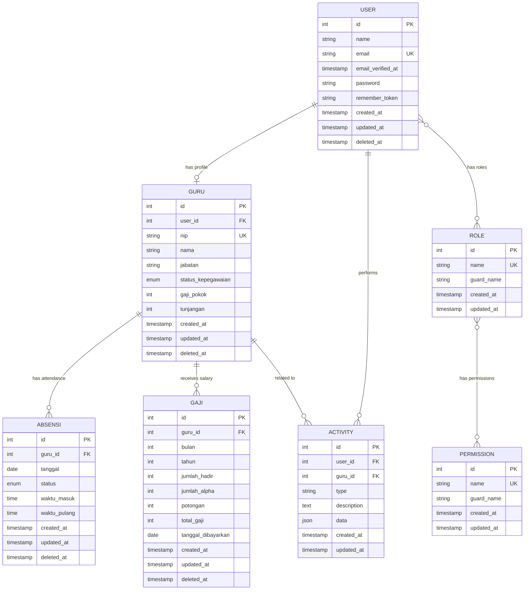
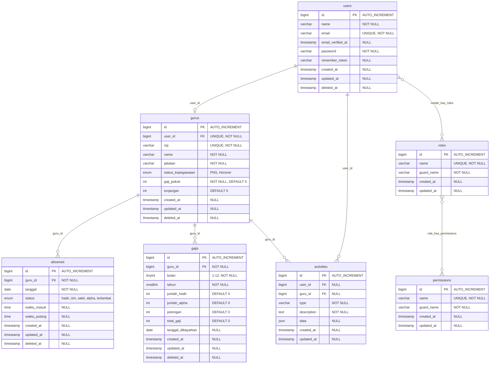
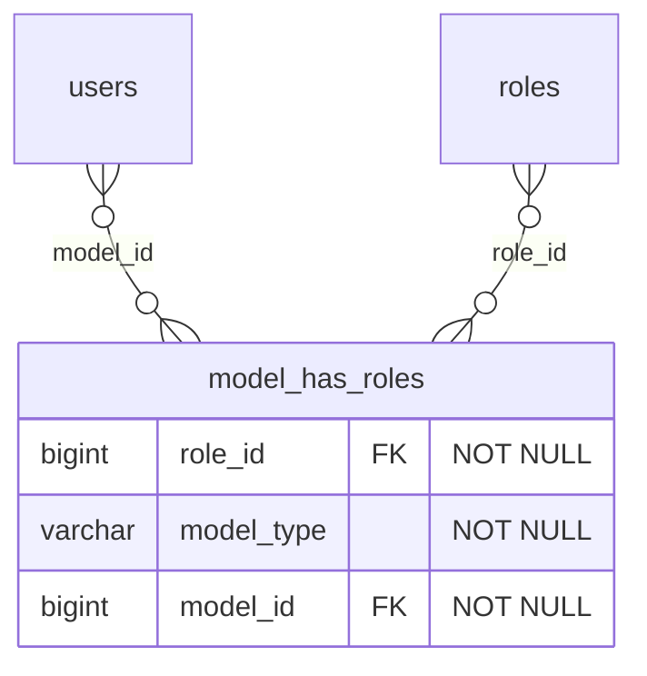
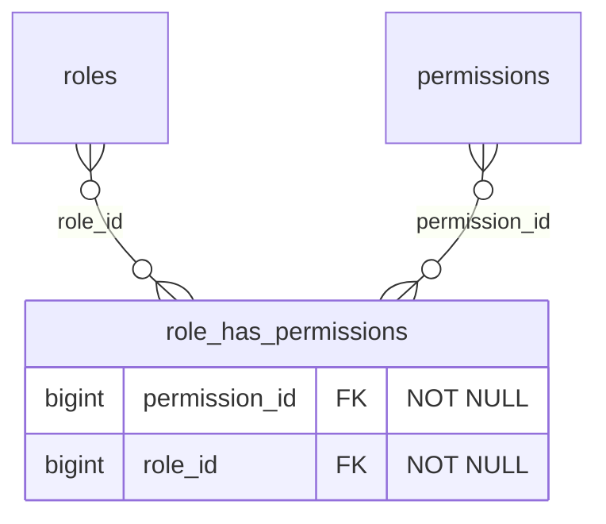

# Entity Relationship Diagram (ERD)

Dokumen ini berisi Entity Relationship Diagram untuk database sistem E-Presensi.

## 1. ERD - Notasi Chen



---

## 2. ERD - Notasi Crow's Foot (Detail)



---

## 3. Tabel Pivot (Many-to-Many Relations)

### A. model_has_roles
Tabel pivot untuk relasi User dan Role (dari Spatie Permission).



**Keterangan:**
- `role_id`: Foreign key ke tabel `roles`
- `model_type`: Polymorphic type, biasanya `App\Models\User`
- `model_id`: Foreign key ke tabel `users`
- **Primary Key**: Composite (`role_id`, `model_id`, `model_type`)

---

### B. role_has_permissions
Tabel pivot untuk relasi Role dan Permission (dari Spatie Permission).



**Keterangan:**
- `permission_id`: Foreign key ke tabel `permissions`
- `role_id`: Foreign key ke tabel `roles`
- **Primary Key**: Composite (`permission_id`, `role_id`)

---

## 4. Constraint dan Index

### Primary Keys (PK)
| Tabel | Primary Key |
|-------|-------------|
| users | id |
| gurus | id |
| absensis | id |
| gajis | id |
| activities | id |
| roles | id |
| permissions | id |
| model_has_roles | (role_id, model_id, model_type) |
| role_has_permissions | (permission_id, role_id) |

---

### Foreign Keys (FK)

| Tabel | Foreign Key | References | On Delete |
|-------|-------------|------------|-----------|
| gurus | user_id | users(id) | CASCADE |
| absensis | guru_id | gurus(id) | CASCADE |
| gajis | guru_id | gurus(id) | CASCADE |
| activities | user_id | users(id) | SET NULL |
| activities | guru_id | gurus(id) | SET NULL |
| model_has_roles | role_id | roles(id) | CASCADE |
| model_has_roles | model_id | users(id) | CASCADE |
| role_has_permissions | permission_id | permissions(id) | CASCADE |
| role_has_permissions | role_id | roles(id) | CASCADE |

**Keterangan:**
- **CASCADE**: Jika parent dihapus, child juga dihapus
- **SET NULL**: Jika parent dihapus, foreign key di child di-set NULL

---

### Unique Constraints (UK)

| Tabel | Kolom | Keterangan |
|-------|-------|------------|
| users | email | Email harus unik untuk login |
| gurus | nip | NIP harus unik untuk setiap guru |
| gurus | user_id | Satu user hanya bisa punya 1 profil guru |
| absensis | (guru_id, tanggal) | Guru hanya bisa absen 1x per hari |
| roles | name | Nama role harus unik |
| permissions | name | Nama permission harus unik |

---

### Indexes

| Tabel | Kolom | Tipe | Keterangan |
|-------|-------|------|------------|
| users | email | UNIQUE | Untuk login cepat |
| gurus | nip | UNIQUE | Pencarian guru by NIP |
| gurus | user_id | UNIQUE | Relasi 1-to-1 dengan user |
| absensis | guru_id | INDEX | Query absensi per guru |
| absensis | tanggal | INDEX | Query absensi per tanggal |
| absensis | (guru_id, tanggal) | UNIQUE | Constraint 1 absen/hari |
| gajis | guru_id | INDEX | Query gaji per guru |
| gajis | (bulan, tahun) | INDEX | Query gaji per periode |
| activities | user_id | INDEX | Query activity per user |
| activities | guru_id | INDEX | Query activity per guru |
| activities | type | INDEX | Filter by type |
| activities | created_at | INDEX | Sort by time |

---

## 5. Kardinalitas dan Penjelasan Relasi

### Relasi 1-to-0..1 (One-to-Zero-or-One)

#### User → Guru
```
User (1) ──────── (0..1) Guru
```
**Arti:**
- 1 User **bisa memiliki** 0 atau 1 Guru
- Jika role = 'guru' → ada profil di tabel gurus
- Jika role = 'admin' atau 'kepala sekolah' → tidak ada profil guru

**Implementasi:**
- Foreign Key: `gurus.user_id` → `users.id` (UNIQUE)
- Eloquent: `User::guru()` returns `belongsTo`
- Eloquent: `Guru::user()` returns `hasOne`

---

### Relasi 1-to-Many (One-to-Many)

#### Guru → Absensi
```
Guru (1) ──────── (Many) Absensi
```
**Arti:**
- 1 Guru **memiliki banyak** record Absensi (1 record per hari)
- 1 Absensi **dimiliki oleh** 1 Guru saja

**Implementasi:**
- Foreign Key: `absensis.guru_id` → `gurus.id`
- Unique Constraint: `(guru_id, tanggal)` → 1 guru max 1 absen per hari
- Eloquent: `Guru::absensis()` returns `hasMany`
- Eloquent: `Absensi::guru()` returns `belongsTo`

---

#### Guru → Gaji
```
Guru (1) ──────── (Many) Gaji
```
**Arti:**
- 1 Guru **memiliki banyak** record Gaji (1 record per bulan)
- 1 Gaji **dimiliki oleh** 1 Guru saja

**Implementasi:**
- Foreign Key: `gajis.guru_id` → `gurus.id`
- Eloquent: `Guru::gajis()` returns `hasMany`
- Eloquent: `Gaji::guru()` returns `belongsTo`

---

#### User/Guru → Activity
```
User (1) ──────── (Many) Activity
Guru (1) ──────── (Many) Activity
```
**Arti:**
- 1 User **memiliki banyak** Activity
- 1 Activity **bisa terkait** User atau Guru atau keduanya

**Implementasi:**
- Foreign Key: `activities.user_id` → `users.id` (NULLABLE)
- Foreign Key: `activities.guru_id` → `gurus.id` (NULLABLE)
- Eloquent: `User::activities()` returns `hasMany`
- Eloquent: `Activity::user()` returns `belongsTo`
- Eloquent: `Activity::guru()` returns `belongsTo`

---

### Relasi Many-to-Many (Many-to-Many)

#### User ↔ Role
```
User (Many) ──────── (Many) Role
         └── model_has_roles ──┘
```
**Arti:**
- 1 User **bisa memiliki banyak** Role (misal: admin + guru)
- 1 Role **dimiliki oleh banyak** User

**Implementasi:**
- Pivot Table: `model_has_roles`
- Spatie Permission Package
- Eloquent: `User::roles()` returns `belongsToMany`
- Eloquent: `Role::users()` returns `belongsToMany`

**Contoh Data:**
| user_id | role_id | role_name |
|---------|---------|-----------|
| 1 | 1 | admin |
| 2 | 3 | guru |
| 3 | 2 | kepala sekolah |

---

#### Role ↔ Permission
```
Role (Many) ──────── (Many) Permission
         └── role_has_permissions ──┘
```
**Arti:**
- 1 Role **bisa memiliki banyak** Permission
- 1 Permission **bisa dimiliki banyak** Role

**Implementasi:**
- Pivot Table: `role_has_permissions`
- Spatie Permission Package
- Eloquent: `Role::permissions()` returns `belongsToMany`
- Eloquent: `Permission::roles()` returns `belongsToMany`

---

## 6. Enum Values

### Tabel: gurus
**Kolom:** `status_kepegawaian`
```sql
ENUM('PNS', 'Honorer')
```
**Nilai:**
- `PNS`: Pegawai Negeri Sipil
- `Honorer`: Pegawai Honorer/Non-PNS

---

### Tabel: absensis
**Kolom:** `status`
```sql
ENUM('hadir', 'izin', 'sakit', 'alpha', 'terlambat')
```
**Nilai:**
- `hadir`: Hadir tepat waktu (< 08:00)
- `terlambat`: Hadir terlambat (>= 08:00), potongan Rp 50.000
- `izin`: Izin dengan surat/pemberitahuan, tidak ada potongan
- `sakit`: Sakit dengan surat dokter, tidak ada potongan
- `alpha`: Tidak hadir tanpa keterangan, potongan Rp 200.000

---

## 7. Data Default dan Seeder

### Role Seeder
Data role yang di-insert saat setup aplikasi:

```php
// RoleSeeder.php
Role::create(['name' => 'admin', 'guard_name' => 'web']);
Role::create(['name' => 'kepala sekolah', 'guard_name' => 'web']);
Role::create(['name' => 'guru', 'guard_name' => 'web']);
```

---

### User Seeder (Sample)
Contoh data user default:

| id | name | email | role |
|----|------|-------|------|
| 1 | Admin System | admin@epresensi.com | admin |
| 2 | Kepala Sekolah | kepsek@epresensi.com | kepala sekolah |
| 3 | Guru 1 | guru1@epresensi.com | guru |

---

## 8. Trigger dan Stored Procedure (Opsional)

Meskipun Laravel Eloquent sudah handle logic, berikut adalah contoh trigger yang bisa diimplementasi di database level:

### Trigger: Auto Calculate Gaji
```sql
-- Trigger saat insert/update gaji
DELIMITER $$

CREATE TRIGGER calculate_gaji_bersih
BEFORE INSERT ON gajis
FOR EACH ROW
BEGIN
    DECLARE gaji_pokok INT;
    DECLARE tunjangan INT;

    -- Ambil gaji pokok dan tunjangan dari guru
    SELECT g.gaji_pokok, g.tunjangan
    INTO gaji_pokok, tunjangan
    FROM gurus g
    WHERE g.id = NEW.guru_id;

    -- Hitung total gaji
    SET NEW.total_gaji = gaji_pokok + tunjangan - NEW.potongan;
END$$

DELIMITER ;
```

**Catatan:** Trigger ini opsional karena sudah di-handle oleh GajiService di Laravel.

---

## 9. View Database (Opsional)

### View: v_guru_absensi_summary
View untuk mempermudah query summary absensi per guru:

```sql
CREATE VIEW v_guru_absensi_summary AS
SELECT
    g.id AS guru_id,
    g.nip,
    g.nama,
    YEAR(a.tanggal) AS tahun,
    MONTH(a.tanggal) AS bulan,
    COUNT(CASE WHEN a.status = 'hadir' THEN 1 END) AS total_hadir,
    COUNT(CASE WHEN a.status = 'terlambat' THEN 1 END) AS total_terlambat,
    COUNT(CASE WHEN a.status = 'izin' THEN 1 END) AS total_izin,
    COUNT(CASE WHEN a.status = 'sakit' THEN 1 END) AS total_sakit,
    COUNT(CASE WHEN a.status = 'alpha' THEN 1 END) AS total_alpha,
    (COUNT(CASE WHEN a.status = 'terlambat' THEN 1 END) * 50000) +
    (COUNT(CASE WHEN a.status = 'alpha' THEN 1 END) * 200000) AS total_potongan
FROM gurus g
LEFT JOIN absensis a ON g.id = a.guru_id
WHERE g.deleted_at IS NULL
  AND a.deleted_at IS NULL
GROUP BY g.id, g.nip, g.nama, YEAR(a.tanggal), MONTH(a.tanggal);
```

**Penggunaan:**
```sql
-- Query gaji guru untuk bulan tertentu
SELECT * FROM v_guru_absensi_summary
WHERE guru_id = 1 AND tahun = 2025 AND bulan = 11;
```

---

## 10. Normalisasi Database

### Form Normal yang Dipenuhi

#### 1NF (First Normal Form) ✅
- Setiap kolom berisi nilai atomic (tidak ada multi-value)
- Setiap baris unik (ada primary key)
- Tidak ada repeating groups

**Contoh:**
- Tabel `absensis` tidak menyimpan array status, tapi 1 status per record
- Tabel `gurus` tidak menyimpan multiple NIP

---

#### 2NF (Second Normal Form) ✅
- Memenuhi 1NF
- Tidak ada partial dependency (semua non-key attribute tergantung pada seluruh primary key)

**Contoh:**
- Tabel `absensis`: `status`, `waktu_masuk`, `waktu_pulang` tergantung pada `id` (PK)
- Tidak ada kolom yang tergantung pada sebagian PK

---

#### 3NF (Third Normal Form) ✅
- Memenuhi 2NF
- Tidak ada transitive dependency (non-key attribute tidak tergantung pada non-key attribute lain)

**Contoh:**
- `gaji_pokok` dan `tunjangan` disimpan di tabel `gurus`, bukan di `gajis`
- `total_gaji` di tabel `gajis` bisa dihitung dari `gurus.gaji_pokok + gurus.tunjangan - gajis.potongan`

---

### Denormalisasi (Trade-off)

Beberapa kolom sengaja di-denormalisasi untuk performa:

#### Tabel: gajis
```
- jumlah_hadir    (bisa dihitung from absensis)
- jumlah_alpha    (bisa dihitung from absensis)
- potongan        (bisa dihitung from absensis)
- total_gaji      (bisa dihitung from gurus + absensis)
```

**Alasan:**
- Menghindari complex query saat generate laporan
- Snapshot gaji untuk periode tertentu (historical data)
- Performa lebih baik untuk laporan bulanan

---

## 11. Backup dan Recovery Strategy

### Backup Tables
Tabel yang kritis dan harus di-backup regular:

1. **users** - Data akun login
2. **gurus** - Data guru (master data)
3. **absensis** - Historical presensi
4. **gajis** - Historical penggajian
5. **activities** - Log audit

### Recovery Point
- Daily backup untuk tabel transactional (absensis, gajis, activities)
- Weekly backup untuk tabel master (users, gurus)
- Monthly full backup semua tabel

---

## 12. Security Considerations

### Soft Deletes
Semua tabel utama menggunakan soft delete (`deleted_at`):
- Data tidak benar-benar dihapus dari database
- Bisa di-restore jika diperlukan
- Audit trail tetap terjaga

### Password Hashing
- Password di-hash menggunakan bcrypt (Laravel default)
- Tidak pernah disimpan dalam plain text

### Timestamps
Semua tabel memiliki `created_at` dan `updated_at` untuk audit:
- Kapan data dibuat
- Kapan data terakhir diubah

---

## Kesimpulan

ERD ini menunjukkan:
1. **7 tabel utama** untuk aplikasi E-Presensi
2. **2 tabel pivot** untuk many-to-many relations (Spatie)
3. **Relasi yang jelas** antar entity dengan foreign keys
4. **Normalisasi yang baik** (memenuhi 3NF)
5. **Constraint dan index** untuk data integrity dan performa
6. **Soft deletes** untuk data safety
7. **Timestamps** untuk audit trail

Database design ini mendukung:
- Role-based access control (RBAC)
- Multi-user concurrent access
- Historical data tracking
- Audit logging
- Data integrity dan consistency
