# Activity Diagram Sistem E-Presensi

Dokumen ini berisi Activity Diagram untuk proses-proses utama dalam sistem E-Presensi. Activity Diagram menunjukkan alur aktivitas dari awal hingga akhir.

---

## 1. Activity Diagram: Login


**Penjelasan:**
- User memasukkan email dan password
- Sistem validasi credentials
- Jika gagal, tampilkan error dan ulangi
- Jika berhasil, cek apakah email sudah diverifikasi
- Jika belum verified, kirim email verifikasi
- Jika sudah verified, identifikasi role dan redirect ke dashboard

---

## 2. Activity Diagram: Presensi Check-in (Guru)


**Penjelasan:**
- Guru login dan buka menu presensi
- Sistem cek apakah sudah check-in hari ini
- Jika sudah, tampilkan error
- Jika belum, guru klik tombol check-in
- Sistem ambil waktu sekarang
- Jika sebelum jam 08:00 → Status Hadir
- Jika jam 08:00 atau lebih → Status Terlambat dengan potongan Rp 50.000
- Simpan ke database dan log aktivitas
- Update dashboard

---

## 3. Activity Diagram: Presensi Check-out (Guru)


**Penjelasan:**
- Guru yang sudah check-in klik tombol check-out
- Sistem validasi: apakah sudah check-in?
- Sistem validasi: apakah sudah check-out?
- Jika lolos validasi, ambil waktu sekarang
- Update database dengan waktu pulang
- Log aktivitas check-out
- Update dashboard

---

## 4. Activity Diagram: Tambah Guru Baru (Admin)


**Penjelasan:**
- Admin login dan buka menu Data Guru
- Klik tambah guru baru, tampilkan form
- Admin isi semua field dan submit
- Sistem validasi data (NIP unique, email unique, dll)
- Jika gagal, tampilkan error dan kembali ke form
- Jika berhasil, mulai database transaction
- Buat user account → Assign role → Buat profil guru
- Opsional kirim email verifikasi
- Commit transaction
- Tampilkan pesan sukses dan redirect

---

## 5. Activity Diagram: Perhitungan Gaji

```mermaid
flowchart TD
    Start([Mulai]) --> UserRequest[User Request<br/>Lihat Gaji]
    UserRequest --> InputFilter[Input Filter:<br/>Bulan & Tahun]
    InputFilter --> GetGuru[Ambil Data Guru:<br/>Gaji Pokok<br/>& Tunjangan]
    GetGuru --> GetAbsen[Ambil Data Absensi<br/>Bulan Tersebut]
    GetAbsen --> CountStatus[Hitung Jumlah<br/>per Status:<br/>Hadir, Terlambat,<br/>Izin, Sakit, Alpha]
    CountStatus --> CalcPotongan[Hitung Potongan:<br/>Terlambat × Rp 50.000<br/>Alpha × Rp 200.000]
    CalcPotongan --> CalcTotal[Hitung Gaji Bersih:<br/>Gaji Pokok<br/>+ Tunjangan<br/>- Total Potongan]
    CalcTotal --> DisplayResult[Tampilkan Hasil:<br/>Detail Gaji]
    DisplayResult --> End([Selesai])

    style Start fill:#51cf66,stroke:#2f9e44,stroke-width:3px,color:#fff
    style End fill:#51cf66,stroke:#2f9e44,stroke-width:3px,color:#fff
    style CalcPotongan fill:#ff8787,stroke:#c92a2a,stroke-width:2px,color:#fff
    style CalcTotal fill:#51cf66,stroke:#2f9e44,stroke-width:2px,color:#fff
    style DisplayResult fill:#4dabf7,stroke:#1971c2,stroke-width:2px,color:#fff
```



**Penjelasan:**
- User (Guru/Admin/Kepsek) request lihat gaji
- Input filter bulan dan tahun
- Sistem ambil data gaji pokok dan tunjangan dari tabel Guru
- Sistem ambil data absensi bulan tersebut
- Hitung jumlah per status (hadir, terlambat, izin, sakit, alpha)
- Hitung total potongan: (Terlambat × 50.000) + (Alpha × 200.000)
- Hitung gaji bersih: Gaji Pokok + Tunjangan - Total Potongan
- Tampilkan hasil detail gaji

---

## 6. Activity Diagram: Lihat Laporan Bulanan (Admin/Kepsek)


**Penjelasan:**
- Admin/Kepala Sekolah login dan buka menu Laporan Bulanan
- Pilih bulan dan tahun yang ingin dilihat
- Sistem ambil data semua guru
- Loop untuk setiap guru:
  - Ambil data absensi bulan tersebut
  - Hitung ringkasan (hadir, terlambat, alpha, potongan, gaji)
  - Tambahkan ke list hasil
- Setelah loop selesai, hitung statistik keseluruhan
- Tampilkan laporan bulanan
- User bisa pilih export ke PDF atau Excel (opsional)

---

## 7. Activity Diagram: Input Absensi Manual (Admin)


**Penjelasan:**
- Admin login dan buka menu Input Absensi Manual
- Pilih guru yang akan diinput absensinya
- Pilih tanggal
- Cek apakah absensi untuk guru dan tanggal tersebut sudah ada
- Jika sudah ada, tanya konfirmasi untuk overwrite
- Jika belum ada atau user konfirmasi overwrite, tampilkan form
- Pilih status dan input waktu (opsional)
- Submit dan simpan ke database
- Log aktivitas admin
- Tampilkan pesan sukses

---

## Ringkasan Activity Diagram

| No | Proses | Actor | Kompleksitas |
|----|--------|-------|--------------|
| 1 | Login | Semua User | Sedang |
| 2 | Presensi Check-in | Guru | Sedang |
| 3 | Presensi Check-out | Guru | Simple |
| 4 | Tambah Guru Baru | Admin | Kompleks |
| 5 | Perhitungan Gaji | Semua User | Sedang |
| 6 | Lihat Laporan Bulanan | Admin/Kepsek | Kompleks |
| 7 | Input Absensi Manual | Admin | Sedang |

---

## Notasi Activity Diagram

### Simbol yang Digunakan:

| Simbol | Nama | Keterangan |
|--------|------|------------|
| `([...])` | Start/End Node | Awal dan akhir aktivitas |
| `[...]` | Activity | Aktivitas/proses yang dilakukan |
| `{...}` | Decision | Percabangan/keputusan |
| `-->` | Flow | Aliran aktivitas |

### Warna:

| Warna | Keterangan |
|-------|------------|
| 🟢 Hijau | Start/End/Success |
| 🟣 Ungu | Decision/Choice |
| 🔴 Merah | Error/Terlambat |
| 🔵 Biru | Display/Show Result |
| ⚪ Abu-abu | Cancel/Stop |

---

## Tips Menggunakan Activity Diagram di Skripsi

### Untuk BAB III - Perancangan Sistem:

1. **Sub-bab: Perancangan Proses Bisnis**
   - Gunakan activity diagram untuk menjelaskan alur proses
   - Setiap proses utama punya 1 activity diagram
   - Beri penjelasan di bawah diagram

2. **Format Caption:**
   ```
   Gambar 3.X. Activity Diagram [Nama Proses]
   Contoh: Gambar 3.5. Activity Diagram Proses Check-in Presensi
   ```

3. **Penjelasan:**
   - Jelaskan swimlane jika ada (actor yang terlibat)
   - Jelaskan decision point (percabangan)
   - Jelaskan exception handling (error flow)

4. **Rekomendasi Diagram untuk Skripsi:**
   - ⭐⭐⭐ Activity Diagram Login (wajib)
   - ⭐⭐⭐ Activity Diagram Check-in (proses utama)
   - ⭐⭐ Activity Diagram Tambah Guru (contoh CRUD)
   - ⭐⭐ Activity Diagram Perhitungan Gaji (business logic)
   - ⭐ Activity Diagram Laporan (opsional)

---

## Cara Export ke Word

1. Buka https://mermaid.live/
2. Copy-paste kode diagram yang ingin di-export
3. Atur ukuran:
   - Width: 1600-2000px
   - Scale: 2
4. Export ke PNG
5. Insert ke Word dengan caption

**Ukuran Optimal:**
- Width: 1800px untuk diagram vertikal
- Width: 2000px untuk diagram horizontal

---

## Perbedaan Activity Diagram vs Flowchart

| Aspek | Activity Diagram | Flowchart |
|-------|------------------|-----------|
| **Fokus** | Aktivitas/proses | Alur keputusan |
| **Swimlane** | Bisa pakai swimlane untuk actor | Biasanya tidak |
| **Notasi** | UML standard | Bebas |
| **Paralel** | Bisa menunjukkan proses paralel | Lebih linear |
| **Cocok untuk** | Proses bisnis kompleks | Algoritma/logika sederhana |

**Rekomendasi:**
- Gunakan **Activity Diagram** untuk menjelaskan **proses bisnis** (check-in, tambah guru, dll)
- Gunakan **Flowchart** untuk menjelaskan **hak akses role** dan **decision flow**

---

## Kesimpulan

Activity Diagram ini cocok digunakan di **BAB III - Analisis dan Perancangan Sistem** untuk:
- Menjelaskan alur proses bisnis sistem
- Menunjukkan aktivitas yang dilakukan user
- Menunjukkan decision point dan exception handling
- Melengkapi dokumentasi flowchart dan sequence diagram

Semua diagram sudah dibuat **simple** dan **mudah dipahami** agar cocok untuk dokumen skripsi.
