# Data Flow Diagram (DFD) Level 1
## Sistem Informasi Presensi dan Penggajian Guru

---

## 1. Deskripsi Sistem

Sistem Informasi Presensi dan Penggajian Guru merupakan aplikasi berbasis web yang dirancang untuk mengotomasi proses pencatatan kehadiran dan perhitungan gaji guru. Sistem ini memiliki tiga entitas eksternal utama yaitu Administrator, Guru, dan Bendahara dengan fungsi dan hak akses yang berbeda-beda.

---

## 2. Entitas Eksternal

| Entitas | Deskripsi | Hak Akses |
|---------|-----------|-----------|
| **Administrator** | Pengelola sistem yang memiliki akses penuh untuk mengelola data guru, absensi manual, perhitungan gaji, dan manajemen pengguna | Create, Read, Update, Delete |
| **Guru** | Pengguna yang melakukan pencatatan absensi harian dan dapat melihat riwayat absensi serta informasi gaji pribadi | Read, Create (absensi) |
| **Bendahara** | Pihak keuangan yang memiliki akses untuk melihat laporan absensi, data guru, dan **melakukan pencairan gaji** yang telah dihitung oleh sistem | Read, Update (pencairan gaji) |

---

## 3. Penyimpanan Data (Data Store)

| Kode | Nama | Deskripsi |
|------|------|-----------|
| **D1** | Data Pengguna | Menyimpan informasi akun pengguna sistem termasuk email, password, dan role |
| **D2** | Data Guru | Menyimpan informasi guru meliputi NIP, nama, jabatan, status kepegawaian, gaji pokok, dan tunjangan |
| **D3** | Data Absensi | Menyimpan catatan kehadiran guru termasuk tanggal, waktu masuk, waktu pulang, dan status kehadiran |
| **D4** | Data Gaji | Menyimpan informasi perhitungan gaji guru meliputi jumlah kehadiran, potongan, total gaji, dan status pencairan |

---

## 4. Proses Bisnis

### 4.1 Proses 1.0: Login
Proses autentikasi pengguna untuk mengakses sistem. Pengguna (Administrator, Guru, atau Bendahara) memasukkan kredensial login yang akan divalidasi dengan data pengguna yang tersimpan di database.

### 4.2 Proses 2.0: Kelola Data Guru
Proses pengelolaan data guru yang mencakup penambahan, pengubahan, penghapusan, dan pencarian data guru beserta akun penggunanya. Proses ini dilakukan oleh Administrator dengan hak akses penuh (CRUD), sedangkan Bendahara memiliki akses read-only untuk keperluan keuangan.

### 4.3 Proses 3.0: Kelola Absensi
Proses pencatatan dan pengelolaan kehadiran guru yang meliputi check-in/check-out oleh Guru secara mandiri dan pencatatan absensi manual oleh Administrator untuk kasus khusus (izin, sakit, alpha). Proses ini menghasilkan data absensi yang akan digunakan untuk perhitungan gaji.

### 4.4 Proses 4.0: Kelola Laporan
Proses pengolahan dan penyajian informasi dalam bentuk laporan absensi harian, bulanan, riwayat kehadiran, serta ekspor data dalam format PDF dan Excel. Laporan dapat diakses oleh Administrator dan Bendahara untuk keperluan monitoring, sedangkan Guru dapat melihat riwayat absensi pribadi.

### 4.5 Proses 5.0: Kelola Gaji
Proses perhitungan dan pencairan gaji guru berdasarkan data kehadiran dengan memperhitungkan gaji pokok, tunjangan, dan potongan. Administrator melakukan trigger perhitungan gaji, Bendahara melakukan pencairan gaji dengan menekan tombol pencairan, dan Guru dapat melihat informasi gaji pribadi.

---

## 5. Diagram DFD Level 1

```mermaid
flowchart TB
    %% External Entities
    Admin["👤 Administrator"]
    Guru["👤 Guru"]
    Bendahara["👤 Bendahara"]

    %% Processes
    P1["⚙️ 1.0<br/>Login"]
    P2["⚙️ 2.0<br/>Kelola<br/>Data Guru"]
    P3["⚙️ 3.0<br/>Kelola<br/>Absensi"]
    P4["⚙️ 4.0<br/>Kelola<br/>Laporan"]
    P5["⚙️ 5.0<br/>Kelola<br/>Gaji"]

    %% Data Stores
    D1[("📊 D1<br/>Data Pengguna")]
    D2[("📊 D2<br/>Data Guru")]
    D3[("📊 D3<br/>Data Absensi")]
    D4[("📊 D4<br/>Data Gaji")]

    %% ========== PROSES 1.0: LOGIN ==========
    Admin -->|"Data Login"| P1
    Guru -->|"Data Login"| P1
    Bendahara -->|"Data Login"| P1

    D1 -->|"Data Pengguna"| P1

    P1 -->|"Akses Sistem"| Admin
    P1 -->|"Akses Sistem"| Guru
    P1 -->|"Akses Sistem"| Bendahara

    %% ========== PROSES 2.0: KELOLA DATA GURU ==========
    Admin -->|"Data Guru"| P2
    P2 -->|"Simpan Data Guru"| D2
    D2 -->|"Informasi Guru"| P2
    P2 -->|"Informasi Guru"| Admin
    P2 -->|"Informasi Guru"| Bendahara

    %% ========== PROSES 3.0: KELOLA ABSENSI ==========
    Guru -->|"Data Absensi"| P3
    Admin -->|"Data Absensi"| P3

    P3 -->|"Simpan Data Absensi"| D3
    D2 -->|"Data Gaji Pokok"| P3
    P3 -->|"Hasil Perhitungan Gaji"| D4

    %% ========== PROSES 4.0: KELOLA LAPORAN ==========
    Admin -->|"Request Laporan"| P4
    Bendahara -->|"Request Laporan"| P4
    Guru -->|"Request Laporan"| P4

    D2 -->|"Data Guru"| P4
    D3 -->|"Data Absensi"| P4

    P4 -->|"Laporan Absensi"| Admin
    P4 -->|"Laporan Absensi"| Bendahara
    P4 -->|"Laporan Absensi"| Guru

    %% ========== PROSES 5.0: KELOLA GAJI ==========
    Bendahara -->|"Request Data Gaji"| P5
    Bendahara -->|"Cairkan Gaji"| P5
    Guru -->|"Request Data Gaji"| P5

    D4 -->|"Data Gaji"| P5
    P5 -->|"Update Status Pencairan"| D4

    P5 -->|"Informasi Gaji"| Bendahara
    P5 -->|"Informasi Gaji"| Guru

    %% Styling
    classDef processStyle fill:#4A90E2,stroke:#2E5C8A,stroke-width:2px,color:#fff
    classDef datastoreStyle fill:#50C878,stroke:#2E7D4E,stroke-width:2px,color:#fff
    classDef entityStyle fill:#FF6B6B,stroke:#C92A2A,stroke-width:2px,color:#fff

    class P1,P2,P3,P4,P5 processStyle
    class D1,D2,D3,D4 datastoreStyle
    class Admin,Guru,Bendahara entityStyle
```

---

## 6. Penjelasan Aliran Data

### 6.1 Aliran Data Proses Login (1.0)

| Dari | Ke | Aliran Data | Deskripsi |
|------|-----|-------------|-----------|
| Administrator | Proses 1.0 | Data Login | Email dan password administrator |
| Guru | Proses 1.0 | Data Login | Email dan password guru |
| Bendahara | Proses 1.0 | Data Login | Email dan password bendahara |
| D1: Data Pengguna | Proses 1.0 | Data Pengguna | Data pengguna untuk validasi login |
| Proses 1.0 | Administrator | Akses Sistem | Memberikan akses ke sistem untuk administrator |
| Proses 1.0 | Guru | Akses Sistem | Memberikan akses ke sistem untuk guru |
| Proses 1.0 | Bendahara | Akses Sistem | Memberikan akses ke sistem untuk bendahara |

### 6.2 Aliran Data Proses Kelola Data Guru (2.0)

| Dari | Ke | Aliran Data | Deskripsi |
|------|-----|-------------|-----------|
| Administrator | Proses 2.0 | Data Guru | NIP, nama, jabatan, status kepegawaian, gaji pokok, tunjangan |
| Proses 2.0 | D2: Data Guru | Simpan Data Guru | Menyimpan data guru ke database |
| D2: Data Guru | Proses 2.0 | Informasi Guru | Data guru yang tersimpan |
| Proses 2.0 | Administrator | Informasi Guru | Menampilkan informasi guru kepada administrator |
| Proses 2.0 | Bendahara | Informasi Guru | Menampilkan informasi guru kepada bendahara |

### 6.3 Aliran Data Proses Kelola Absensi (3.0)

| Dari | Ke | Aliran Data | Deskripsi |
|------|-----|-------------|-----------|
| Guru | Proses 3.0 | Data Absensi | Data check-in/check-out guru |
| Administrator | Proses 3.0 | Data Absensi | Pencatatan absensi manual |
| Proses 3.0 | D3: Data Absensi | Simpan Data Absensi | Menyimpan data absensi ke database |
| D2: Data Guru | Proses 3.0 | Data Gaji Pokok | Gaji pokok dan tunjangan untuk perhitungan |
| Proses 3.0 | D4: Data Gaji | Hasil Perhitungan Gaji | Hasil perhitungan gaji otomatis berdasarkan absensi |

### 6.4 Aliran Data Proses Kelola Laporan (4.0)

| Dari | Ke | Aliran Data | Deskripsi |
|------|-----|-------------|-----------|
| Administrator | Proses 4.0 | Request Laporan | Permintaan laporan absensi |
| Bendahara | Proses 4.0 | Request Laporan | Permintaan laporan absensi |
| Guru | Proses 4.0 | Request Laporan | Permintaan laporan absensi pribadi |
| D2: Data Guru | Proses 4.0 | Data Guru | Data guru untuk laporan |
| D3: Data Absensi | Proses 4.0 | Data Absensi | Data absensi untuk laporan |
| Proses 4.0 | Administrator | Laporan Absensi | Laporan dalam format PDF/Excel |
| Proses 4.0 | Bendahara | Laporan Absensi | Laporan dalam format PDF/Excel |
| Proses 4.0 | Guru | Laporan Absensi | Laporan absensi pribadi |

### 6.5 Aliran Data Proses Kelola Gaji (5.0)

| Dari | Ke | Aliran Data | Deskripsi |
|------|-----|-------------|-----------|
| Bendahara | Proses 5.0 | Request Data Gaji | Permintaan informasi gaji semua guru |
| Bendahara | Proses 5.0 | Cairkan Gaji | Trigger pencairan gaji |
| Guru | Proses 5.0 | Request Data Gaji | Permintaan informasi gaji pribadi |
| D4: Data Gaji | Proses 5.0 | Data Gaji | Data gaji yang tersimpan |
| Proses 5.0 | D4: Data Gaji | Update Status Pencairan | Update status gaji menjadi sudah dicairkan |
| Proses 5.0 | Bendahara | Informasi Gaji | Menampilkan informasi gaji kepada bendahara |
| Proses 5.0 | Guru | Informasi Gaji | Menampilkan informasi gaji pribadi kepada guru |

---

## 7. Tabel Ringkasan Proses

| Kode | Nama Proses | Input | Output | Data Store Terkait |
|------|-------------|-------|--------|-------------------|
| 1.0 | Login | Data Login | Akses Sistem | D1 |
| 2.0 | Kelola Data Guru | Data Guru | Informasi Guru | D2 |
| 3.0 | Kelola Absensi | Data Absensi | Hasil Perhitungan Gaji | D2, D3, D4 |
| 4.0 | Kelola Laporan | Request Laporan | Laporan Absensi | D2, D3 |
| 5.0 | Kelola Gaji | Request Data Gaji, Cairkan Gaji | Informasi Gaji | D4 |

---

## 8. Catatan Teknis

### 8.1 Aturan Bisnis

1. **Proses Login (1.0)**
   - Sistem memvalidasi kredensial pengguna dengan data yang tersimpan di database
   - Setiap pengguna memiliki role yang berbeda (Administrator, Guru, Bendahara)
   - Hak akses diberikan berdasarkan role pengguna

2. **Proses Kelola Absensi (3.0)**
   - Sistem mencatat data absensi guru (hadir, terlambat, izin, alpha, sakit)
   - Setiap pencatatan absensi akan otomatis memicu perhitungan gaji
   - Hasil perhitungan gaji disimpan ke Data Gaji (D4)

3. **Proses Kelola Gaji (5.0)**
   - Formula: Total Gaji = (Gaji Pokok + Tunjangan) - Total Potongan
   - Potongan Alpha: Rp 20.000 per hari
   - Potongan Terlambat: Rp 15.000 per hari
   - Bendahara melakukan pencairan gaji dengan mengubah status pencairan
   - Sistem mencatat tanggal pencairan gaji

### 8.2 Pembagian Hak Akses

| Proses | Administrator | Guru | Bendahara |
|--------|---------------|------|-----------|
| 1.0 Login | ✓ | ✓ | ✓ |
| 2.0 Kelola Data Guru | ✓ | ✗ | ✓ (Read) |
| 3.0 Kelola Absensi | ✓ | ✓ | ✗ |
| 4.0 Kelola Laporan | ✓ | ✓ (Pribadi) | ✓ |
| 5.0 Kelola Gaji | ✗ | ✓ (Pribadi) | ✓ |

---

**Dokumen ini dibuat untuk keperluan skripsi dan dokumentasi sistem**

*Versi: 2.0 - Simplified*
*Tanggal: 29 Desember 2025*
