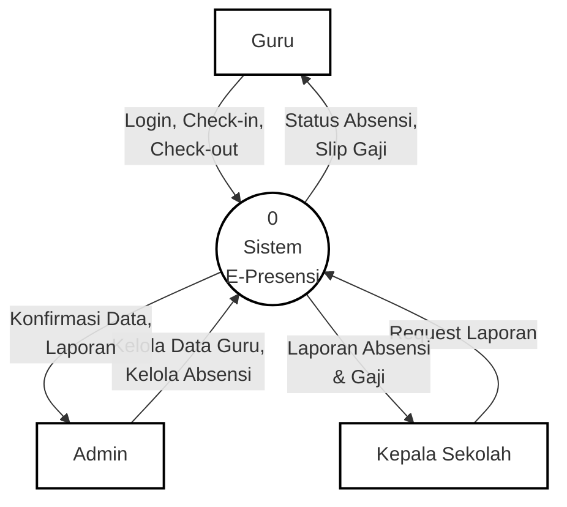
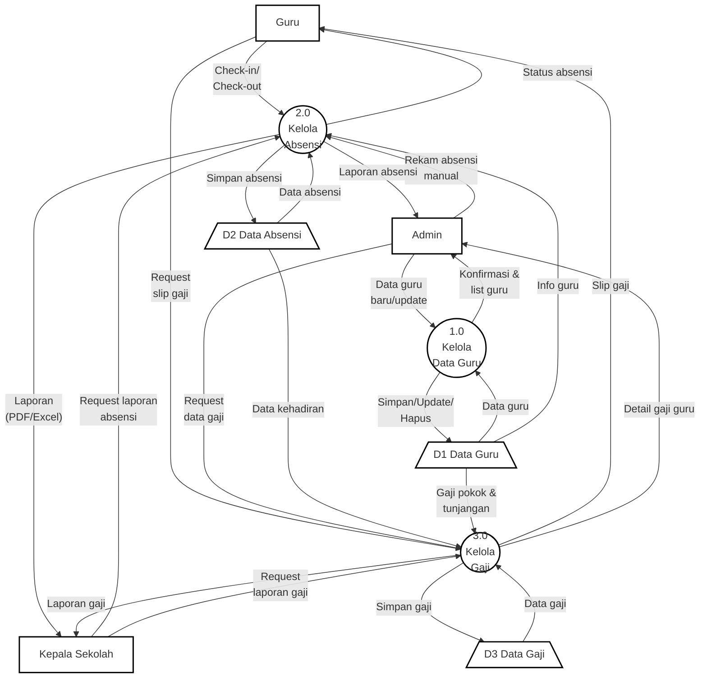
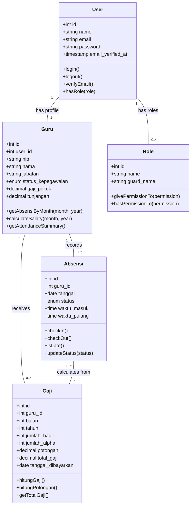
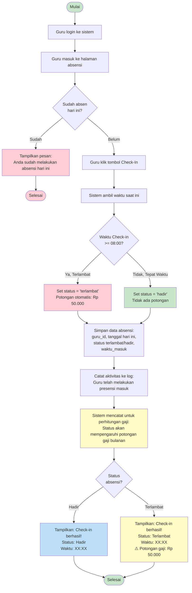
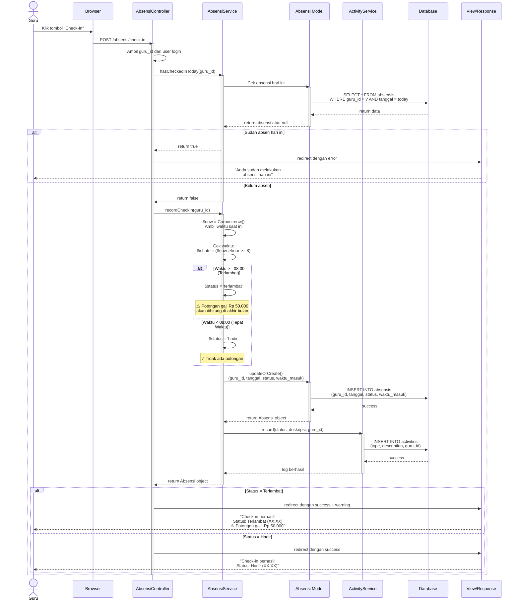
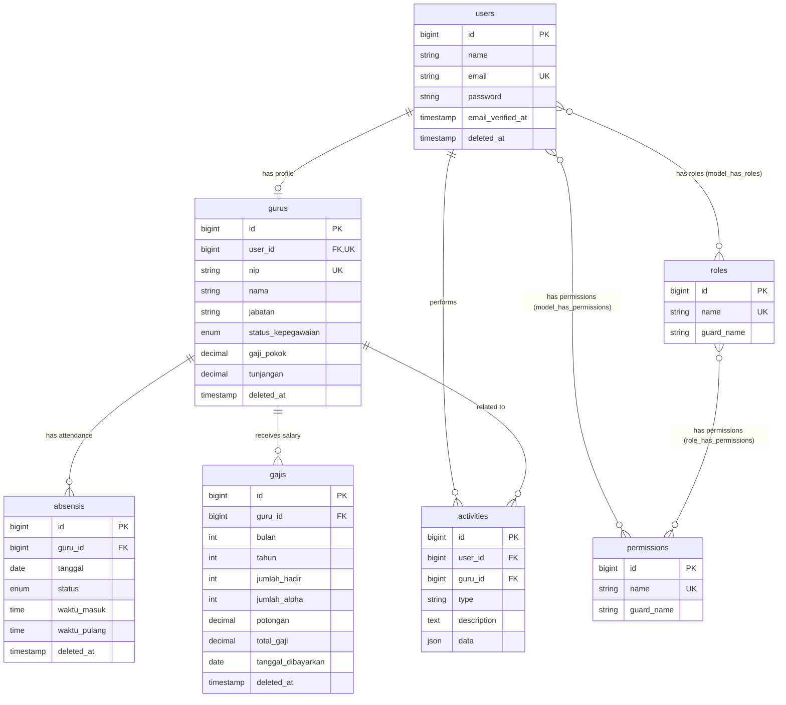

# Dokumentasi Sistem E-Presensi
## Data Flow Diagram (DFD) Level 1 dan Struktur Database

---

## 1. Data Flow Diagram (DFD)

### 1.1 DFD Level 0 (Context Diagram)



**Penjelasan Context Diagram**:
- Menunjukkan sistem sebagai satu kesatuan proses tunggal
- 3 entitas eksternal yang berinteraksi dengan sistem
- Data flow utama antara entitas dan sistem

---

### 1.1.1 DFD Level 0 - Diagram ASCII Art

```
                        +------------------+
                        |                  |
                        |      GURU        |
                        |                  |
                        +--------+---------+
                                 |
                    Login,       |
                  Check-in,      |
                 Check-out       |
                                 |
                                 v
        +--------------+    +----------+    +------------------+
        |              |    |          |    |                  |
        |    ADMIN     +--->|    0     |<---+  KEPALA SEKOLAH  |
        |              |    |          |    |                  |
        +--------------+    | Sistem   |    +------------------+
                            |    E-    |
        Kelola Data Guru,   | Presensi |      Request Laporan
        Kelola Absensi      |          |
                            +----+-----+
                                 |
                   +-------------+-------------+
                   |             |             |
           Status  |   Konfir-   |   Laporan   |
          Absensi, |    masi     |   Absensi   |
         Slip Gaji |    Data,    |   & Gaji    |
                   |   Laporan   |             |
                   v             v             v
            +----------+  +-----------+  +-------------+
            |          |  |           |  |             |
            |   GURU   |  |   ADMIN   |  | KEPALA      |
            |          |  |           |  | SEKOLAH     |
            +----------+  +-----------+  +-------------+
```

**Keterangan:**
- **Kotak persegi** `+---+` = External Entity (Guru, Admin, Kepala Sekolah)
- **Lingkaran** (dibuat dengan angka 0) = Process (Sistem E-Presensi)
- **Panah** `--->, <---, |, v` = Data Flow dengan label di sampingnya

---

### 1.2 DFD Level 1



### 1.2.1 DFD Level 1 - Diagram ASCII Art

```
    +----------+              +-----------+           +---------------+
    |          |              |           |           |               |
    |   GURU   |              |   ADMIN   |           | KEPALA SEKOLAH|
    |          |              |           |           |               |
    +----+-----+              +-----+-----+           +-------+-------+
         |                          |                         |
         | Check-in/               | Data guru               | Request
         | Check-out               | baru/update             | laporan
         |                          |                         | absensi
         |                          v                         |
         |                    +-----------+                   |
         |                    |           |                   |
         |                    |    1.0    |                   |
         +----------------->  |  Kelola   | <-----------------+
         |                    |   Data    |                   |
         |                    |   Guru    |                   |
         |                    +-----+-----+                   |
         |                          |                         |
         |                Konfirmasi|& list guru              |
         |                          v                         |
         |                    +-----------+                   |
         |                    |           |                   |
         |                    |   ADMIN   |                   |
         |                    +-----------+                   |
         |                          |                         |
         |                          | Simpan/Update/          |
         |                          | Hapus                   |
         |                          v                         |
         |                    ==============                  |
         |                    | D1: Data  |                  |
         |                    |   Guru    |                  |
         |                    ==============                  |
         |                          |                         |
         |                    Info  | guru                    |
         |                          |                         |
         |                          v                         |
         |                    +-----------+                   |
         +------------------>|           |<------------------+
         |                    |    2.0    |                   |
         |    Rekam absensi   |  Kelola   |  Request laporan  |
         |    manual          | Absensi   |  absensi          |
         |                    |           |                   |
         |                    +-----+-----+                   |
         |                          |                         |
         |          Status    Laporan|     Laporan            |
         |         absensi   absensi |  (PDF/Excel)           |
         |                          |                         |
         v                          v                         v
    +--------+             +----------+             +-------------+
    |        |             |          |             |             |
    |  GURU  |             |  ADMIN   |             | KEPALA      |
    |        |             |          |             | SEKOLAH     |
    +--------+             +----------+             +-------------+
         |                     |                          |
         | Request             | Request                  | Request
         | slip gaji           | data gaji                | laporan gaji
         |                     |                          |
         v                     v                          v
    +---------------------------------------------------------+
    |                         3.0                             |
    |                       Kelola                            |
    |                        Gaji                             |
    +--------------------------+------------------------------+
                               |
                    Slip gaji  | Detail gaji  | Laporan gaji
                               | guru         |
                               v              v              v
                         +--------+    +--------+    +----------+
                         |  GURU  |    | ADMIN  |    | KEPALA   |
                         |        |    |        |    | SEKOLAH  |
                         +--------+    +--------+    +----------+

                    ==============        ==============
                    | D2: Data  |        | D3: Data  |
                    |  Absensi  |------->|   Gaji    |
                    ==============        ==============
                         ^                      ^
                         |                      |
                         | Data absensi         | Data gaji
                         |                      |
                    Simpan absensi          Simpan gaji
                         |                      |
                    (2.0 Kelola            (3.0 Kelola
                     Absensi)               Gaji)

    Data kehadiran dari D2 ---> (3.0 Kelola Gaji)
    Gaji pokok & tunjangan dari D1 ---> (3.0 Kelola Gaji)
```

**Keterangan:**
- **Kotak persegi** `+---+` = External Entity (Guru, Admin, Kepala Sekolah)
- **Lingkaran** `( 1.0 )` = Process (1.0 Kelola Data Guru, 2.0 Kelola Absensi, 3.0 Kelola Gaji)
- **Garis ganda** `====` = Data Store (D1: Data Guru, D2: Data Absensi, D3: Data Gaji)
- **Panah** `--->, <---, |, v, ^` = Data Flow dengan label

**Data Flow Summary:**

| No | Dari | Ke | Keterangan |
|----|------|-----|------------|
| 1 | Admin | 1.0 Kelola Data Guru | Data guru baru/update |
| 2 | 1.0 Kelola Data Guru | Admin | Konfirmasi & list guru |
| 3 | 1.0 Kelola Data Guru | D1 Data Guru | Simpan/Update/Hapus |
| 4 | D1 Data Guru | 1.0 Kelola Data Guru | Data guru |
| 5 | Guru | 2.0 Kelola Absensi | Check-in/Check-out |
| 6 | Admin | 2.0 Kelola Absensi | Rekam absensi manual |
| 7 | Kepala Sekolah | 2.0 Kelola Absensi | Request laporan absensi |
| 8 | 2.0 Kelola Absensi | Guru | Status absensi |
| 9 | 2.0 Kelola Absensi | Admin | Laporan absensi |
| 10 | 2.0 Kelola Absensi | Kepala Sekolah | Laporan (PDF/Excel) |
| 11 | 2.0 Kelola Absensi | D2 Data Absensi | Simpan absensi |
| 12 | D2 Data Absensi | 2.0 Kelola Absensi | Data absensi |
| 13 | D1 Data Guru | 2.0 Kelola Absensi | Info guru |
| 14 | Guru | 3.0 Kelola Gaji | Request slip gaji |
| 15 | Admin | 3.0 Kelola Gaji | Request data gaji |
| 16 | Kepala Sekolah | 3.0 Kelola Gaji | Request laporan gaji |
| 17 | 3.0 Kelola Gaji | Guru | Slip gaji |
| 18 | 3.0 Kelola Gaji | Admin | Detail gaji guru |
| 19 | 3.0 Kelola Gaji | Kepala Sekolah | Laporan gaji |
| 20 | 3.0 Kelola Gaji | D3 Data Gaji | Simpan gaji |
| 21 | D3 Data Gaji | 3.0 Kelola Gaji | Data gaji |
| 22 | D2 Data Absensi | 3.0 Kelola Gaji | Data kehadiran |
| 23 | D1 Data Guru | 3.0 Kelola Gaji | Gaji pokok & tunjangan |

---

### 1.3 Penjelasan Proses DFD Level 1

| No | Nama Proses | Deskripsi | Input | Output |
|---|---|---|---|---|
| 1.0 | Kelola Data Guru | Mengelola CRUD data guru termasuk NIP, nama, jabatan, status kepegawaian, dan komponen gaji | Data guru dari Admin | Konfirmasi simpan/update/hapus, daftar guru |
| 2.0 | Kelola Absensi | Mengelola pencatatan kehadiran harian (check-in/check-out), absensi manual, dan pelaporan | Data check-in/check-out dari Guru, data absensi manual dari Admin, request laporan dari Kepala Sekolah | Status absensi, laporan harian/bulanan (PDF/Excel) |
| 3.0 | Kelola Gaji | Menghitung dan mengelola gaji berdasarkan kehadiran dengan sistem potongan keterlambatan dan ketidakhadiran | Data absensi bulanan, data gaji guru, request dari user | Slip gaji, detail perhitungan, laporan gaji |

### 1.4 Penjelasan Data Store

| Kode | Nama Data Store | Deskripsi | Tabel Database |
|---|---|---|---|
| D1 | Data Guru | Menyimpan informasi lengkap guru: identitas, jabatan, status kepegawaian, gaji pokok, dan tunjangan | `users`, `gurus` |
| D2 | Data Absensi | Menyimpan data kehadiran harian guru beserta waktu masuk, waktu pulang, dan status kehadiran | `absensis` |
| D3 | Data Gaji | Menyimpan perhitungan gaji bulanan termasuk komponen gaji, potongan, dan total gaji bersih | `gajis` |

### 1.5 External Entities (Entitas Eksternal)

| Entitas | Deskripsi | Hak Akses |
|---|---|---|
| **Guru (Teacher)** | Tenaga pengajar yang melakukan absensi harian | - Check-in/check-out<br/>- Melihat riwayat absensi pribadi<br/>- Melihat slip gaji pribadi<br/>- Update profil |
| **Admin** | Administrator sistem dengan akses penuh | - Kelola data guru (CRUD)<br/>- Rekam absensi manual<br/>- Lihat semua laporan absensi & gaji<br/>- Kelola user & role<br/>- Dashboard statistik lengkap |
| **Kepala Sekolah (Principal)** | Pimpinan sekolah yang memonitor kehadiran dan gaji | - Lihat data guru (read-only)<br/>- Lihat & export laporan absensi<br/>- Lihat laporan gaji<br/>- Dashboard monitoring |

---

## 2. Struktur Database

### 2.1 Tabel: users

**Deskripsi**: Menyimpan data akun pengguna sistem

| Kolom | Tipe Data | Constraint | Keterangan |
|---|---|---|---|
| id | BIGINT UNSIGNED | PRIMARY KEY, AUTO_INCREMENT | ID unik user |
| name | VARCHAR(255) | NOT NULL | Nama lengkap user |
| email | VARCHAR(255) | NOT NULL, UNIQUE | Email untuk login (unique) |
| password | VARCHAR(255) | NOT NULL | Password (hashed dengan bcrypt) |
| email_verified_at | TIMESTAMP | NULLABLE | Waktu verifikasi email |
| remember_token | VARCHAR(100) | NULLABLE | Token untuk "remember me" |
| created_at | TIMESTAMP | NULLABLE | Waktu pembuatan record |
| updated_at | TIMESTAMP | NULLABLE | Waktu update terakhir |
| deleted_at | TIMESTAMP | NULLABLE | Waktu soft delete (untuk soft delete) |

**Relasi**:
- **Has One**: `gurus` (user_id)
- **Has Many**: `activities` (user_id)
- **Belongs To Many**: `roles` (via model_has_roles)

---

### 2.2 Tabel: gurus

**Deskripsi**: Menyimpan data profil guru/tenaga pengajar

| Kolom | Tipe Data | Constraint | Keterangan |
|---|---|---|---|
| id | BIGINT UNSIGNED | PRIMARY KEY, AUTO_INCREMENT | ID unik guru |
| user_id | BIGINT UNSIGNED | FOREIGN KEY, UNIQUE | Referensi ke tabel users (cascade on delete) |
| nip | VARCHAR(255) | NOT NULL, UNIQUE | Nomor Induk Pegawai (unique) |
| nama | VARCHAR(255) | NOT NULL | Nama lengkap guru |
| jabatan | VARCHAR(255) | NOT NULL | Jabatan/posisi guru (contoh: "Guru Matematika") |
| status_kepegawaian | ENUM | NOT NULL | Status: 'PNS' atau 'Honorer' |
| gaji_pokok | DECIMAL(15,2) | NOT NULL | Gaji pokok guru (dalam Rupiah) |
| tunjangan | DECIMAL(15,2) | DEFAULT 0 | Tunjangan tambahan (dalam Rupiah) |
| created_at | TIMESTAMP | NULLABLE | Waktu pembuatan record |
| updated_at | TIMESTAMP | NULLABLE | Waktu update terakhir |
| deleted_at | TIMESTAMP | NULLABLE | Waktu soft delete |

**Relasi**:
- **Belongs To**: `users` (user_id)
- **Has Many**: `absensis` (guru_id)
- **Has Many**: `gajis` (guru_id)
- **Has Many**: `activities` (guru_id)

**Index**:
- Unique index pada `user_id`
- Unique index pada `nip`

---

### 2.3 Tabel: absensis

**Deskripsi**: Menyimpan data kehadiran/absensi guru per hari

| Kolom | Tipe Data | Constraint | Keterangan |
|---|---|---|---|
| id | BIGINT UNSIGNED | PRIMARY KEY, AUTO_INCREMENT | ID unik absensi |
| guru_id | BIGINT UNSIGNED | FOREIGN KEY, NOT NULL | Referensi ke tabel gurus (cascade on delete) |
| tanggal | DATE | NOT NULL | Tanggal absensi |
| status | ENUM | NOT NULL | Status: 'hadir', 'izin', 'sakit', 'alpha', 'terlambat' |
| waktu_masuk | TIME | NULLABLE | Waktu check-in (jam masuk) |
| waktu_pulang | TIME | NULLABLE | Waktu check-out (jam pulang) |
| created_at | TIMESTAMP | NULLABLE | Waktu pembuatan record |
| updated_at | TIMESTAMP | NULLABLE | Waktu update terakhir |
| deleted_at | TIMESTAMP | NULLABLE | Waktu soft delete |

**Relasi**:
- **Belongs To**: `gurus` (guru_id)

**Constraint Unique**:
- Unique compound index pada (`guru_id`, `tanggal`) - satu guru hanya bisa punya satu record absensi per hari

**Business Rules**:
- Status 'terlambat' otomatis jika check-in >= 08:00:00
- Status 'hadir' jika check-in < 08:00:00
- Status 'alpha', 'izin', 'sakit' dicatat manual oleh admin

---

### 2.4 Tabel: gajis

**Deskripsi**: Menyimpan data perhitungan gaji guru per bulan

| Kolom | Tipe Data | Constraint | Keterangan |
|---|---|---|---|
| id | BIGINT UNSIGNED | PRIMARY KEY, AUTO_INCREMENT | ID unik gaji |
| guru_id | BIGINT UNSIGNED | FOREIGN KEY, NOT NULL | Referensi ke tabel gurus (cascade on delete) |
| bulan | INTEGER | NOT NULL | Bulan perhitungan gaji (1-12) |
| tahun | INTEGER | NOT NULL | Tahun perhitungan gaji |
| jumlah_hadir | INTEGER | DEFAULT 0 | Total hari hadir (termasuk terlambat) |
| jumlah_alpha | INTEGER | DEFAULT 0 | Total hari tidak hadir (alpha) |
| potongan | DECIMAL(15,2) | DEFAULT 0 | Total potongan gaji (dalam Rupiah) |
| total_gaji | DECIMAL(15,2) | NOT NULL | Total gaji bersih setelah potongan |
| tanggal_dibayarkan | DATE | NULLABLE | Tanggal pembayaran gaji |
| created_at | TIMESTAMP | NULLABLE | Waktu pembuatan record |
| updated_at | TIMESTAMP | NULLABLE | Waktu update terakhir |
| deleted_at | TIMESTAMP | NULLABLE | Waktu soft delete |

**Relasi**:
- **Belongs To**: `gurus` (guru_id)

**Business Rules Perhitungan**:
- Potongan terlambat: Rp 50.000 per kejadian
- Potongan alpha (tidak hadir): Rp 200.000 per hari
- Formula: `total_gaji = gaji_pokok + tunjangan - potongan`

---

### 2.5 Tabel: activities

**Deskripsi**: Menyimpan log aktivitas untuk audit trail sistem

| Kolom | Tipe Data | Constraint | Keterangan |
|---|---|---|---|
| id | BIGINT UNSIGNED | PRIMARY KEY, AUTO_INCREMENT | ID unik aktivitas |
| user_id | BIGINT UNSIGNED | FOREIGN KEY, NULLABLE | Referensi ke tabel users (cascade on delete) |
| guru_id | BIGINT UNSIGNED | FOREIGN KEY, NULLABLE | Referensi ke tabel gurus (cascade on delete) |
| type | VARCHAR(255) | NOT NULL | Tipe aktivitas (contoh: 'check-in', 'check-out', 'create_guru') |
| description | TEXT | NOT NULL | Deskripsi detail aktivitas |
| data | JSON | NULLABLE | Data tambahan dalam format JSON |
| created_at | TIMESTAMP | NULLABLE | Waktu aktivitas terjadi |
| updated_at | TIMESTAMP | NULLABLE | Waktu update terakhir |

**Relasi**:
- **Belongs To**: `users` (user_id)
- **Belongs To**: `gurus` (guru_id)

**Contoh Tipe Aktivitas**:
- `check-in`: Guru melakukan check-in
- `check-out`: Guru melakukan check-out
- `admin_action`: Admin melakukan aksi (create/update/delete guru)
- `manual_attendance`: Admin mencatat absensi manual

---

### 2.6 Tabel: roles

**Deskripsi**: Menyimpan daftar role/peran pengguna (dari Spatie Laravel Permission)

| Kolom | Tipe Data | Constraint | Keterangan |
|---|---|---|---|
| id | BIGINT UNSIGNED | PRIMARY KEY, AUTO_INCREMENT | ID unik role |
| name | VARCHAR(255) | NOT NULL, UNIQUE | Nama role (contoh: 'admin', 'guru', 'kepala sekolah') |
| guard_name | VARCHAR(255) | NOT NULL | Nama guard Laravel (default: 'web') |
| created_at | TIMESTAMP | NULLABLE | Waktu pembuatan record |
| updated_at | TIMESTAMP | NULLABLE | Waktu update terakhir |

**Roles yang Digunakan**:
- `admin`: Administrator sistem
- `guru`: Guru/tenaga pengajar
- `kepala sekolah`: Kepala sekolah/principal

---

### 2.7 Tabel: permissions

**Deskripsi**: Menyimpan daftar permission/hak akses (dari Spatie Laravel Permission)

| Kolom | Tipe Data | Constraint | Keterangan |
|---|---|---|---|
| id | BIGINT UNSIGNED | PRIMARY KEY, AUTO_INCREMENT | ID unik permission |
| name | VARCHAR(255) | NOT NULL, UNIQUE | Nama permission (contoh: 'manage_guru', 'view_absensi') |
| guard_name | VARCHAR(255) | NOT NULL | Nama guard Laravel (default: 'web') |
| created_at | TIMESTAMP | NULLABLE | Waktu pembuatan record |
| updated_at | TIMESTAMP | NULLABLE | Waktu update terakhir |

---

### 2.8 Tabel: model_has_roles

**Deskripsi**: Tabel pivot untuk relasi many-to-many antara user dan role

| Kolom | Tipe Data | Constraint | Keterangan |
|---|---|---|---|
| role_id | BIGINT UNSIGNED | FOREIGN KEY, NOT NULL | Referensi ke tabel roles |
| model_type | VARCHAR(255) | NOT NULL | Class name model (contoh: 'App\Models\User') |
| model_id | BIGINT UNSIGNED | NOT NULL | ID dari model (user_id) |

**Composite Primary Key**: (`role_id`, `model_id`, `model_type`)

---

### 2.9 Tabel: model_has_permissions

**Deskripsi**: Tabel pivot untuk relasi many-to-many antara user dan permission (direct permission assignment)

| Kolom | Tipe Data | Constraint | Keterangan |
|---|---|---|---|
| permission_id | BIGINT UNSIGNED | FOREIGN KEY, NOT NULL | Referensi ke tabel permissions |
| model_type | VARCHAR(255) | NOT NULL | Class name model (contoh: 'App\Models\User') |
| model_id | BIGINT UNSIGNED | NOT NULL | ID dari model (user_id) |

**Composite Primary Key**: (`permission_id`, `model_id`, `model_type`)

---

### 2.10 Tabel: role_has_permissions

**Deskripsi**: Tabel pivot untuk relasi many-to-many antara role dan permission

| Kolom | Tipe Data | Constraint | Keterangan |
|---|---|---|---|
| permission_id | BIGINT UNSIGNED | FOREIGN KEY, NOT NULL | Referensi ke tabel permissions |
| role_id | BIGINT UNSIGNED | FOREIGN KEY, NOT NULL | Referensi ke tabel roles |

**Composite Primary Key**: (`permission_id`, `role_id`)

---

## 3. Class Diagram



**Penjelasan Class Diagram:**

| Class | Deskripsi | Relasi |
|---|---|---|
| **User** | Class untuk autentikasi dan manajemen akun pengguna | Has One Guru, Has Many Role |
| **Guru** | Class profil guru dengan data kepegawaian dan gaji | Belongs To User, Has Many Absensi, Has Many Gaji |
| **Absensi** | Class untuk pencatatan kehadiran harian guru | Belongs To Guru |
| **Gaji** | Class untuk perhitungan dan penyimpanan gaji bulanan | Belongs To Guru, Uses Absensi |
| **Role** | Class untuk role-based access control (admin, guru, kepala sekolah) | Belongs To Many User |

**Kardinalitas:**
- User - Guru: **1:1** (Satu user memiliki satu profil guru)
- User - Role: **1:N** (Satu user bisa punya banyak role)
- Guru - Absensi: **1:N** (Satu guru punya banyak record absensi)
- Guru - Gaji: **1:N** (Satu guru punya banyak record gaji bulanan)

---

## 4. Activity Diagram - Proses Absensi Guru (Check-in)



**Penjelasan Activity Diagram Absensi Guru:**

| Tahap | Aktivitas | Keterangan |
|---|---|---|
| 1 | Login & Akses | Guru login dan masuk ke halaman absensi |
| 2 | Validasi Absensi | Sistem cek apakah guru sudah absen hari ini (1 kali per hari) |
| 3 | Check-in | Guru klik tombol check-in, sistem ambil waktu saat ini |
| 4 | **Deteksi Keterlambatan** | **Otomatis cek: jika >= 08:00 = Terlambat (potongan Rp 50.000)** |
| 5 | Set Status | Status otomatis: 'hadir' (tepat waktu) atau 'terlambat' (>= 08:00) |
| 6 | Simpan Data | Simpan absensi dengan status dan waktu masuk ke database |
| 7 | Log Aktivitas | Catat aktivitas untuk audit trail |
| 8 | **Update Info Gaji** | **Sistem mencatat status untuk perhitungan potongan gaji bulanan** |
| 9 | Konfirmasi | Tampilkan hasil check-in dengan notifikasi potongan jika terlambat |

---

## 5. Sequence Diagram - Proses Absensi Guru (Check-in)



**Penjelasan Sequence Diagram Absensi Guru:**

| Aktor/Objek | Peran | Tanggung Jawab |
|---|---|---|
| **Guru** | User yang melakukan absensi | Melakukan check-in melalui browser |
| **Browser** | Client-side | Mengirim request HTTP ke server |
| **AbsensiController** | Controller Laravel | Menerima request, validasi, dan koordinasi proses |
| **AbsensiService** | Service Layer | Logika bisnis absensi dan deteksi keterlambatan |
| **Absensi Model** | Model Eloquent | Operasi CRUD data absensi ke database |
| **ActivityService** | Service Layer | Mencatat log aktivitas untuk audit trail |
| **Database** | Penyimpanan Data | Menyimpan data absensi dan aktivitas |
| **View/Response** | Presentation Layer | Menampilkan notifikasi hasil check-in |

**Alur Proses:**
1. Guru klik tombol check-in di halaman absensi
2. Browser kirim POST request ke server
3. Controller validasi: cek apakah guru sudah absen hari ini
4. Jika sudah absen: tolak dan tampilkan error
5. Jika belum absen: lanjut ke proses check-in
6. **Service ambil waktu saat ini dan deteksi keterlambatan:**
   - **Jika >= 08:00 → Status: 'terlambat' (potongan Rp 50.000)**
   - **Jika < 08:00 → Status: 'hadir' (tidak ada potongan)**
7. Simpan data absensi ke database (guru_id, tanggal, status, waktu_masuk)
8. Catat aktivitas ke log untuk audit trail
9. Tampilkan konfirmasi ke guru dengan notifikasi:
   - **Terlambat: Tampilkan warning potongan gaji**
   - **Hadir: Tampilkan sukses tanpa warning**

**Catatan Penting:**
- Potongan gaji **tidak langsung dipotong saat check-in**
- Status absensi (hadir/terlambat) **dicatat dan akan dihitung** saat perhitungan gaji bulanan
- Sistem otomatis hitung: Total Potongan = (Jumlah Terlambat × Rp 50.000) + (Jumlah Alpha × Rp 200.000)

---

## 6. Entity Relationship Diagram (ERD)



---

## 4. Keterangan Tambahan

### 4.1 Enum Values

**status_kepegawaian** (pada tabel `gurus`):
- `PNS`: Pegawai Negeri Sipil
- `Honorer`: Pegawai Honorer/Kontrak

**status** (pada tabel `absensis`):
- `hadir`: Hadir tepat waktu (check-in < 08:00)
- `terlambat`: Hadir terlambat (check-in >= 08:00)
- `izin`: Izin dengan pemberitahuan
- `sakit`: Sakit dengan surat keterangan
- `alpha`: Tidak hadir tanpa keterangan

### 4.2 Business Rules Penting

1. **Soft Delete**: Semua tabel utama (users, gurus, absensis, gajis) menggunakan soft delete untuk menjaga integritas data historis
2. **Cascade Delete**:
   - Hapus user → hapus data guru terkait
   - Hapus guru → hapus absensi dan gaji terkait
3. **One Attendance Per Day**: Satu guru hanya bisa memiliki satu record absensi per hari (constraint unique)
4. **Automatic Late Detection**: Sistem otomatis mendeteksi keterlambatan jika check-in >= 08:00:00
5. **Email Verification**: User wajib verifikasi email sebelum dapat akses penuh sistem

### 4.3 Indeks Database

Untuk optimasi performa, indeks berikut direkomendasikan:
- `users.email` (unique index)
- `gurus.nip` (unique index)
- `gurus.user_id` (unique index)
- `absensis.guru_id` (index)
- `absensis.tanggal` (index)
- `absensis.guru_id, tanggal` (unique composite index)
- `gajis.guru_id` (index)
- `activities.user_id` (index)
- `activities.guru_id` (index)
- `activities.created_at` (index)

---

## 5. Data Dictionary Summary

| Tabel | Jumlah Kolom | Primary Key | Foreign Keys | Keterangan |
|---|---|---|---|---|
| users | 9 | id | - | Data akun pengguna sistem |
| gurus | 10 | id | user_id → users(id) | Profil guru/tenaga pengajar |
| absensis | 9 | id | guru_id → gurus(id) | Data kehadiran harian |
| gajis | 11 | id | guru_id → gurus(id) | Data gaji bulanan |
| activities | 8 | id | user_id → users(id)<br/>guru_id → gurus(id) | Log aktivitas sistem |
| roles | 4 | id | - | Daftar role (Spatie) |
| permissions | 4 | id | - | Daftar permission (Spatie) |
| model_has_roles | 3 | composite | role_id → roles(id) | Pivot user-role |
| model_has_permissions | 3 | composite | permission_id → permissions(id) | Pivot user-permission |
| role_has_permissions | 2 | composite | permission_id → permissions(id)<br/>role_id → roles(id) | Pivot role-permission |

---

**Dokumen ini dibuat untuk keperluan skripsi**
**Sistem**: E-Presensi - Sistem Manajemen Kehadiran Guru
**Framework**: Laravel 12
**Database**: MySQL/PostgreSQL/SQLite compatible
